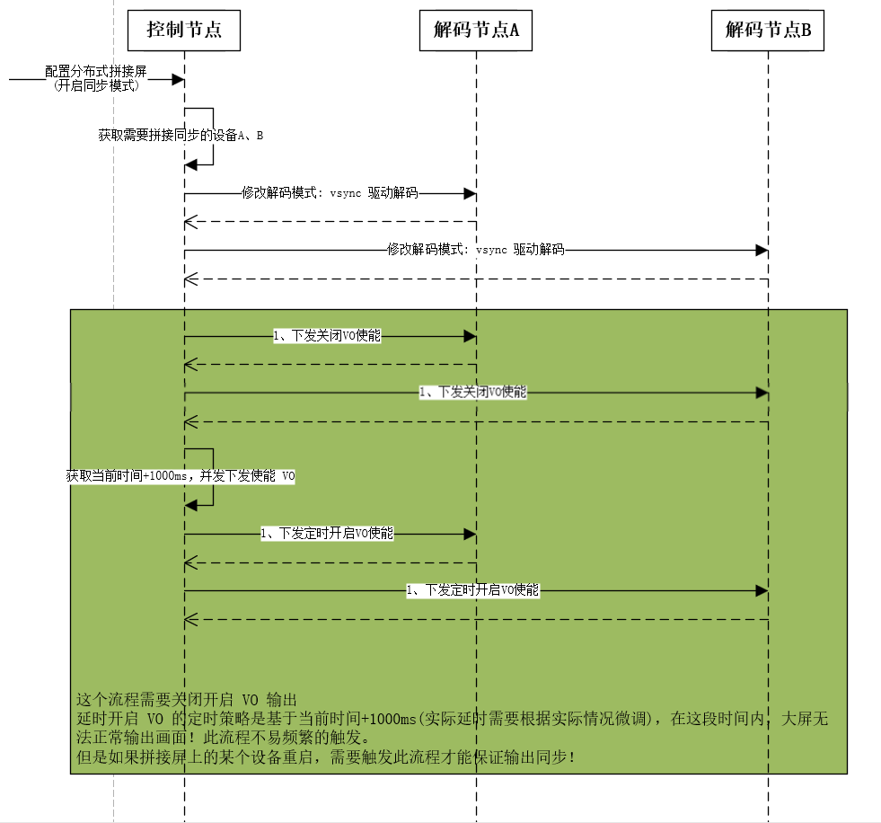
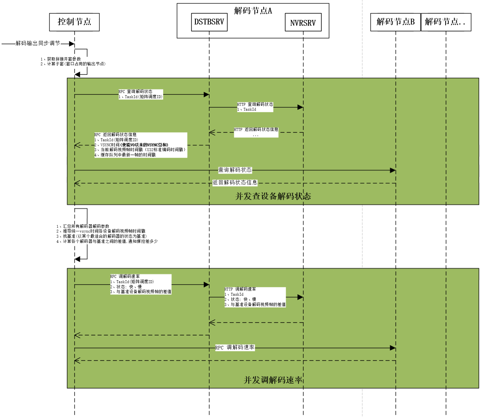
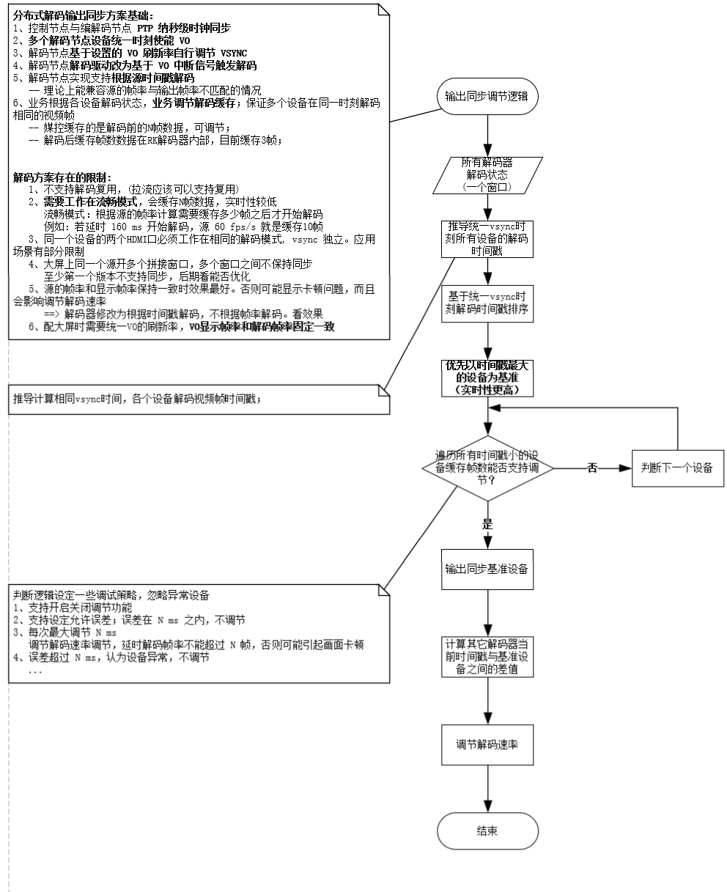
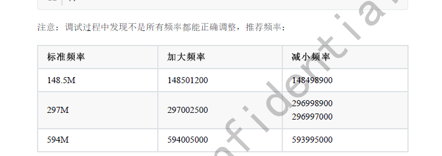
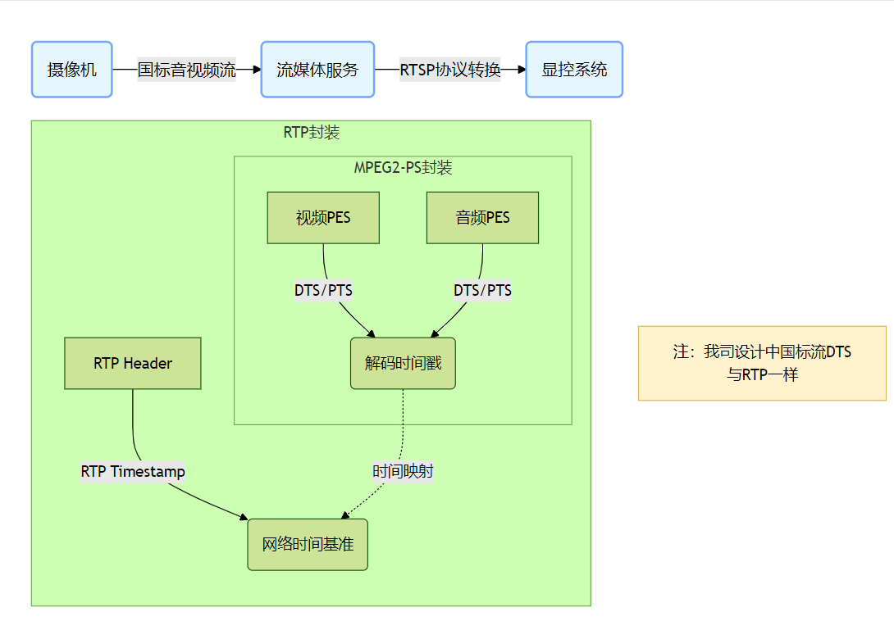

[TOC]

---
## 输出同步场景说明

分布式显控输出同步方案实现主要波及以下四类设备：
- 控制节点(主控服务器)
- 输入节点(编码节点)
- 输出节点(解码节点)
- 流媒体服务器

输出同步场景以 2x2 拼接屏为例说明；实际也可能是 1x2、3x3 等更大的拼接屏；

- **场景一：** 一个源的画面在多个解码设备上裁剪输出；**源帧率和解码输出刷新率一致；**

  

  

- **场景二：** 一个源的画面在多个解码设备上裁剪输出；**源帧率和解码输出刷新率不同；**


- **场景三：** 同时存在多个源的画面在四个设备上裁剪输出，两个源的帧率不同
		 要保证每个窗口的各个子窗之间都能正常同步
		

- **场景四：** 高分辨率主机，显卡支持将画面一分为4，经4个HDMI口输出;
需要4个编码节点分别采集显卡4个HDMI输出的画面，编码后上墙；这种场景需要支持多个输入源同步。
  此场景只要**保证用显控自己的编码节点**能实现同步即可。


## 实现方案说明

### 1、理论依据

前期调研阶段 `@戈志明` 提拱了实现拼接同步的基础理论，各业务单元在此基础上讨论的实现方案。
1. 多个 CPU 间通过 PTP 实现主从时间同步（驱动负责实现，业务调用） 
   第一步是方案的基础，保证多个设备之间 PTP 时钟同步

2. 不同cpu之间需要同一时刻使能 vo，保证初始化的时候vsync是同步的（业务负责，解码端媒控协助）
	最准确的实现方法是硬件信号中断的方式。目前不具备的情况下可以采用下面的方案：
	PTP 时间同步后，多台输出节点的业务可以约定将来某个时刻统一开启 VO 输出。
	
3. 多 3588CPU 因为时钟不同源，跑一段时间后 VSYNC 可能出现相位差，需要微调 vsync（解码端媒控负责实现，业务协助）
（1）多个cpu各自监控自己的vsync回调时间，计算单位时间内的vsync的时间总和，从机根据主机的vsync时间总和以及从机自身统计的单位时间vsync时间总和的差值微调vsync。HDMI PHY 内部 PLL。
（2）业务定期发送主机的时间戳和单位时间内 vsync 时间总和

4. 显示输出送数据帧同步（解码端媒控负责实现，业务协助）
（1）利用 VO 缓冲，实现统一时刻发送相同时间戳的视频帧
（2）业务定期发送主机的时间戳+当前发送数据帧的时间戳

### 2、各业务单元实现方案

**概述：**

1、控制节点与编解码节点支持 PTP 纳秒级时钟同步 

2、控制节点下发请求设定某个未来时刻，多个解码节点统一时刻使能 VO

3、解码节点基于统一设置的 VO 刷新率自行微调 VSYNC

4、解码节点解码驱动改为基于 VO 中断信号触发解码


5、解码节点实现支持根据源时间戳解码

	理论上能兼容源的帧率与输出帧率不匹配的情况
6、主控业务根据各解码节点解码状态，统一调节解码节奏
	通过此逻辑保证多个设备在同一时刻解码相同的视频帧
 
	-- 媒控缓存的是解码前的N帧数据，可调节；

	-- 解码后缓存帧数数据在RK解码器内部，目前缓存 3 帧；

**方案存在的限制：**
   1、不支持解码复用 (拉流应该可以支持复用)
   2、需要工作在流畅模式，会缓存N帧数据，实时性较低 
  
	流畅模式：根据源的帧率计算需要缓存多少帧之后才开始解码 
	例如：若延时 160 ms 开始解码，源 60 fps/s 就是缓存10帧 
   3、同一个设备的两个HDMI口必须工作在相同的解码模式；vsync 独立。
	同一个设备多个HDMI口，应用场景有部分限制   
   4、大屏上同一个源开多个拼接窗口，多个窗口之间不保持同步
      
	至少第一个版本不支持同步，后期看能否优化      
   5、源的帧率和显示帧率保持一致时效果最好。否则可能显示卡顿问题，而且会影响调节解码速率
      ==> 解码器修改为根据时间戳解码，不根据帧率解码。看效果
   6、配大屏时需要统一VO的刷新率，VO显示帧率和解码帧率固定一致

#### 2.1 各分布式节点支持PTP时钟同步
主控作为PTP主时钟，其它编解码节点作为从时钟与主控同步时间。
#### 2.2 控制节点设置多个解码节点同时使能VO流程


#### 2.3 解码节点实现微调 VSYCN 逻辑
@王艳芳 可以补充下具体实现细节
#### 2.4 解码节点支持基于 VO 中断信号触发解码
@王艳芳 可以补充下具体实现细节
#### 2.5 解码节点支持根据信号源的时间戳解码
@王艳芳 可以补充下具体实现细节
#### 2.6 控制节点统计多个解码节点当前解码时间戳




### 3、目前方案上存在的问题

#### 3.1、目前方案上确定的主控节点微调解码节奏方案存疑

###### 描述
各个解码节点输出画面一开始是保持同步的，但过一段时间会出现不同步现象，并且在控制节点不参与调节解码节奏的情况下，会自动恢复同步。
与约定的由控制节点调节解码节奏的方案相悖。

**06.05 会议沟通后，基于现在的方案，媒控同事 @王艳芳 邮件发送验证结果如下：**
```shell
1、借了会议相机，使用会议相机采集，确定会议相机的同步效果更好。
2、会议相机显示是60fps，但是这个60fps与解码板视频输出的60fps还不是完全一致的60fps。
    目前，为了拼接同步，解码板使用流畅模式，流畅模式下媒控会在解码侧缓存10帧，经过长拷后的数据推算，会议相机采集的情况下，缓存的这10帧数据大概在2小时20分钟左右被消耗完，说明视频输出的60fps还是大于视频采集的60fps。

3、之前的电脑源输入作为采集时，号称是60fps，实际统计下来只有59.94fps，这个帧率明显与解码板视频输出的60fps不一致。

    目前，为了拼接同步，解码板使用流畅模式，流畅模式下媒控会在解码侧缓存10帧，经过长拷后的数据推算，电脑输出采集的情况下，缓存的这10帧数据大概在3分钟左右被消耗完，这个数据从视频输出60fps和采集输入59.94fps反推也是相符合的。


使用会议相机，测试结果：
1、视频输出使用直通模式，也就是不经过合成，在输出有数据可拿的情况下（会议相机的2小时20分钟内），测试经过长时间观察（30分钟左右）没有观察到不同步现象。
2、视频输出使用非直通模式，也就是经过合成，在输出有数据可拿的情况下（会议相机的2小时20分钟内），测试经过长时间观察（10分钟左右）观察到不同步现象，并且不同步现象发生后，后面会频繁出现不同步现象。
   今天跟rk的人员沟通，按照他们的建议将layer的buf len加大（从5加大到8），使用非直通模式，测试经过长时间观察（40分钟左右），仅观察到两次不同步现象。


个人认为，目前看来，想要达到最好的同步效果：  
1、输入输出帧率能够完全匹配一致。  
2、使用直通模式。【但是直通模式的使用有很多限制：1、已知的画面隐藏功能无法使用；2、仅限单屏单画面才能使用直通模式；3、直通模式下零通道编码只能编码设备层的画面】

  
前述的测试，都是基于输入输出帧率匹配一致的前提，媒控只做了两个逻辑：1、为了抗网络抖动，先缓存了10帧才开启解码；2、第一次解码时，一次性解码3帧，以达到vo cache里一直有余量数据可拿。

后续的解码触发，都是vo来一个中断，触发解码一帧。

而目前用了两个输入（电脑和会议相机）都发现输入输出帧率不可能完全匹配一致，这时候需要借助时间戳解码来平衡，而时间戳解码从理论上来说不可能达到每块解码板的每一帧都在同一个时间点上，现象上就可能看到不同步的情况。

已知的还需要优化的点：
目前已经做了各个解码板的视频输出设备在同一时刻使能，
待优化的点为视频解码在同一时刻解码。
```

###### 解决进度：待确定优化方案细节

###### 疑问点
1、需要确认下媒控内部缓存管理策略
	不使用会议终端测试，3分钟媒控侧缓存被消耗光。媒控是否会再重新再缓存回来？
	为什么现在方案中定义的接口查询各个解码节点的缓存状态，缓存数据一直是有的？

2、如何实现控制多个解码节点同时开始解码？(接口查到的解码状态已经是在解同一帧了)；
	如果之前确定的微调方案不能满足要求，需要确定下具体方案，并提供接口

3、邮件中提到的验证方案是来一次VO中断，解一帧数据；不是方案中基于时间戳解码的模式，不能满足上文提到的各种应用场景。


测试确定友商能做到什么程度
1、验证友商**源的帧率和输出的刷新率不一致**时的表现

当前方案优化思路(也只能满足场景一)：
**以下思路的前提是源和输出帧率一致**；不依赖时间戳，解码节点的缓存由控制节点控制。
1、保证多个设备同时开始解码
	在同时使能VO的前提下，下发解码任务后，查每个设备中断数，指定未来某个中断开始同时解码。
2、保证每个设备一直有缓存可用
	设定缓存数阈值，控制节点定时查每个设备的缓存个数，根据设定的阈值，同时控制多个设备在某个中断开始快解慢解。保证一直有缓存可用。


#### 3.2、媒控内部 VSYNC 调节问题

**媒控内部 VSYCN 调节实现逻辑：**
在 PTP 同步的前提下，将需要同步的解码器设置成相同的刷新率，并且保证所有设备在统一时刻使能 VO;  然后每个设备都参考理想状态下的 VSYNC 值去微调自己的 VSYNC 相位差;
媒控依据**设置的刷新率**和**统计的中断次数**，计算理论的 VSYNC 时间。
以 1080P60 的刷新率为例(来一次中断理论上是经过了 1000/60 ms) 
1、计算理论的 VSYNC 时间和:  使能VO以来的中断次数 * (1000/60) 毫秒)
2、获取实际的 VSYNC 时间和:  当前VSYNC时间 - 使能VO时的VSYNC时间
3、VSYNC 时间差 = 理论VSYNC时间 - 实际VSYNC时间（单位ms）

解码器依据计算得到的VSYNC时间差去调节自己的VSYNC的频率；每次VSYNC可调节的频率参数，参照RK文档：
##### 3.2.1 问题一：
###### 描述
当前版本媒控业务**每次调节VSYNC的频率是固定值**，实际验证在不同设备上实际表现不一样。有的设备通过调节可以保证VSYNC误差值在 1ms 以内，有的设备无法保证。

每个设备的产生的 VSYNC 误差不一样?  导致每个设备都**采用相同的频率参数调节** VSYNC 频率时表现不一样？

例如：设备产生的 VSYNC 误差超过每次调的幅度，即使一直在微调，设备整体的 VSYNC 误差还是会在慢慢变大？

需要弄清楚 VSYNC  误差产生的原理？
```shell
RK3588编解码盒子PLL的输入时钟来自于RK外挂的24M晶振，而晶振频率是有误差的，所以PLL出来的像素时钟也是有误差的。
24M晶振的时钟精度在RK3588单板上会保证在+/-10ppm，即大概+/-4ms上下。因为晶体本身个体差异性无法控制。
```
###### 临时方案
VSYNC 调的幅度统一设置大一些，确保测试环境中的设备可能保证在 1ms 以内的误差。

###### 解决进度：已确认。RK开发可以提供个算法，计算出误差


##### 3.2.2 问题二：

###### 描述
输出(大屏分辨率)设置为以下几种参数 1080P60[1920x1080@60]、4K30[3840x2160@30]、4K60[3840x2160@60]，VSYCN 才能正常调节

###### 解决进度：已确认，是媒控业务限制


##### 3.2.3 问题三：

###### 描述 
插拔输出的 HDMI 线，会导致 VSYNC 出现偏差
>  媒控做了一个测试，结论如下：
>  1、拔掉 HDMI 线，或者关掉显示器，不会导致 VSYNC 时间相位差。
>  2、插上 HDMI 线，或者打开显示器，都会导致 VSYNC 时间相位差。
> 	   结果就是，要么缓慢能调节回来，要么不仅永远调不回来且朝着反方向在跑。
>
>  **建议：** 测同步的过程中，同步的几个解码板，不要拔插HDMI线，也不要开关显示器。**如果要插拔 HDMI 线或者开关显示器，要重新统一定时使能 VO。**


暂时没有修改方案，后续评估是否通过HDMI口音视频信号状态变化，触发重新使能VO逻辑。

###### 解决进度：已确认，需要重新同步VO


#### 3.3、 基于上述方案经流媒体拉流测试验证，不同步的现象更频繁

**初步结论：**
1、经流媒体后，码流抖动严重，需要加更多缓存，延迟高。
2、经流媒体后，流媒体会重新打时间戳。原因如下：
- GB协议接入，解码时使用 RTSP、Webtrc 协议拉流，为了还原真实时间戳，时间戳需要经过转换
- 有的摄像机时间戳不对，为了纠错会修改时间戳



#### 06.13 会议讨论

1、评审下由控制节点统一管理解码节点缓存数据的方案

2、评估下方案上后续能否实现满足4种应用场景


