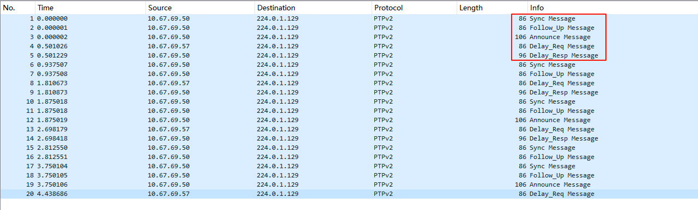

**目录**

[TOC]

------

## PTP 时钟同步算法实现原理

PTP（IEEE 1588）通过主从架构实现高精度时间同步，核心目标是**消除网络传输延迟和时钟频率差异**。其算法实现分为以下关键步骤：

------

### 1. 主从时钟角色选举：最佳主时钟算法（BMC）

- **功能**：在网络中选择最稳定的设备作为主时钟（Grandmaster Clock）。
- **依据参数**：
  - `priority1`、`priority2`（值越小优先级越高）
  - `clockClass`（时钟类别，值越小精度越高）
  - `clockAccuracy`（时钟精度）
  - `offsetScaledLogVariance`（时钟稳定性）
- **过程**：
  1. 所有时钟广播包含自身参数的 Announce 消息。
  2. 每个时钟根据 BMC 规则比较参数，选择最优主时钟。
  3. 未被选中的设备自动成为从时钟。

------

### **2. 时间戳交换与延迟测量**

PTP通过四类消息测量主从时钟之间的**路径延迟（Path Delay）** 和 **时钟偏移（Offset）**

| 消息类型           | 方向    | 携带时间戳 | 说明                      |
| :------------- | :---- | :---- | :---------------------- |
| **Sync**       | 主 → 从 | `t1`  | 主时钟发送Sync的时间戳           |
| **Follow_Up**  | 主 → 从 | `t1`  | 若主时钟启用两步模式，补充Sync的精确时间戳 |
| **Delay_Req**  | 从 → 主 | `t3`  | 从时钟请求延迟测量的时间戳           |
| **Delay_Resp** | 主 → 从 | `t4`  | 主时钟回复Delay_Req的时间戳      |

- **时间戳关系**：
  主时钟时间轴：t1 (Sync发送) → t4 (Delay_Req接收)
  从时钟时间轴：t2 (Sync接收) → t3 (Delay_Req发送)

- **路径延迟计算**：
  单向延迟 = ((t4−t1)−(t3−t2))/2
  假设网络延迟对称（主到从和从到主的延迟相同）

- **时钟偏移计算**：
  Offset = (t2−t1) − 单向延迟
  - 若Offset为正：从时钟比主时钟快，需减速。
  - 若Offset为负：从时钟比主时钟慢，需加速。

------

### **3. 伺服控制（Clock Servo）**

伺服控制器根据计算出的Offset动态调整从时钟的频率和相位，实现同步。常用**比例积分（PI）控制器**：

- **比例项（P）**：快速响应当前偏移。
  P = Kp×Offset

- **积分项（I）**：消除长期稳态误差。
  I = Ki×∑Offset

- **频率调整**：
  Δf=P+I
  将 Δf 应用于从时钟的硬件频率调节器（如PHC）

------

### **4. 时间戳处理与滤波**

- **时间戳模式**：
  - **硬件时间戳**：由网卡生成，精度可达纳秒级（推荐）。
  - **软件时间戳**：由操作系统生成，精度较低（微秒级）。

- **滤波算法**：
  - **移动平均（Moving Average）**：平滑网络抖动，但响应较慢。
  - **移动中位数（Moving Median）**：抗突发干扰，适合高抖动环境。
  - **指数加权（Exponential Smoothing）**：对最新数据赋予更高权重。

- **配置示例**：
  ```shell
  delay_filter           moving_average  # 选择滤波器类型
  delay_filter_length    5               # 滤波窗口长度
  ```

------

### **5. 动态调整与容错机制**

- **同步间隔优化**：
  - 缩短 Sync 消息间隔（`logSyncInterval`）以提高同步频率。
  - 示例：`logSyncInterval = -3` 表示每秒发送 8 次 Sync 消息。
- **故障恢复**：
  - 若主时钟失效，BMC 重新选举新主时钟。
  - `announceReceiptTimeout` 控制主时钟失效检测时间。
- **非对称延迟补偿**：
  - 若网络路径延迟不对称，通过 `delayAsymmetry` 手动补偿差值。

------

### **6. 硬件与协议支持**

- **透明时钟（TC）**：
  - 交换机或路由器支持时，可修正PTP消息的驻留时间，进一步减少误差。
- **边界时钟（BC）**：
  - 在网络分段中作为中间主时钟，减少级联误差。

------

### **总结**

PTP同步算法的核心是通过**精确测量路径延迟**和**动态调整从时钟频率**实现高精度同步。其实现依赖于：
1. **BMC选举主时钟**，确保网络时间源唯一。
2. **四步消息交换**，计算延迟与偏移。
3. **PI控制器**，消除时钟偏差。
4. **硬件时间戳与滤波**，减少噪声影响。

实际部署时需结合网络拓扑（P2P/E2E）、硬件能力（TC/BC支持）和伺服参数调优，才能达到纳秒级同步精度。


## 分布式欧拉主控PTP服务配置

### 分布式主控硬件信息
@刘辉 
处理器型号：飞腾腾锐D2000
网卡型号：网讯WX1860A4(支持PTP)
晶振型号：INTERQUIP(应达利) 5YAA25000203TF30Q3 精度 ±30 ppm
系统版本：@俞露
```shell
[root@localhost mpuaps]# uname -a
Linux localhost.localdomain 5.10.0-60.18.0.50.oe2203.aarch64 #1 SMP Wed Mar 30 02:43:08 UTC 2022 aarch64 aarch64 aarch64 GNU/Linux
[root@localhost mpuaps]# cat /etc/os-release
NAME="openEuler"
VERSION="22.03 LTS"
ID="openEuler"
VERSION_ID="22.03"
PRETTY_NAME="openEuler 22.03 LTS"
ANSI_COLOR="0;31"
```

### ethtool 网卡硬件信息确认
```shell
# 查看网卡对PTP的支持
# 预期输出（支持时）：
#  PTP Hardware Clock: 0
#  Hardware Transmit Timestamp Modes: off on
#  Hardware Receive Filter Modes: none all
[root@localhost ~]# ethtool -T enp4s0f1
Time stamping parameters for enp4s0f1:
Capabilities:
        hardware-transmit
        software-transmit
        hardware-receive
        software-receive
        software-system-clock
        hardware-raw-clock
PTP Hardware Clock: 3
Hardware Transmit Timestamp Modes:
        off
        on
Hardware Receive Filter Modes:
        none
        ptpv1-l4-sync
        ptpv1-l4-delay-req
        ptpv2-l4-event
        ptpv2-l4-sync
        ptpv2-l4-delay-req
        ptpv2-l2-event
        ptpv2-l2-sync
        ptpv2-l2-delay-req
        ptpv2-event
        ptpv2-sync
        ptpv2-delay-req

# 查看网卡驱动
[root@localhost msp]# ethtool -i enp4s0f1 | grep driver
driver: ngbe

# 查看驱动详情(ngbe国产网卡)
[root@localhost ~]# modinfo ngbe
filename:       /lib/modules/5.10.0-60.18.0.50.oe2203.aarch64/updates/drivers/net/ethernet/wangxun/ngbe/ngbe.ko
version:        1.2.3elos
license:        GPL
description:    WangXun(R) Gigabit PCI Express Network Driver
author:         Beijing WangXun Technology Co., Ltd, <linux.nic@trustnetic.com>
srcversion:     0B5F3F87063154308D5EBC9
alias:          pci:v00008088d0000010Csv*sd*bc*sc*i*
alias:          pci:v00008088d0000010Asv*sd*bc*sc*i*
alias:          pci:v00008088d0000010Bsv*sd*bc*sc*i*
alias:          pci:v00008088d00000109sv*sd*bc*sc*i*
alias:          pci:v00008088d00000100sv*sd*bc*sc*i*
alias:          pci:v00008088d00000108sv*sd*bc*sc*i*
alias:          pci:v00008088d00000107sv*sd*bc*sc*i*
alias:          pci:v00008088d00000106sv*sd*bc*sc*i*
alias:          pci:v00008088d00000105sv*sd*bc*sc*i*
alias:          pci:v00008088d00000104sv*sd*bc*sc*i*
alias:          pci:v00008088d00000103sv*sd*bc*sc*i*
alias:          pci:v00008088d00000102sv*sd*bc*sc*i*
alias:          pci:v00008088d00000101sv*sd*bc*sc*i*
alias:          pci:v00008088d00000000sv*sd*bc*sc*i*
depends:
name:           ngbe
vermagic:       5.10.0-60.18.0.50.oe2203.aarch64 SMP mod_unload modversions aarch64
parm:           InterruptType:Change Interrupt Mode (0=Legacy, 1=MSI, 2=MSI-X), default IntMode (deprecated) (array of int)
parm:           IntMode:Change Interrupt Mode (0=Legacy, 1=MSI, 2=MSI-X), default 2 (array of int)
parm:           MQ:Disable or enable Multiple Queues, default 1 (array of int)
parm:           RSS:Number of Receive-Side Scaling Descriptor Queues, default 0=number of cpus (array of int)
parm:           VMDQ:Number of Virtual Machine Device Queues: 0/1 = disable, 2-16 enable (default=8) (array of int)
parm:           max_vfs:Number of Virtual Functions: 0 = disable (default), 1-8 = enable this many VFs (array of int)
parm:           VEPA:VEPA Bridge Mode: 0 = VEB (default), 1 = VEPA (array of int)
parm:           InterruptThrottleRate:Maximum interrupts per second, per vector, (0,1,980-500000), default 1 (array of int)
parm:           LLIPort:Low Latency Interrupt TCP Port (0-65535) (array of int)
parm:           LLISize:Low Latency Interrupt on Packet Size (0-1500) (array of int)
parm:           LLIEType:Low Latency Interrupt Ethernet Protocol Type (array of int)
parm:           LLIVLANP:Low Latency Interrupt on VLAN priority threshold (array of int)
parm:           AtrSampleRate:Software ATR Tx packet sample rate (array of int)
parm:           LRO:Large Receive Offload (0,1), default 1 = on (array of int)
parm:           dmac_watchdog:DMA coalescing watchdog in microseconds (0,41-10000),default 0 = off (array of int)
parm:           RxBufferMode:0=(default)no header split
                        1=hdr split for recognized packet
 (array of int)


# demsg 查看驱动加载情况
#       是否已启用PTP支持
#       是否已启用硬件时间戳
[root@localhost ~]# dmesg | grep -i ptp
[    2.957164] PTP clock support registered
[root@localhost ~]#
[root@localhost ~]#
[root@localhost ~]#
[root@localhost ~]# dmesg | grep -i ngbe | grep -i timestamp
[root@localhost ~]#
[root@localhost ~]#
[root@localhost ~]# dmesg | grep -i ngbe
[   12.043228] ngbe: loading out-of-tree module taints kernel.
[   12.043684] ngbe: module verification failed: signature and/or required key missing - tainting kernel
[   12.045705] ngbe 0000:04:00.0: enabling device (0000 -> 0002)
[   12.192752] ngbe 0000:04:00.0: 16.000 Gb/s available PCIe bandwidth (5.0 GT/s PCIe x4 link)
[   12.199794] ngbe 0000:04:00.0 eth0: NCSI : unsupported
[   12.199798] ngbe 0000:04:00.0 eth0: PHY: Internal, PBA No: Wang Xun GbE Family Controller
[   12.199802] ngbe 0000:04:00.0 eth0: 02:03:04:05:06:16
[   12.199805] ngbe 0000:04:00.0 eth0: Enabled Features: RxQ: 8 TxQ: 8
[   12.199808] ngbe 0000:04:00.0 eth0: WangXun(R) Gigabit Network Connection
[   12.199812] ngbe 0000:04:00.0: hwmon_device_register() is deprecated. Please convert the driver to use hwmon_device_register_with_info().
[   12.200093] ngbe 0000:04:00.1: enabling device (0000 -> 0002)
[   12.339929] ngbe 0000:04:00.1: 16.000 Gb/s available PCIe bandwidth (5.0 GT/s PCIe x4 link)
[   12.347001] ngbe 0000:04:00.1 eth1: NCSI : unsupported
[   12.347006] ngbe 0000:04:00.1 eth1: PHY: Internal, PBA No: Wang Xun GbE Family Controller
[   12.347010] ngbe 0000:04:00.1 eth1: 02:03:04:05:06:17
[   12.347014] ngbe 0000:04:00.1 eth1: Enabled Features: RxQ: 8 TxQ: 8
[   12.347016] ngbe 0000:04:00.1 eth1: WangXun(R) Gigabit Network Connection
[   12.347292] ngbe 0000:04:00.2: enabling device (0000 -> 0002)
[   12.486937] ngbe 0000:04:00.2: 16.000 Gb/s available PCIe bandwidth (5.0 GT/s PCIe x4 link)
[   12.493961] ngbe 0000:04:00.2 eth2: NCSI : unsupported
[   12.493967] ngbe 0000:04:00.2 eth2: PHY: Internal, PBA No: Wang Xun GbE Family Controller
[   12.493971] ngbe 0000:04:00.2 eth2: 02:03:04:05:06:18
[   12.493975] ngbe 0000:04:00.2 eth2: Enabled Features: RxQ: 8 TxQ: 8
[   12.493978] ngbe 0000:04:00.2 eth2: WangXun(R) Gigabit Network Connection
[   12.494248] ngbe 0000:04:00.3: enabling device (0000 -> 0002)
[   12.642944] ngbe 0000:04:00.3: 16.000 Gb/s available PCIe bandwidth (5.0 GT/s PCIe x4 link)
[   12.650357] ngbe 0000:04:00.3 eth3: NCSI : unsupported
[   12.650363] ngbe 0000:04:00.3 eth3: PHY: Internal, PBA No: Wang Xun GbE Family Controller
[   12.650367] ngbe 0000:04:00.3 eth3: 02:02:03:04:05:09
[   12.650370] ngbe 0000:04:00.3 eth3: Enabled Features: RxQ: 8 TxQ: 8
[   12.650373] ngbe 0000:04:00.3 eth3: WangXun(R) Gigabit Network Connection
[   12.671378] ngbe 0000:04:00.1 enp4s0f1: renamed from eth1
[   12.710193] ngbe 0000:04:00.2 enp4s0f2: renamed from eth2
[   12.754861] ngbe 0000:04:00.0 enp4s0f0: renamed from eth0
[   12.818956] ngbe 0000:04:00.3 enp4s0f3: renamed from eth3
[   13.206705] ngbe 0000:04:00.1: registered PHC device on enp4s0f1
[   13.414471] ngbe 0000:04:00.2: registered PHC device on enp4s0f2
[   13.625986] ngbe 0000:04:00.0: registered PHC device on enp4s0f0
[   13.841535] ngbe 0000:04:00.3: registered PHC device on enp4s0f3
[   16.246052] ngbe 0000:04:00.1 enp4s0f1: NIC Link is Up 1 Gbps, Flow Control: RX/TX
[root@localhost ~]#
```

### yum 仓库源配置

**主控节点安装 linuxptp 不需要配置，默认就是这个仓库源；**
流媒体服务器安装 linuxptp 需要先配置下 yum 仓库源；
```shell
# 配置使用公司内部私有仓库源，并修改 /etc/yum.conf 禁用 gpgcheck
# 安装完成后，恢复流媒体服务器默认配置，避免引入一些未知问题
[root@node-2t97 yum.repos.d]# cat /etc/yum.conf
[main]
gpgcheck=0  # 这个设置为0，安装linuxptp之后改为默认值 1
installonly_limit=3
clean_requirements_on_remove=True
best=True
skip_if_unavailable=False

[root@node-2t97 yum.repos.d]#
[root@node-2t97 yum.repos.d]#
# 配置仓库源信息
# 在 /ect/yum.repos.d/ 目录添加 openEuler.repo 内如如下
# 安装完成后，将 openEuler.repo 文件重命名为 openEuler.repo.bak
[root@node-2t97 yum.repos.d]# cat /etc/yum.repos.d/openEuler.repo
[OS]
name=OS
baseurl=http://10.68.11.150/openeuler/22.03lts/aarch64/OS/
enabled=1

[everything]
name=everything
baseurl=http://10.68.11.150/openeuler/22.03lts/aarch64/everything/
enabled=1

[EPOL]
name=EPOL
baseurl=http://10.68.11.150/openeuler/22.03lts/aarch64/EPOL/
enabled=1

[debuginfo]
name=debuginfo
baseurl=http://10.68.11.150/openeuler/22.03lts/aarch64/debuginfo/
enabled=1

[source]
name=source
baseurl=http://10.68.11.150/openeuler/22.03lts/aarch64/source/
enabled=1

[update]
name=update
baseurl=http://10.68.11.150/openeuler/22.03lts/aarch64/update/
enabled=1
[root@node-2t97 yum.repos.d]#
```


### ptp4l 服务安装
```shell
#安装 linuxptp 套件
[root@localhost ~]# sudo yum install linuxptp -y
Last metadata expiration check: 1:30:30 ago on 2025年03月25日 星期二 18时15分38秒.
Dependencies resolved.
=================================================================
 Package     Architecture    Version      Repository    Size
=================================================================
Installing:
 linuxptp     aarch64      2.0-6.oe2203     update     142 k

Transaction Summary
=================================================================
Install  1 Package

Total download size: 142 k
Installed size: 860 k
Downloading Packages:
linuxptp-2.0-6.oe2203.aarch64.rpm                                                            587 kB/s | 142 kB     00:00
-----------------------------------------------------------------
Total                                                                                        577 kB/s | 142 kB     00:00
Running transaction check
Transaction check succeeded.
Running transaction test
Transaction test succeeded.
Running transaction
  Preparing        :                                                                                                     1/1
  Installing       : linuxptp-2.0-6.oe2203.aarch64                                                                       1/1
  Running scriptlet: linuxptp-2.0-6.oe2203.aarch64                                                                       1/1
  Verifying        : linuxptp-2.0-6.oe2203.aarch64                                                                       1/1

Installed:
  linuxptp-2.0-6.oe2203.aarch64

Complete!
[root@localhost ~]#
[root@localhost ~]#
[root@localhost ~]#
[root@localhost ~]# ptp4l -v
2.0

# 测试手动启动 ptp4l 并启用硬件时间戳（需要网卡支持）
# 手动启动 ptp4l 并启用调试模式
# 局域网内没有其它优先级更高的PTP设备，选举自己为主时钟
# -H 启用硬件时间戳，正常启动会输出如下信息
sudo ptp4l -f /etc/ptp4l.conf -i bond0 -H -m -l 6
[root@localhost mpuaps]# sudo ptp4l -f /etc/ptp4l.conf -i enp4s0f1 -H -m -l 6 
ptp4l[12125.285]: selected /dev/ptp3 as PTP clock
ptp4l[12125.286]: port 1: INITIALIZING to LISTENING on INIT_COMPLETE
ptp4l[12125.286]: port 0: INITIALIZING to LISTENING on INIT_COMPLETE
ptp4l[12132.894]: port 1: LISTENING to MASTER on ANNOUNCE_RECEIPT_TIMEOUT_EXPIRES
ptp4l[12132.894]: selected local clock 4e4ed4.fffe.a4b36e as best master
ptp4l[12132.894]: assuming the grand master role


# 检查当前生效的硬件时间戳配置参数
#  tx_type 1     即HWTSTAMP_TX_ON（启用硬件发送时间戳）
#  rx_filter 12  即HWTSTAMP_FILTER_PTP_V2_EVENT（捕获PTPv2事件消息：Sync, Delay_Req, Pdelay_Req, Pdelay_Resp）
[root@localhost msp]# hwstamp_ctl -i enp4s0f1
current settings:
tx_type 1
rx_filter 12
[root@localhost msp]#


# 如果启动有报错，需要先排查解决报错
## step-1 检查对应网卡状态和链路
ip link show enp4s0f1 | grep "state"
### 输出应为：state UP
ethtool enp4s0f1 | grep "Link detected"
### 输出应为：Link detected: yes

## step-2 交换机
# 如果经过交换机实现跨局域网同步，还需要启动交换机端口 PTP VLAN
# 交换机端口需要启动 PTP VLAN
....

# PTP主时钟冗余与BMCA算法调优
....


## 在 /etc/sysconfig/ptp4l 配置服务启动参数
## 注意: 此参数会传给 ptp4l 服务启动参数，启动服务前需要先配置此参数
#    -f /etc/ptp4l.conf 加载配置文件（需检查配置是否指定主时钟源）
#    -i enp4s0f1 指定网络接口
#    -H 启用硬件时间戳（​必需选项​，依赖网卡支持）
#    -m 打印日志到标准输出（便于调试）
#    -l 6 日志级别（6=INFO级，适当调高到7可能获更多错误信息）
OPTIONS="-f /etc/ptp4l.conf -i enp4s0f1 -H -l 6"


# 系统PTP服务配置自启动
systemctl start ptp4l
systemctl enable ptp4l


## 当存在外部高精度时钟源（如GPS）时，可配置 NTP 作为 PTP 的次级同步源
## TODO 如何配置主时钟使用外部 GPS 时钟源


# 与NTP服务的协同配置
## 禁用冲突的 NTP 服务
systemctl stop chronyd
systemctl disable chronyd


# PTP 同步状态验证
## pmc 客户端查询主从同步状态
pmc -i enp4s0f1 -u -b 0 "GET CURRENT_DATA_SET"

## 10.67.29.98 测试环境验证
[root@localhost ~]# pmc -i enp4s0f1 -b 0 "GET CURRENT_DATA_SET"
sending: GET CURRENT_DATA_SET
        00141a.fffe.3db436-1 seq 0 RESPONSE MANAGEMENT CURRENT_DATA_SET
                stepsRemoved     1
                offsetFromMaster -8.0
                meanPathDelay    3579.0


# 抓取 PTP 报文
# PTP 是通过组播来实现多设备之间的时钟同步，PTP 的标准多播地址是224.0.1.129端口319和320
# 持续抓包并过滤 PTP 报文，确保存在完整的 Sync → Follow_Up → Delay_Req → Delay_Resp 交互流程
sudo tcpdump -i enp4s0f1 -vvv -nn 'port 319 or port 320'
tcpdump -i eth0 -vvv -nn 'port 319 or port 320'

## 主控抓包：抓包保存到文件，并限制抓取 20 个数据包自动停止
sudo tcpdump -i enp4s0f1 -vvv -nn -c 20 -w ptp_capture.pcap 'port 319 or port 320'

## 编解码器：抓包保存到文件，并限制抓取 2000 个数据包自动停止
tcpdump -i eth1 -vvv -nn -c 2000 -w ptp_capture.pcap 'port 319 or port 320'

## 编解码器：抓包保存到文件，不限制抓包数据，需手动Ctrl—C停止抓包
tcpdump -i eth1 -vvv -nn -w dec_capture.pcap
```

### phc2sys 服务配置
此服务主要用于实现将**网卡硬件时间**同步到**系统时间**
```shell
# 同步网卡PHC与系统时钟
#phc2sys -c enp4s0f1 -s CLOCK_REALTIME -O 0 -m --step_threshold=1 -w
phc2sys -c enp4s0f1 -s CLOCK_REALTIME -O 0 -w

# 在 /etc/sysconfig/phc2sys 添加服务启动参数，将网卡时钟同步到系统时钟
# 注意: 此参数会传给 phc 服务启动参数，启动服务前需要先配置此参数
#   -s enp4s0f1 源时钟为网卡PHC
#   -c CLOCK_REALTIME 目标为系统时钟（需同步的对象）
#   -O 0 UTC与TAI时差设为0（常规配置）
#   -m 打印日志到标准输出
#   --step_threshold=1 偏移>1秒时触发时钟跳变（而非平滑调整;默认就是1）
#   -w 等待ptp4l先完成PHC同步
# 默认配置: OPTIONS="-a -r"
OPTIONS="-c enp4s0f1 -s CLOCK_REALTIME -O 0 -w"


# 启动 phc2sys 服务
systemctl start phc2sys
systemctl enable phc2sys

```


### ptp4l 配置说明

以下是 `/etc/ptp4l.conf` 配置文件中**常用字段的详细解释**，结合PTP 协议规范和 Linux ptp4l 实现特性整理：

------

#### 全局配置（Global Settings）

1. **时钟行为控制**
   - `twoStepFlag 1`
     启用两步同步模式
     （默认），主时钟先发送 Sync 消息，再通过 Follow_Up 消息传递精确时间戳。适合高带宽链路（如 10G+）
   - `slaveOnly 0`
     允许设备作为 ​**主时钟或从时钟**​（若设为 `1` 则强制为从模式）
   - `priority1 128 / priority2 128`
     主时钟选举优先级（值越低优先级越高），用于冗余主时钟场景
   - `domainNumber 0`
     PTP 域编号，同一域内的设备需保持一致以实现同步。

1. **时钟属性定义**
   - `clockClass 248`
     表示时钟的精度等级（0-255），值越低表示精度越高（如 GPS 时钟通常为 6）。
   - `clockAccuracy 0xFE`
     时钟精度标识（十六进制），`0xFE` 表示未知精度。
   - `free_running 0`
     禁用自由运行模式，强制同步到上级时钟（若为 `1` 则独立运行）。

------

#### 端口配置（Port Settings）

1. **报文发送间隔**
   - `logAnnounceInterval 1`
     Announce 报文发送间隔为 2 的 1 次方 = 2 秒，影响主从选举响应速度
   - `logSyncInterval 0`
     Sync 报文间隔为 2 的 0 次方 = 1 秒，缩短间隔可提升同步精度但增加网络负载。
   - `logMinDelayReqInterval 0`
     Delay_Req 报文最小间隔为 2 的 0 次方 =1 秒，用于端到端延迟测量。

1. **超时与容错**
   - `announceReceiptTimeout 3`
     Announce 报文超时时间为 2 的 3 次方 = 8 秒，超时后触发主时钟重新选举。
   - `fault_reset_interval 4`
     FAULTY 状态恢复间隔为 4 秒，用于链路异常后的自动恢复。

------

#### 运行时选项（Runtime Options）

1. **日志与调试**
   - `logging_level 6`
     日志级别设为 DEBUG（0=紧急，6=调试），用于排查同步问题。
   - `use_syslog 1`
     日志输出到系统日志（如 `/var/log/messages`）。

1. **网络与硬件**
   - `network_transport UDPv4`
     使用 UDP/IPv4 传输协议（若需 L2 层则改为 IEEE_802_3）
   - `time_stamping     hardware`
     启用 ​**硬件时间戳**​（需网卡支持，否则改为 `software`）
   - `tx_timestamp_timeout 1`
     发送时间戳等待超时为 1 秒，防止硬件响应延迟导致阻塞。

------

#### 伺服控制（Servo Options）

1. **时钟同步算法**
   - `clock_servo pi`
     使用 ​**比例-积分（PI）控制器** 调整本地时钟频率，平衡收敛速度与稳定性。
   - `step_threshold 0.0`
     禁止瞬时跳变（若设为正数，允许时钟步进调整，可能影响应用连续性）
   - `max_frequency 900000000`
     最大频率调整幅度为 900 ppm（百万分之一），限制时钟伺服调节范围。
2. **滤波器配置**
   - `tsproc_mode filter`
     启用时间戳滤波，减少网络抖动影响。
   - `delay_filter moving_median`
     使用 ​**滑动中值滤波** 处理延迟测量值，窗口大小为 10（`delay_filter_length 10`）

------

#### 时钟描述（Clock Description）

- `manufacturerIdentity 00:00:00`
  制造商标识（IEEE 分配的三字节 OUI），`00:00:00` 表示未指定。
- `timeSource 0xA0`
  时钟源类型，`0xA0` 表示内部振荡器（如 GPS 为 `0x20`）。

------

#### 关键参数调整

1. **主时钟冗余**
   若部署多主架构，需为各主时钟设置不同的 priority1（如 64 和 128）以避免冲突。

2. **网络延迟优化**
   在拥塞网络中，增大 `logMinDelayReqInterval` 可降低报文丢失率，但可能牺牲同步精度。

3. **硬件兼容性**
   若遇到 `time_stamping  hardware` 错误，检查网卡驱动支持性（如 `ethtool -T` 验证 PTP 功能）通过此配置，设备将作为普通时钟（OC）运行，通过 UDPv4 协议同步时间，优先使用硬件时间戳，并在异常时自动恢复。

4. **时钟同步算法**
   若主从时钟偏移量远大于纳秒级(9999纳秒以上)，且每次调整幅度很低，需要比较久的时间才能达到纳秒级别的时钟同步。要快速实现主从时钟的纳秒级同步，可调整相关参数以优化伺服响应和同步速度。
   ```shell
   ###伺服控制参数（加快响应速度）
   # 增大比例常数以快速响应偏差
   pi_proportional_const   1.0
   # 启用积分控制以消除稳态误差
   pi_integral_const       0.1
   # 允许更大的初始步进调整（20微秒 → 20000纳秒）
   first_step_threshold    0.00002  # 保持当前值（20微秒）或适当增大
   # 放宽最大频率调整限制（确保足够大）
   max_frequency           2000000000  # 2e9 ns/s（需硬件支持）, 默认9000000000
   
   # 允许伺服直接大步调整（步进阈值设为1秒）,同时也要考虑时钟波动
   step_threshold         1.0
   
   ###调整同步间隔（提高同步频率）
   # 缩短Sync消息间隔（log2秒）
   logSyncInterval        -3  # 2^-3 = 0.125秒（每秒8次同步）
   # 缩短Announce消息间隔
   logAnnounceInterval    0   # 1秒（默认）
   
   ###优化延迟滤波（减少滤波延迟）
   # 使用移动平均滤波器替代中位数（响应更快）
   delay_filter           moving_average
   # 减少滤波窗口长度（降低延迟）
   delay_filter_length    5
   
   ###其它关键参数
   # 确保使用硬件时间戳（最高精度）
   time_stamping          hardware
   # 禁用滤波模式（直接使用原始时间戳）
   tsproc_mode            raw
   # 关闭自由运行模式（强制同步）
   free_running           0
   ```
#### 主从参数配置对比

在PTP（精确时间协议）中，主从时钟的配置参数既有共同的部分，也有独立的部分；以下列举常用配置说明。

##### 1、主从时钟需保持一致的参数

- **网络传输协议**
```shell
network_transport       L2      # 必须一致（如L2、UDPv4）
delay_mechanism         P2P     # 延迟机制（P2P或E2E）
```

- **PTP域编号**
```shell
domainNumber            0       # 主从必须在同一域
```

- **两步时间戳模式**
```shell
twoStepFlag             1       # 主从需一致（通常主时钟启用）
```

##### 2、主时钟关键参数

主时钟需优先配置以下参数以控制同步行为：

- **Sync消息发送间隔**
  ```shell
  logSyncInterval         -3      # 主时钟控制Sync消息频率（2^-3秒=0.125秒）
  ```

- **Announce消息优先级**
  ```shell
  priority1               128     # 值越小，主时钟优先级越高
  priority2               128
  ```

- **时钟类别与精度声明**
  ```shell
  clockClass              248     # 表示时钟的精度等级（0-255），值越低表示精度越高（如 GPS 时钟通常为 6）
  clockAccuracy           0xFE    # 时钟精度标识（十六进制），0xFE 表示未知精度
  ```

------

##### 3、从时钟关键参数

从时钟需独立配置以下参数以优化时钟同步收敛速度：

- **伺服控制参数**
  ```shell
  pi_proportional_const   1.0         # 比例增益（从时钟需增大以快速响应）
  pi_integral_const       0.1         # 积分增益（消除稳态误差）
  step_threshold          1.0         # 允许大步调整（主时钟无需配置）
  first_step_threshold    0.00002     # 保持当前值（20微秒）或适当增大
  max_frequency           9000000000  # 放宽最大频率调整限制（确保足够大）
  ```

- **时间戳模式与滤波**
  ```shell
  time_stamping           hardware  # 从时钟必须启用硬件时间戳（若支持）
  tsproc_mode             raw       # 禁用滤波（主时钟无需配置）
  delay_filter            moving_average  # 从时钟需优化滤波算法
  ```

- **强制从模式**
  ```shell
  slaveOnly               1       # 从时钟可设为仅从模式（主时钟设为0）
  ```

------

##### 4、主从无需同步的参数

以下参数通常**独立配置**，无需主从一致：

- **本地优先级（G.8275协议）**
  ```shell
  G.8275.defaultDS.localPriority  128   # 本地网络拓扑决定
  ```

- **日志与调试选项**
  ```shell
  logging_level           6             # 从时钟可启用更详细日志
  use_syslog              1
  ```

------

##### **总结**

- **主时钟**：需控制 `logSyncInterval`、`priority1/2`、`clockClass` 等核心参数。
- **从时钟**：需独立优化 `伺服控制参数`、`时间戳模式`、`滤波算法`，并强制设为从模式（`slaveOnly=1`）。
- **一致性要求**：仅 `domainNumber`、`network_transport`、`delay_mechanism`、`twoStepFlag` 需主从严格一致。

若从时钟配置不当（如伺服增益过低或滤波窗口过长），即使主时钟参数正确，同步速度仍会受限。因此，**主从时钟的参数需根据角色差异化配置**，而非完全一致。

## 主控服务器时区配置

主控与编解码设备需要配置成相同的时区，方便直观的看到时间是否相同。
```shell
# 编解码器 date 默认显示的是 UTC 时间（协调世界时）
/usr/dstb # date
Sat Mar 29 06:12:27 UTC 2025
# 主控节点 date 默认输出的是 CST 时间（中国标准时间）
[root@localhost ~]# date
2025年 03月 29日 星期六 14:29:31 CST
# 可以使用 date -u 查看UTC时间
[root@localhost ~]# date -u
2025年 03月 29日 星期六 06:20:39 UTC

# 主控时区信息
[root@localhost ~]# timedatectl
               Local time: 六 2025-03-29 14:25:08 CST
           Universal time: 六 2025-03-29 06:25:08 UTC
                 RTC time: 六 2025-03-29 06:25:08
                Time zone: Asia/Shanghai (CST, +0800)
System clock synchronized: no
              NTP service: inactive
          RTC in local TZ: no
[root@localhost ~]# date
2025年 03月 29日 星期六 14:25:13 CST
[root@localhost ~]# date -u
2025年 03月 29日 星期六 06:25:16 UTC
```

- **UTC（协调世界时）**
  全球统一的时间标准，不受时区或夏令时影响。例如， `Universal time: 六 2025-03-29 05:44:14 UTC`，表示当前的 UTC 时间是 05:44:14。
- **CST（中国标准时间）**
  中国所在的时区名称，对应 `UTC+8`（比 `UTC` 快 8 小时）。例如，`Local time: 六 2025-03-29 13:44:14 CST` 表示当前本地时间 `CST` = `UTC+8` 。

**1、查看当前时区状态**
```shell
# 未设置系统前默认是 CST
[root@localhost ~]# timedatectl status
               Local time: 六 2025-03-29 13:44:14 CST
           Universal time: 六 2025-03-29 05:44:14 UTC
                 RTC time: 六 2025-03-29 13:44:12
                Time zone: Asia/Shanghai (CST, +0800)
System clock synchronized: no
              NTP service: inactive
          RTC in local TZ: yes

Warning: The system is configured to read the RTC time in the local time zone.
         This mode cannot be fully supported. It will create various problems
         with time zone changes and daylight saving time adjustments. The RTC
         time is never updated, it relies on external facilities to maintain it.
         If at all possible, use RTC in UTC by calling
         'timedatectl set-local-rtc 0'.
         
# 关于 RTC 时间的警告
# 问题原因：硬件时钟（RTC）默认应使用 UTC 时间，但您的系统将其设置为本地时间（CST）。
# 潜在风险：如果开启夏令时（虽然中国已取消）或跨时区调整，可能导致时间混乱。
# 解决方案：运行以下命令将 RTC 设置为 UTC，此操作后，硬件时钟会存储 UTC 时间，系统自动根据时区转换本地时间。
[root@localhost ~]# sudo timedatectl set-local-rtc 0

# 设置本地时区为 Asia/Shanghai（其实就是 UTC+08:00）
[root@localhost ~]# sudo timedatectl set-timezone Asia/Shanghai && timedatectl

# 设置系统采用 UTC，设置此参数后，date 命令默认显示的就是 UTC 时间
[root@localhost ~]# sudo timedatectl set-timezone UTC && timedatectl
```

**2、列出所有可用时区**
```shell
[root@localhost ~]# timedatectl list-timezones
...
Asia/Beijing
Asia/Chongqing
Asia/Harbin
Asia/Hebron
Asia/Hong_Kong
Asia/Shanghai
Asia/Singapore
Asia/Srednekolymsk
Asia/Taipei
Asia/Tashkent
Asia/Tbilisi
Asia/Tehran
Asia/Tel_Aviv
UTC
...
```


## 分布式显控 PTP 同步确认

### 编解码节点PTP同步状态
#### 1、抓包确认 PTP 报文

确保存在完整的 Sync → Follow_Up → Delay_Req → Delay_Resp 交互流程

`tcpdump -i eth1 -vvv -nn -c 20 -w ptp_capture.pcap 'port 319 or port 320'`




#### 2、确认设备 PTP 服务正常启动
```shell
# 编解码 Web 配置启用 PTP 时钟，会有相关日志打印
/var/log # tail -f /usr/log/syserr.log
Apr06:11:35 Userlocalcbb_daemon:[NETCBB_ERR] :PID[391] :TID[391]:[ApidPtp0pen] (210): open ok,i: 0, handle:0x318128f0 interface:eth1
Apr7 06:12:00 User local6.err netcbb_daemon:[NETCBB ERR]:PID[391]:TID[391]:[ApidPtpClose](249) : 
Apr7 06:12:00 User local6.err netcbb_daemon:[NETCBB ERR]:PID[391]:TID[391]:[ApidPtpClose](255): index:0, interface : eth1 interface : eth1
Apr7 06:12:00 User local6.err netcbb_daemon:[NETCBB_ERR]:PID[391]:TID[391] :[ApidPtpClose] (258): close ptp handle 0x318128f0
Apr7 06:12:08 User local6.err goahead: [7 06:12:00 User
Aprlocal6.err netcbb_daemon: INETCBB ERR]:PID[391]:TID[391j:[ApidPtpClose](292): close eth1 ok[NETCBB ERR]:PID[480]:TID[774]:[NetcbbPtpOpen] (759): ptp type is NETCBB PTP_CLOCK_TYPE H
## 重点关注这行参数信息
Apr7 06:12:08 User local6.err goahead: [NETCBB ERR]:PID[480j:TID[774]:INetcbbPtp0pen](766): interface : eth1, dStepThresh: 1.000000, ptpMode: 1, ptpType: 0
Apr7 06:12:08 User local6.err netcbb_daemon: [NETCBB_ERR]:PID[391]:TID[391]:[ApidPtp0pen](190): sizeof(PtpClockSrcParamInfo is 144, type :0
Apr7 06:12:08 User local6.err netcbb_daemon: [
7 06:12:08 User local6.err netcbb_dae
[NETCBB_ERR]:PID[391]:TID[391]:[ApidPtpOpen] (200): index : 0, interface : eth1, dStepThresh: 1.000000, ptpMode: 1, ptpType: 0
AprNETCBB ERR]:PID[391]:TID[391]:[ApidPtp0enl(210):handle:0x318128f0 interface:eth1


# 确认相关线程是否正常启动[ptp4l_thread、Phc2Sys_thread]

## 未启用 PTP
/bin # ps -T | grep netcbb_daemon
  399 admin     0:00 /bin/netcbb_daemon
  400 admin     0:00 {NetcbbSysRecvIp} /bin/netcbb_daemon
  401 admin     0:00 {NetcbbSysSendIp} /bin/netcbb_daemon
  402 admin     0:00 {NetcbbSysRecvIp} /bin/netcbb_daemon
  403 admin     0:00 {NetcbbSysSendIp} /bin/netcbb_daemon
  404 admin     0:00 {NetcbbSysNetlin} /bin/netcbb_daemon
  405 admin     0:00 {NetcbbRouteMoni} /bin/netcbb_daemon
  866 admin     0:00 grep netcbb_daemon
/bin #
/bin #

## 启用了 PTP
/usr/log # ps -T | grep netcbb_daemon
  935 admin     0:00 netcbb_daemon
  942 admin     0:00 {NetcbbSysRecvIp} netcbb_daemon
  943 admin     0:00 {NetcbbSysSendIp} netcbb_daemon
  944 admin     0:00 {NetcbbSysRecvIp} netcbb_daemon
  945 admin     0:00 {NetcbbSysSendIp} netcbb_daemon
  946 admin     0:00 {NetcbbSysNetlin} netcbb_daemon
  947 admin     0:00 {NetcbbRouteMoni} netcbb_daemon
 1058 admin     0:00 {Phc2Sys_thread} netcbb_daemon
 1059 admin     0:00 {ptp4l_thread} netcbb_daemon
 1122 admin     0:00 {V6NetcbbDhcpcPr} netcbb_daemon
 1239 admin     0:00 grep netcbb_daemon
/usr/log #


## 确认编解码盒子作为 PTP 从时钟能否正常同步修改时间 netcbb_daemon
### 方法一：修改一下系统时间，看会不会自动同步修改回来
/usr/log # date -s 12:01:01
Fri Mar 28 12:01:01 UTC 2025
/usr/log #
/usr/log # date
Fri Mar 28 01:53:53 UTC 2025
/usr/log #
### 方法二：查看编解码盒子系统日志 /var/log/message
##  主从偏移量：master offset -12; 单位纳秒,正值表示从时钟比主时钟慢,负值表示从时钟比主时钟快
##  从时钟的频率调整值: freq   +3739; 单位: ns/s; 正值,加快时钟频率;负值,减慢时钟频率
##  同步状态码: - s0：初始化或未锁定状态；
##            - s1：同步中；
##            - s2：已锁定（稳定状态）
##  路径延迟: path delay 3404;单位纳秒;主从时钟之间的网络路径延迟(单向或双向平均),一定是正值;
/usr/log # tail -f /var/log/message
[99.622] master offset 150219493051 s0 freq      -0 path delay     2246
[100.622] master offset 150219496802 s1 freq   +3751 path delay    2267
[101.622] master offset        -12 s2 freq   +3739 path delay      2267
[102.622] master offset       -684 s2 freq   +3063 path delay      2943
[103.622] master offset       -469 s2 freq   +3073 path delay      3404
[104.622] master offset        223 s2 freq   +3624 path delay      3404
[105.622] master offset        323 s2 freq   +3791 path delay      3404
[106.622] master offset        327 s2 freq   +3892 path delay      3404
[107.622] master offset        116 s2 freq   +3779 path delay      3487
[108.622] master offset          9 s2 freq   +3707 path delay      3570
[109.622] master offset         54 s2 freq   +3755 path delay      3561
[110.622] master offset         47 s2 freq   +3764 path delay      3568
[111.622] master offset         15 s2 freq   +3746 path delay      3568
[112.622] master offset          3 s2 freq   +3739 path delay      3568
[113.622] master offset         46 s2 freq   +3782 path delay      3561
[114.622] master offset         -6 s2 freq   +3744 path delay      3561
[115.622] master offset          6 s2 freq   +3754 path delay      3565
```

### 控制服务器查看同步状态

#### 抓包确认主时钟状态
```shell
# 抓取 PTP 报文
# PTP 是通过组播来实现多设备之间的时钟同步，PTP 的标准多播地址是224.0.1.129端口319和320
# 持续抓包并过滤 PTP 报文，确保存在完整的 Sync → Follow_Up → Delay_Req → Delay_Resp 交互流程
sudo tcpdump -i enp4s0f1 -vvv -nn 'port 319 or port 320'
tcpdump -i eth1 -vvv -nn 'port 319 or port 320'

## 主控抓包：抓包保存到文件，并限制抓取 20 个数据包自动停止
sudo tcpdump -i enp4s0f1 -vvv -nn -c 20 -w ptp_capture.pcap 'port 319 or port 320'

## 编解码器：抓包保存到文件，并限制抓取 20000 个数据包自动停止
tcpdump -i eth1 -vvv -nn -c 20000 -w ptp_capture.pcap 'port 319 or port 320'

## 编解码器：抓包保存到文件，不限制抓包数据，需手动Ctrl—C停止抓包
tcpdump -i eth1 -vvv -nn -w dec_capture.pcap
```
#### 主控查看PTP服务状态
```shell
################################
# journalctl 查看服务启动运行日志 #
################################
#查看完整日志
journalctl -u ptp4l 

#翻页查看完整日志
journalctl -u ptp4l | less

# 查看最近100条日志
journalctl -u ptp4l -n 100

# 查看包含"timeout"关键词的日志
journalctl -u ptp4l -g "timeout"

# 查看状态变化的日志（结合优先级过滤）
journalctl -u ptp4l -p info..warning -g "state changed"

#跟踪最新日志打印
journalctl -u ptp4l -f

# 查看今天日志
journalctl -u ptp4l --since today

# 查看最近2小时日志
journalctl -u ptp4l --since "2 hours ago"

# 查看特定时间段
journalctl -u ptp4l --since "2025-07-24 09:00:00" --until "2025-07-24 10:00:00"

# 导出全部日志
journalctl -u ptp4l > ptp4l_full.log

# 导出特定时间段日志
journalctl -u ptp4l --since "2025-07-23" --until "2025-07-24" > ptp4l_0723-0724.log


# 确认服务正常启动
[root@localhost etc]# systemctl status phc2sys.service ptp4l.service
● phc2sys.service - PTP: Synchronize two clocks
     Loaded: loaded (/usr/lib/systemd/system/phc2sys.service; enabled; vendor preset: disabled)
     Active: active (running) since Mon 2025-03-31 14:03:29 CST; 1h 6min ago
   Main PID: 868986 (phc2sys)
      Tasks: 1 (limit: 195830)
     Memory: 136.0K
     CGroup: /system.slice/phc2sys.service
             └─868986 /usr/sbin/phc2sys -a -r

3月 31 14:03:29 localhost.localdomain systemd[1]: Started PTP: Synchronize two clocks.
3月 31 14:03:30 localhost.localdomain phc2sys[868986]: [276789.876] reconfiguring after port state change
3月 31 14:03:30 localhost.localdomain phc2sys[868986]: [276789.876] selecting enp4s0f1 for synchronization
3月 31 14:03:30 localhost.localdomain phc2sys[868986]: [276789.876] nothing to synchronize

● ptp4l.service - PTP: Boundary/Ordinary Clock
     Loaded: loaded (/usr/lib/systemd/system/ptp4l.service; enabled; vendor preset: disabled)
     Active: active (running) since Mon 2025-03-31 13:59:15 CST; 1h 10min ago
   Main PID: 866368 (ptp4l)
      Tasks: 1 (limit: 195830)
     Memory: 136.0K
     CGroup: /system.slice/ptp4l.service
             └─866368 /usr/sbin/ptp4l -f /etc/ptp4l.conf -i enp4s0f1

3月 31 13:59:15 localhost.localdomain systemd[1]: Started PTP: Boundary/Ordinary Clock.
3月 31 13:59:15 localhost.localdomain ptp4l[866368]: [276535.164] selected /dev/ptp1 as PTP clock
3月 31 13:59:15 localhost.localdomain ptp4l[866368]: [276535.165] port 1: INITIALIZING to LISTENING on INIT_COMPLETE
3月 31 13:59:15 localhost.localdomain ptp4l[866368]: [276535.166] port 0: INITIALIZING to LISTENING on INIT_COMPLETE
3月 31 13:59:21 localhost.localdomain ptp4l[866368]: [276541.168] port 1: LISTENING to MASTER on ANNOUNCE_RECEIPT_TIMEOUT>
3月 31 13:59:21 localhost.localdomain ptp4l[866368]: [276541.168] selected local clock 020203.fffe.040507 as best master
3月 31 13:59:21 localhost.localdomain ptp4l[866368]: [276541.168] assuming the grand master role

[root@localhost etc]#
```

#### 主控使用PMC工具查看同步状态
```shell
## 在控制服务器上用 pmc 工具查看主从同步状态
### 查看与从设备同步状态
###  -u：使用 UDP 传输协议（默认端口 319）
​###  -b 6​：指定 PTP 域编号（Domain Number），默认为 0
​###  -f <配置文件>​：加载 ptp4l 的配置文件（如 ptp4l.conf），确保配置一致性
​###  GET <管理TLV>​：指定查询的 PTP 管理 TLV（Type-Length-Value）类型
###      PORT_DATA_SET      端口状态(角色、同步状态)
###      CURRENT_DATA_SET   主从时钟同步状态(偏移量、路径延时)
###      DEFAULT_DATA_SET   本地时钟信息(时钟等级、精度)
###      PARENT_DATA_SET    父时钟信息(主时钟ID、优先级)

[root@localhost mpuaps]# sudo pmc -u -b 6 -f /etc/ptp4l.conf "GET PORT_DATA_SET"
sending: GET PORT_DATA_SET
        020304.fffe.050617-1 seq 0 RESPONSE MANAGEMENT PORT_DATA_SET
                portIdentity            020304.fffe.050617-1
                portState               MASTER
                logMinDelayReqInterval  0
                peerMeanPathDelay       0
                logAnnounceInterval     1
                announceReceiptTimeout  3
                logSyncInterval         0
                delayMechanism          1
                logMinPdelayReqInterval 0
                versionNumber           2
        001611.fffe.ccde95-1 seq 0 RESPONSE MANAGEMENT PORT_DATA_SET
                portIdentity            001611.fffe.ccde95-1
                portState               SLAVE
                logMinDelayReqInterval  0
                peerMeanPathDelay       0
                logAnnounceInterval     1
                announceReceiptTimeout  3
                logSyncInterval         0
                delayMechanism          1
                logMinPdelayReqInterval 0
                versionNumber           2

## 同步正常的示例
[root@localhost mpuaps]# sudo pmc -u -b 6 -f /etc/ptp4l.conf "GET CURRENT_DATA_SET"
sending: GET CURRENT_DATA_SET
        00141a.fffe.3db436-1 seq 0 RESPONSE MANAGEMENT CURRENT_DATA_SET   从设备标识符: 00141a.fffe.3db436 去除 fffe 就是 mac 地址
                stepsRemoved     1                                        表示当前设备距离主时钟的跳数:
                                                                          0，表示该设备是主时钟;
                                                                          1，表示该设备直接同步到主时钟
                                                                          2，表示该设备通过另一个设备间接同步到主时钟
                offsetFromMaster 28.0                                     主从偏移量，单位纳秒
                meanPathDelay    3570.0                                   路径延迟
## 同步异常的示例                
[root@localhost ~]# sudo pmc -i enp4s0f1 "GET CURRENT_DATA_SET"
sending: GET CURRENT_DATA_SET
        001427.fffe.273666-1 seq 0 RESPONSE MANAGEMENT CURRENT_DATA_SET   从设备标识符: 001427.fffe.273666 去除 fffe 就是 mac 地址
                stepsRemoved     1                                        表示当前设备距离主时钟的跳数:
                                                                          0，表示该设备是主时钟;
                                                                          1，表示该设备直接同步到主时钟
                                                                          2，表示该设备通过另一个设备间接同步到主时钟
                offsetFromMaster 589446449.0                              主从偏移量，单位纳秒，转成秒 589446449/1000 000 000 = 0.58s
                                                                          正常该值应该在几十纳秒或几百纳秒
                meanPathDelay    -30054663.0                              路径延迟为负数，肯定不正确; 需要检查网络环境


### 查看主时钟参数
[root@localhost ~]# sudo pmc -i enp4s0f1 "GET GRANDMASTER_SETTINGS_NP"
sending: GET GRANDMASTER_SETTINGS_NP
        001427.fffe.273666-1 seq 0 RESPONSE MANAGEMENT GRANDMASTER_SETTINGS_NP
                clockClass              255
                clockAccuracy           0xfe
                offsetScaledLogVariance 0xffff
                currentUtcOffset        37
                leap61                  0
                leap59                  0
                currentUtcOffsetValid   0
                ptpTimescale            1
                timeTraceable           0
                frequencyTraceable      0
                timeSource              0xa0


# 强制同步时间
sudo pmc -i enp4s0f1 'RESET_TIME_SPAN
```

#### 时间区分
##### 系统时间
```shell
#查看系统时间
date
date "+%Y-%m-%d %H:%M:%S.%6N"

#修改系统时间
date -s 12:01:01

### 主控查看系统时间[微秒级]和硬件时间是否一致 -- 因命令执行先后顺序，微秒时间戳不同
[root@localhost ~]# phc_ctl enp4s0f1 get && date "+%Y-%m-%d %H:%M:%S.%6N"
2025-03-31 15:24:11.309160
phc_ctl[21436.573]: clock time is 1743405851.354092873 or Mon Mar 31 15:24:11 2025
[root@localhost ~]#

### 编解码节点系统时间和硬件时间; 网卡硬件时间如何命令获取? -- 自己编译 phc_ctl
/usr/dstb # ./phc_ctl eth1 get && date "+%Y-%m-%d %H:%M:%S.%6N"
2025-03-31 07:50:59.   %6N
Mon Mar 31 07:51:00 2025  0.000000 seconds
/usr/dstb #

```
##### 硬件时间
**注：** phc2sys 服务的作用是让**系统时间**与**网卡硬件时间**保持一致

查看三个时间信息：`hwclock && phc_ctl enp4s0f1 get && date "+%Y-%m-%d %H:%M:%S.%6N"`

###### 网卡硬件时间
```shell
# phc_ctl 读取网卡硬件时间
phc_ctl /dev/ptp0 get

# 检查当前生效的硬件时间戳模式
#  tx_type 1     即HWTSTAMP_TX_ON（启用硬件发送时间戳）
#  rx_filter 12  即HWTSTAMP_FILTER_PTP_V2_EVENT（捕获PTPv2事件消息：Sync, Delay_Req, Pdelay_Req, Pdelay_Resp）
[root@localhost msp]# hwstamp_ctl -i enp4s0f1
current settings:
tx_type 1
rx_filter 12
[root@localhost msp]#


# 测试设置硬件时间戳能力
#  -t 1   启用发送时间戳
#  -r 12  设置接收过滤为PTPv2事件（这是硬件支持的模式）
hwstamp_ctl -i enp4s0f1 -t 1 -r 12
```

**强制将系统时间同步到网卡硬件时间**
```shell
# 强制将系统时间同步到网卡PHC(可能需要重启下ptp服务) 
phc2sys -s CLOCK_REALTIME -c enp4s0f1 -O 0 -m --step_threshold=1

# 验证同步 
phc_ctl enp4s0f1 get && date "+%Y-%m-%d %H:%M:%S.%6N"
```


###### 主板RTC时间
```shell
# hwclock 获取的是 RTC (Real-Time Clock)：这是主板上的一个硬件时钟
#         即使计算机关闭或者操作系统未运行，它也能继续计时。
#         通常，RTC 保存的是本地时间或者UTC时间，取决于系统的配置

#查看主板硬件时间
sudo hwclock

#主板硬件时间同步到系统时间
sudo hwclock --hctosys

#系统时间写入到主板硬件时间
sudo hwclock --systohc
```

