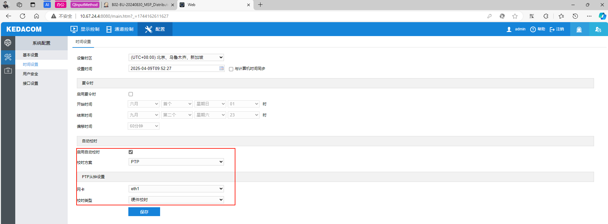
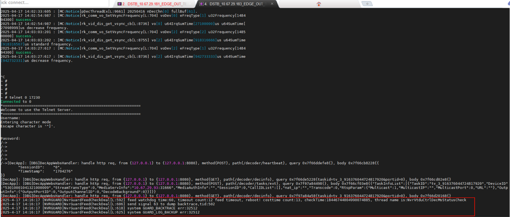
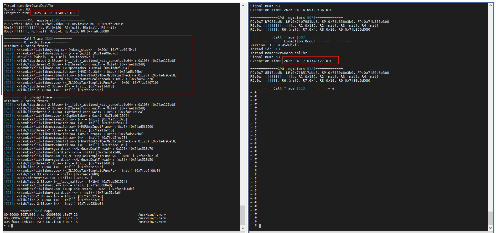
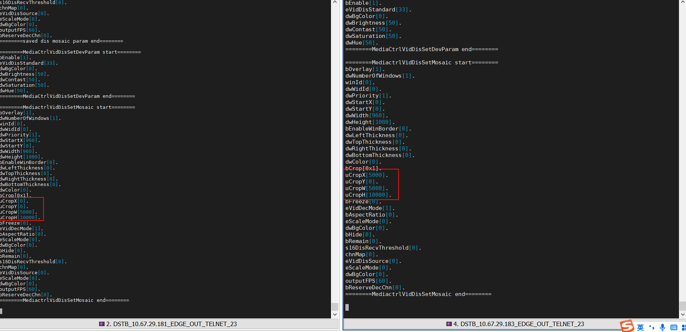

## 分布式解码输出拼接同步

### 调试命令

#### 输入节点
```shell
##############################
# 17230 查看编码器编码时间戳信息
##############################
frame_info_v 0 1
```

#### 输出节点

**1、设备开启 VO 中断触发解码模式**
	创建标志文件`touch /usr/config/mc_vsync`重启生效；
	关闭 VO 中断触发解码模式，删除`/usr/config/mc_vsync`并重启设备；

**2、设置解码模式为流程模式、默认实时模式**
```shell
# telnet 17230 设置解码模式命令 - 重启后失效
# 第五个参数表示解码模式：0=实时 1=流畅 2=均衡
# 第一个参数、第二个参数分别表示：设备的类型、设备Idx
# 第三个参数、第四个参数分别表示：起始通道号、终止通道号
nmsetdecmode 0 0 0 16 1


# 显示设备类型枚举
typedef enum {
    NVR_VID_DIS_DEV_HDMI = 0,///<高清设备hdmi
    NVR_VID_DIS_DEV_VGA,     ///<高清设备vga
    NVR_VID_DIS_DEV_CVBS,    ///<标清设备cvbs
    NVR_VID_DIS_DEV_BT1120,  ///<BT1120
    NVR_VID_DIS_DEV_VIRO,    ///<虚拟vo0
    NVR_VID_DIS_DEV_VIR1,    ///<虚拟vo1
    NVR_VID_DIS_DEV_VIR2,    ///<虚拟vo2
    NVR_VID_DIS_DEV_VIR3,    ///<质拟vo3
    NVR_VID_DIS_DEV_EXTERO,  ///<外置显示设备
    NVR_VID_DIS_DEV_DEC,     ///<实时解码设备（媒控虚拟设备，实际不做任何处理
    NVR_VID_DIS_DEV_MAX      ///<自动枚举值，不要动
} ENvrVidDisDevType;


# 配置文件配置解码模式，重启生效
# 文件里面加一句 DEC_MODE:0;
#              0=实时 1=流畅 2=均衡
touch /usr/config/default/default_cfg.ini 
```

**2、确认设备 PTP 从钟是否开启**
​后台查看 PTP 同步状态，参考 PTP 配置文档；


**3、确认设备定时开启 VO 是否正常**
```shell
/usr/log # tail -f mc_imp0.log
2025-04-09 09:57:22:401 : [MC:Notice]rk_vid_dis_start_vo_device[L:1548] VoDev[0] u64CurTime[1744163842401648]us enableTime[1744163842400962]us diff[686]us.
2025-04-09 09:57:22:519 : [MC:Notice]rk_comm_vo_SetVsyncFrequency[L:699] voDev[0] eFreqType[2] u32Frequency[148500000] success.
2025-04-09 09:57:22:519 : [MC:Notice]rk_vid_dis_get_vsync_cb[L:8683] vo[0] u64IrqSumTime[33333]us u64SumTime[33334]us standard frequency.
```
**4、确认设备 VSYNC 状态**
```shell
#####################################
# 查看 vsync 时间统计
# mc_getvsyncinfo 0[DMI1:0 HDMI2:1]
#####################################
/bin # ./ebus_tool
# mc_getvsyncinfo 0
# OK

# voDev[0] vsync info start.
bFirst[0]
u64InitTime[63667930388]us         # 从设备开机第一次VO使能开始，至最近一次VO使能 vsync 时间总和
u64CurTime[69610396130]us          # 从设备开机第一次VO使能开始，至查询时刻 vsync 时间总和
u64SumTime[5942465742]us           # 从最近一次VO使能开始，至查询时刻 vsync 时间总和
u64IrqCnt[356540]                  # vsync 相位差调整次数统计
u64IrqSumTime[5942316666]us        # vsync 相位差总调整时间
u64VsyncSumTime larger[149076]us, increase frequency.  # 查询时刻 vsync 相位差; 相位差在 1000us 以内可以认为 vsync 周期正常. 
voDev[0] vsync info end.


#########################################
# 查看
# mc_getvovdec 0
#########################################

#########################################
# 查看时间信息
# mc_gettimediff
#########################################

#########################################
# 查看解码通道当前解码视频帧时间戳 
# mc_getdecinfo 解码通道号
##########################################


#########################################
# 查看解码通道对应解码任务缓存帧数 
# mc_decchninfo 解码通道号
##########################################


########################################
# 查看RK内部VO缓存帧数
#######################################
./dumpsys vo


######################################################
# 查看裁剪参数
# 如果裁剪参数不生效，ebus_tool 查看裁剪参数是否设置到媒控  
#######################################################
mc_disparam 0 [0是hdmi1，1是HDMI2]


######################################################
# 查看 mosaic 参数
# 如果裁剪参数不生效，ebus_tool 查看裁剪参数是否设置到媒控  
#######################################################
mc_showputinfo 0 1  开启送帧日志

mc_showputinfo 0 0  关闭送帧日志
```


#### 控制节点
`/msp/mpuaps/config/config-prod.toml` 配置主控侧输出同步调节相关参数
```shell
# 分布式输出同步调试参数
[DSTBVOSyncDebug]
    MediaSwitchType = 0          #拉流方式: 0=流媒体非加密RTSP; 1=流媒体非加密WebRTC; 
                                 #        2=流媒体GB35114加密; 3=点对点RTSP组播; 4=点对点RTSP单播;
    VOEnableDelayMs = 1000       #定时启动VO延时,单位毫秒
    VOSyncCheckTimeInterval = 1  #输出同步状态检查时间间隔,单位秒; 0=关闭自动检测逻辑
    BEnableDecAdjust = false     #是否执行解码调节操作; FALSE=只获取同步状态,不调节; TRUE=调节不同步的解码任务;
    AllowableDiffTimeMs = 16     #允许最大差值,单位毫秒；设备解码时间戳误差在此范围内不触发调节;


# 分布式设备 Rtsp 拉流参数
[DSTBDevRtspAuth]
    RtspUser = "admin"
    RtspPassword = "admin123"
    RtspPort = 554
```


### 中间临时版本

> **前言：**
> 演示版本拼接屏输出同步功能，支持【统一定时开启VO + 媒控自调节VSYNC相位差 + 支持VO中断解码 +  固定缓存60帧】

1、演示前需要确保各编解码节点已与控制节点PTP时钟同步
​      参考 PTP 配置文档

2、需要保证**信号源的帧率**和**拼接屏刷新率**保持一致
- 信号源是 1080P60 | 4k60，大屏刷新率需要设置为 1080P60 或者 4K60
- 信号源是 1080P30 | 4k30，大屏刷新率需要设置为 1080P30 或者 4K30

3、确保演示环境网络状态良好，流媒体实时码流帧率正常
​      如果需要模拟网络比较差的测试场景，拼接屏画面会出现不同步现象。

4、插拔输出的 HDMI 线，会影响拼接输出效果
>      媒控做了一个详细的测试，结论如下：
>      1、拔掉 HDMI 线，或者关掉显示器，不会导致 VSYNC 时间相位差。
>      2、插上 HDMI 线，或者打开显示器，都会导致 VSYNC 时间相位差。
>            结果就是，要么缓慢能调节回来，要么不仅永远调不回来且朝着反方向在跑。
>
>      **所以建议：** 测同步的过程中，同步的几个解码板，不要拔插HDMI线，也不要开关显示器。**如果要插拔 HDMI 线或者开关显示器，要重新统一定时使能 VO。**

5、别开启 NVRSRV 的调试日志，会影响视频帧到解码器的时间，导致画面输出不同步
​     `nvrlog 0` 关闭全部日志打印


### 联调问题记录

#### 1、PTP 同步问题

##### 问题描述

查看设备 PTP 同步状态正常，但使用 date 命令查看设备时间，有误差。重启之后恢复。
控制节点向两个设备同时查设备的当前时间，去除网络误差，差值在毫秒以内，算是正常范围。

**-- 长拷确认**

主控节点和输出节点之间如果跨交换机，PTP 同步误差会不会较大(微秒级|毫秒级)。需要测试验证是否会影响拼接输出效果。


#### 2、同时使能 VO 概率不生效

##### 问题描述

设备重启，使能 VO 没生效？

**-- 没复现**


#### 3、VSYNC 调节问题
##### 实现逻辑
在PTP同步的前提下，将需要同步的解码器设置成相同的刷新率，并且保证所有设备在统一时刻使能VO; 然后每个设备都参考理想状态下的 VSYNC 值去微调自己的 VSYNC 相位差;
解码器根据设置的刷新率，和统计的中断次数，计算理论的 VSYNC 时间。以下以 1080P60 的刷新率为例(来一次中断理论上是经过了 1000/60 ms) 
1、计算理论的 VSYNC 时间和:  使能VO以来的中断次数 * (1000/60) 毫秒)
2、获取实际的 VSYNC 时间和:  当前VSYNC时间 - 使能VO时的VSYNC时间
3、VSYNC 时间差 = 理论VSYNC时间 - 实际VSYNC时间（单位ms）

解码器依据计算得到的VSYNC时间差去调节自己的VSYNC的频率；每次VSYNC可调节的频率参数，参照RK文档：
##### 问题描述
当前版本媒控业务**每次调节VSYNC的频率是固定值**，在不同设备上实际表现不一样。有的设备通过调节可以保证VSYNC误差值在 1ms 以内，有的设备无法保证。

每个设备的产生的 VSYNC 误差不一样?  导致每个设备都采用相同的频率参数调节 VSYNC 频率时表现不一样？

例如：设备产生的 VSYNC 误差超过每次调的幅度，即使一直在微调，设备整体的 VSYNC 误差还是会在慢慢变大？

需要弄清楚 VSYNC  误差产生的原理？
```shell
RK3588编解码盒子PLL的输入时钟来自于RK外挂的24M晶振，而晶振频率是有误差的，所以PLL出来的像素时钟也是有误差的。
24M晶振的时钟精度在RK3588单板上会保证在+/-10ppm，即大概+/-4ms上下。因为晶体本身个体差异性无法控制。
```
##### 临时方案
VSYNC 调的幅度统一设置大一些，确保测试环境中的设备可能保证在 1ms 以内的误差。

##### 问题二
输出(大屏分辨率)设置为以下几种参数 1080P60[1920x1080@60]、4K30[3840x2160@30]、4K60[3840x2160@60]，VSYCN 才能正常调节


#### 4、插拔输出的 HDMI 线，会导致 VSYNC 出现偏差

>      媒控做了一个详细的测试，结论如下：
>      1、拔掉 HDMI 线，或者关掉显示器，不会导致 VSYNC 时间相位差。
>      2、插上 HDMI 线，或者打开显示器，都会导致 VSYNC 时间相位差。
>            结果就是，要么缓慢能调节回来，要么不仅永远调不回来且朝着反方向在跑。
>
>      **所以建议：** 测同步的过程中，同步的几个解码板，不要拔插HDMI线，也不要开关显示器。**如果要插拔 HDMI 线或者开关显示器，要重新统一定时使能 VO。**


暂时没有修改方案，后续评估是否通过HDMI口音视频信号状态变化，触发重新使能VO逻辑。


#### 5、解码缓存问题

##### 问题描述

解码缓存数据概率会很快被消耗完，即使写死缓存 60 帧数据。

##### 问题定位

1、流媒体发送码流的实际帧率有关系，流媒体服务器换了个性能比较低设备。停止一些流媒体上的拉流任务之后，缓存和实际帧率表现正常。

2、点对点拉流，当出现帧率不一致的时候，也可能会复现这种现象

##### 方案优化

后续应用要考虑支持配置解码延时时长，媒控根据设定的延时时长，计算缓存帧数。


#### 6、概率重启

##### 问题描述

测试过程中，设备概率异常重启。





##### 问题定位

已解决。设置解码器参数阻塞了，导致网传阻塞，导致触发看门狗。


#### 7、裁剪参数概率不生效

##### 问题描述

重启设备或者重新使能VO后，源的裁剪参数实际未生效。开窗重新设置布局，裁剪参数概率不生效；



##### 问题定位

已解决


#### 8、输出同步方案验证问题

##### 问题描述

**测试场景：** 源和输出制式1080P60 + 保证 VO 同时使能 + VSYNC 误差在 1ms 以内 + 固定缓存 60 帧数据 + 流媒体实时码流稳定

###### 来一次VO中断触发一次解码

计算两个设备同一VSYNC时间，当前解码时间戳差值不固定，差值有波动不频繁。


###### 基于时间戳解码

计算两个设备同一VSYNC时间，当前解码时间戳差值不固定，差值波动比较频繁。


##### 问题定位
1、基于流媒体平台拉流，两种模式测下来，当前解码时间戳差值都会出现波动（时间戳不准确）。如何确定上层业务触发微调的条件？

2、码流经流媒体之后，视频帧时间戳不准确（被修改）
​      -- 时间戳解码的方案，编码器码流经流媒体之后，时间戳信息不符合预期。如果是接入其它IPC码流，基于时间戳计算是否也不准确？

经流媒体后，码流抖动严重，需要加更多缓存，延迟高。

流媒体修改时间戳原因：
- GB协议接入，解码时使用RTSP协议拉流，为了还原真实时间戳，时间戳需要经过转换
- 有的摄像机时间戳不对，为了纠错会修改时间戳
-- 可以更换 onvif 测试验证；后面流媒体提供个直接透传的版本，不做任何处理。
![[流媒体码流时间戳转换逻辑.png]]

3、直接点对点拉流验证，视频帧时间戳差值固定。解码业务测需要优化根据时间戳解码的逻辑，加个误差范围。 -- 已修复


##### 方案确认
基于时间戳解码的方案，码流经流媒体后，时间戳不稳定？后续能否兼容其它IPC码流？优点是可以兼容源帧率和输出刷新率不一致的应用场景。

评估产品正式版本采用哪种方式？


#### 9、先单屏开窗，再拖动至另一个子屏，输出不同步

##### 问题描述

先在一个子屏上开窗，再拖动窗口跨屏，输出不同步。

##### 问题定位

两个设备上不是同时下发的解码任务，两个设备当前解码视频帧和缓存数据不一致。需要支持调解码时间戳的版本才能兼容这种场景，或者窗口移动，统一先关闭解码任务，再开启解码任务。


#### 10、长拷 netcbb_daemon 进程概率异常

##### 问题描述

ptp4l_thread 时钟同步线程，11 信号异常。

```shell

=============== Exception Occur =================
Version: 1.0.4.45d6b7f5
Thread id: 542
Thread name:ptp4l_thread
Signal num: 11
Exception time: 2025-04-19 08:01:11 UTC

=============CPU registers[542]=============
PC:0x45d2d0, LR:0x46c800, SP:0x7f9b27e4e0, FP:0x7f9b27e4e0
R0:(nil), R1:(nil), R2:0x7f9a982b50, R3:0x3ba3, R4:0x7f9a98934c
R5:(nil), R6:(nil), R7:(nil), R8:0x10, R9:0x7f9b27d1b0

===========Call Trace [542]==========
===========0: extbl trace==========
Obtained 20 stack frames:
[542]: </bin/netcbb_daemon> (<> + (nil)) [0x44705c]
[542]: </bin/netcbb_daemon> (<> + (nil)) [0x44668c]
[542]: <invalid [vdso]> (<> + nil) [0x7f9d47b7c0]
[542]: </bin/netcbb_daemon> (<> + (nil)) [0x45d2d0]
[542]: </bin/netcbb_daemon> (<> + (nil)) [0x46c800]
[542]: </bin/netcbb_daemon> (<> + (nil)) [0x46c9bc]
[542]: </bin/netcbb_daemon> (<> + (nil)) [0x451198]
[542]: </bin/netcbb_daemon> (<> + (nil)) [0x4540c8]
[542]: </bin/netcbb_daemon> (<> + (nil)) [0x46c1c4]
[542]: </bin/netcbb_daemon> (<> + (nil)) [0x46b63c]
[542]: </bin/netcbb_daemon> (<> + (nil)) [0x454818]
[542]: </bin/netcbb_daemon> (<> + (nil)) [0x448e3c]
[542]: </bin/netcbb_daemon> (<> + (nil)) [0x44cd7c]
[542]: </bin/netcbb_daemon> (<> + (nil)) [0x44cc90]
[542]: </bin/netcbb_daemon> (<> + (nil)) [0x44cbf4]
[542]: </bin/netcbb_daemon> (<> + (nil)) [0x44cbac]
[542]: </bin/netcbb_daemon> (<> + (nil)) [0x44cb8c]
[542]: </lib/libstdc++.so.6.0.28> (<> + (nil)) [0x7f9d295a0c]
[542]: </lib/libpthread-2.33.so> (<> + (nil)) [0x7f9d3f2df8]
[542]: </lib/libc-2.33.so> (<> + (nil)) [0x7f9d05571c]

===========1: unwind trace==========
Obtained 29 stack frames:
[542]: </bin/netcbb_daemon> (<> + (nil)) [0x45d2d0]
[542]: </bin/netcbb_daemon> (<> + (nil)) [0x46c800]
[542]: </bin/netcbb_daemon> (<> + (nil)) [0x46c9bc]
[542]: </bin/netcbb_daemon> (<> + (nil)) [0x460000]
[542]: </bin/netcbb_daemon> (<> + (nil)) [0x451198]
[542]: </bin/netcbb_daemon> (<> + (nil)) [0x4540c8]
[542]: </bin/netcbb_daemon> (<> + (nil)) [0x46c1c4]
[542]: </bin/netcbb_daemon> (<> + (nil)) [0x46b63c]
[542]: </lib/libc-2.33.so> (<__poll> + 0xfc) [0x7f9d04c88c]
[542]: </bin/netcbb_daemon> (<> + (nil)) [0x454818]
[542]: </bin/netcbb_daemon> (<> + (nil)) [0x448e3c]
[542]: </bin/netcbb_daemon> (<> + (nil)) [0x448e6c]
[542]: </bin/netcbb_daemon> (<> + (nil)) [0x44cd7c]
[542]: </bin/netcbb_daemon> (<> + (nil)) [0x44cdb8]
[542]: </bin/netcbb_daemon> (<> + (nil)) [0x44cc90]
[542]: </bin/netcbb_daemon> (<> + (nil)) [0x44cbf4]
[542]: </bin/netcbb_daemon> (<> + (nil)) [0x44cbac]
[542]: </bin/netcbb_daemon> (<> + (nil)) [0x44cb8c]
[542]: </lib/libstdc++.so.6.0.28> (<> + (nil)) [0x7f9d295a0c]
[542]: </lib/libpthread-2.33.so> (<> + (nil)) [0x7f9d3f2df8]
[542]: </lib/libc-2.33.so> (<> + (nil)) [0x7f9d05571c]
[542]: </lib/libstdc++.so.6.0.28> (<> + (nil)) [0x7f9d2959f0]
[542]: </bin/netcbb_daemon> (<> + (nil)) [0x44c618]
[542]: </bin/netcbb_daemon> (<> + (nil)) [0x44c640]
[542]: </bin/netcbb_daemon> (<> + (nil)) [0x44c300]
[542]: </bin/netcbb_daemon> (<> + (nil)) [0x44bf24]
[542]: </lib/libc-2.33.so> (<> + (nil)) [0x7f9d090ce0]
[542]: </lib/libc-2.33.so> (<> + (nil)) [0x7f9d0912e0]
[542]: </lib/libc-2.33.so> (<> + (nil)) [0x7f9d091be0]

--------Process [542] Maps-------
00400000-004af000 r-xp 00000000 00:02 686                                /bin/netcbb_daemon
004bf000-004c0000 r--p 000af000 00:02 686                                /bin/netcbb_daemon
004c0000-004c7000 rw-p 000b0000 00:02 686                                /bin/netcbb_daemon
7f9cf82000-7f9d0d7000 r-xp 00000000 00:02 53                             /lib/libc-2.33.so
7f9d0d7000-7f9d0e6000 ---p 00155000 00:02 53                             /lib/libc-2.33.so
7f9d0e6000-7f9d0e9000 r--p 00154000 00:02 53                             /lib/libc-2.33.so
7f9d0e9000-7f9d0ec000 rw-p 00157000 00:02 53                             /lib/libc-2.33.so
7f9d1c4000-7f9d384000 r-xp 00000000 00:02 43                             /lib/libstdc++.so.6.0.28
7f9d384000-7f9d394000 ---p 001c0000 00:02 43                             /lib/libstdc++.so.6.0.28
7f9d394000-7f9d39f000 r--p 001c0000 00:02 43                             /lib/libstdc++.so.6.0.28
7f9d39f000-7f9d3a2000 rw-p 001cb000 00:02 43                             /lib/libstdc++.so.6.0.28
7f9d3ec000-7f9d406000 r-xp 00000000 00:02 45                             /lib/libpthread-2.33.so
7f9d406000-7f9d415000 ---p 0001a000 00:02 45                             /lib/libpthread-2.33.so
7f9d415000-7f9d416000 r--p 00019000 00:02 45                             /lib/libpthread-2.33.so
7f9d416000-7f9d417000 rw-p 0001a000 00:02 45                             /lib/libpthread-2.33.so
7f9d47b000-7f9d47c000 r-xp 00000000 00:00 0                              [vdso]
```


##### 问题定位

暂未复现


### 待优化问题汇总

待添加的接口：

1、上海业务需提供解码模式切换接口（均衡模式、流畅模式、实时模式）

2、上海业务及媒控需支持**流畅模式下，延时时间可配置**，并提供接口（默认是根据源实际帧率动态设置）

3、上海业务需上报 HDMI 接口与显示器连接断开通知（输出同步模式下，拔插HDMI线后需要重新使能 VO）

4、显控业务添加解码器**是否启用输出同步模式**接口（通过删除、创建开启同步模式标志文件实现。解码器全部默认是VO中断+依据时间错解码是否可行？）
​      -- 咨询了媒控，所有应用场景都可以默认开启输出同步模式。与普通模式差别另行说明。（对于显控的应用场景影响不大）
