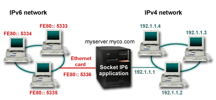
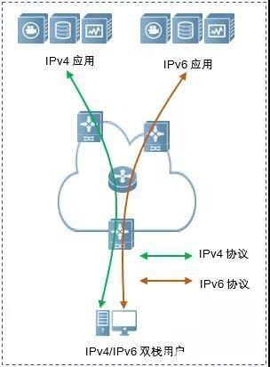
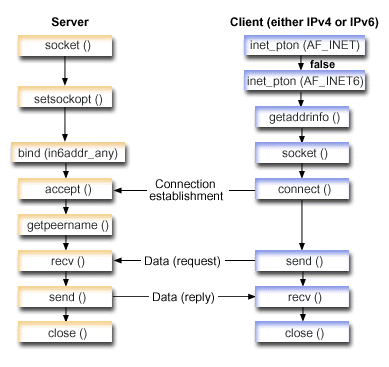
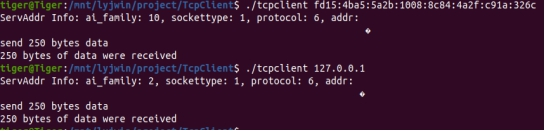
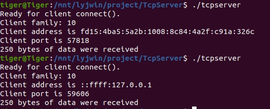
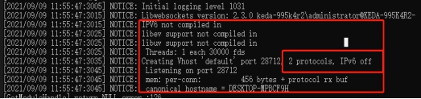
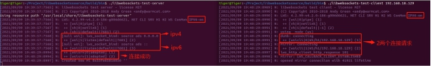
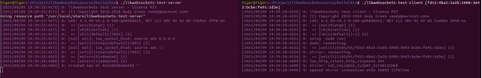
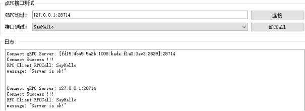

# 显控协议栈IPv4和IPv6兼容问题调研

**前言：** 2011年2月3日，全球互联网数字分配机构(IANA)正式宣布已无新的IPv4地址分配。由于我国运营商已申请到的IPv4地址资源数量有限，而随着物联网、移动互联网等应用的快速发展，将会需求大量的地址资源，这势必会对我国互联网持续稳定的发展产生影响，因此解决IPv4地址短缺的问题迫在眉睫。

　　从技术本质上讲，解决IPv4地址短缺，可以采用两种不同的技术路线，一种是多级NAT(如NAT444)技术，另一种是IPv6技术，这两种技术是完全对立的。从长远来看，NAT技术并不能从根本上解决地址短缺的问题，而且会增加网络结构的复杂性。目前，业界已达成共识：IPv6技术是当前可行的解决IP地址短缺唯一根本的解决方案。但是由于IPv6与IPv4技术不兼容，而且现网中有大量的IPv4设备和用户存在，需要在网络演进过程中解决异构网络的共存与互通问题。

## 问题分析

当前显控平台软件协议定义及各微服务实现仅支持IPv4的网络环境，为适应未来IPv6网络环境或IPv4/IPv6混合网络环景，整理了目前代码实现上存在限制的点，并预研相关解决方案。



走读显控协议代码(msplib)，目前显控协议定义及服务实现上主要存在以下缺陷。

1）IP地址信息字段多数定义为u32类型，无法传递IPv6地址

2）TCP服务实现IPv4的监听和IPv6的监听，但监听的是不同的端口。客户端连接接口分开实现了IPv4和IPv6的接口

3）Websocket服务仅支持IPv4协议，libwebsocket库编译不正确。

4）GRPC服务仅支持IPv4协议。

5）Kafka服务配置，Kafka客户端实现。


## IPv6和IPv4共存方案

### 1、IPv4/IPv6双栈



​    双栈技术，是指在终端各类应用系统、运营支撑系统和各网络节点之间同时运行IPv4和IPv6协议栈(两者具有相同的硬件平台)，从而实现分别与IPv4或IPv6节点间的信息互通。

具有IPv4/IPv6双协议栈的结点称为双栈节点，这些结点既可以收发IPv4报文，也可以收发IPv6报文。它们可以使用IPv4与IPv4结点互通，也可以直接使用IPv6与IPv6结点互通。双栈节点同时包含IPv4和IPv6的网络层，但传输层协议（如TCP和UDP）的使用仍然是单一的。


### 2、隧道技术


​    基于IPv4隧道来传送IPv6数据报文的隧道技术，是将IPv6报文封装在IPv4报文中，这样IPv6协议包就可以穿越IPv4网络进行通信。因此被孤立的IPv6网络之间可以通过IPv6的隧道技术利用现有的IPv4网络互相通信而无需对现有的IPv4网络做任何修改和升级。IPv6隧道可以配置在边界路由器之间也可以配置在边界路由器和主机之间，但是隧道两端的节点都必须既支持IPv4协议栈又支持IPv6协议栈。


### 3、地址协议转换


## 优化方案(支持IPv4/IPv6双栈)

针对协议定义存在限制的点，评估具体使用范围(是否可能跨网域)和影响范围，对可能涉及IPv6地址传输的协议进行修改。对于各服务实现上的缺陷，查阅相关资料，可对代码进行优化。

#### 1）协议定义相关

可能需要修改的点主要涉及的功能：

1、网络配置

2、网络安全

3、机箱冗余

4、堆叠和级联

5、rtsp拉流

......

#### 2）TCP协议

[Socket programming - IBM Documentation](https://www.ibm.com/docs/en/i/7.2?topic=communications-socket-programming)

参阅Socket编程相关知识，可以实现TCP服务同时监听IPv4和IPv6端口，客户端也可实现连接IPv4/IPv6服务。

##### TCP Demo基本流程



##### TCP服务端Demo

socket地址族设为：AF_INET6

bind绑定地址参数设置为：in6addr_any

```c
// TcpServer.cpp : 此文件包含 "main" 函数。程序执行将在此处开始并结束。
//

#include <stdio.h>
#include <string.h>

#ifdef WIN32
#include "io.h"
#include <winsock2.h>
#include <ws2def.h>
#include <ws2ipdef.h>
#include <ws2tcpip.h>
#else
#include <unistd.h>
#include <sys/types.h>
#include <sys/socket.h>
#include <netinet/in.h>
#include <arpa/inet.h>
#endif

#define SERVER_PORT     3005
#define BUFFER_LENGTH    250
#define FALSE              0

int main(int argc, char* argv[])
{
    int nSocketId = -1, nConnSocketId = -1;
    int nRet, on = 1, nRcdSize = BUFFER_LENGTH;
    char achBuffer[BUFFER_LENGTH];
    struct sockaddr_in6 tServAddrIN6, tClientAddrIN6;

#ifdef WIN32
    int nAddrlen = sizeof(tClientAddrIN6);
#else
    unsigned int nAddrlen = sizeof(tClientAddrIN6);
#endif // WIN32

    char achClientAddr[INET6_ADDRSTRLEN] = {0};

    do
    {
        if ((nSocketId = socket(AF_INET6, SOCK_STREAM, 0)) < 0)
        {
            perror("socket() failed");
            break;
        }

        if (setsockopt(nSocketId, SOL_SOCKET, SO_REUSEADDR,
            (char*)&on, sizeof(on)) < 0)
        {
            perror("setsockopt(SO_REUSEADDR) failed");
            break;
        }

        memset(&tServAddrIN6, 0, sizeof(tServAddrIN6));
        tServAddrIN6.sin6_family = AF_INET6;
        tServAddrIN6.sin6_port = htons(SERVER_PORT);
        tServAddrIN6.sin6_addr = in6addr_any; // INADDR_ANY IPv4, IN6ADDR_ANY_INIT IPv6
        
        if (bind(nSocketId, (struct sockaddr*)&tServAddrIN6, sizeof(tServAddrIN6)) < 0)
        {
            perror("bind() failed");
            break;
        }

        if (listen(nSocketId, 10) < 0)
        {
            perror("listen() failed");
            break;
        }

        printf("Ready for client connect().\n");
        if ((nConnSocketId = accept(nSocketId, NULL, NULL)) < 0)
        {
            perror("accept() failed");
            break;
        }
        else
        {
            // 获取客户端地址信息,ipv4是ipv4->ipv6的映射
            getpeername(nConnSocketId, (struct sockaddr*)&tClientAddrIN6, &nAddrlen);
            if (inet_ntop(AF_INET6, &tClientAddrIN6.sin6_addr, achClientAddr, sizeof(achClientAddr))) {
                printf("Client family: %d\n", tClientAddrIN6.sin6_family);
                printf("Client address is %s\n", achClientAddr);
                printf("Client port is %d\n", ntohs(tClientAddrIN6.sin6_port));
            }
        }

        if (setsockopt(nConnSocketId, SOL_SOCKET, SO_RCVLOWAT,
            (char*)&nRcdSize, sizeof(nRcdSize)) < 0)
        {
            perror("setsockopt(SO_RCVLOWAT) failed");
            break;
        }

        nRet = recv(nConnSocketId, achBuffer, sizeof(achBuffer), 0);
        if (nRet < 0)
        {
            perror("recv() failed");
            break;
        }

        printf("%d bytes of data were received\n", nRet);
        if (nRet == 0 ||
            nRet < sizeof(achBuffer))
        {
            printf("The client closed the connection before all of the\n");
            printf("data was sent\n");
            break;
        }

        nRet = send(nConnSocketId, achBuffer, sizeof(achBuffer), 0);
        if (nRet < 0)
        {
            perror("send() failed");
            break;
        }

    } while (FALSE);


#ifdef WIN32
    if (nSocketId != -1)
        _close(nSocketId);
    if (nConnSocketId != -1)
        _close(nConnSocketId);
#else
    if (nSocketId != -1)
        close(nSocketId);
    if (nConnSocketId != -1)
        close(nConnSocketId);
#endif

    return 0;
}
```

##### TCP客户端Demo

根据设置的服务端地址参数[IPv4/IPv6]，填写服务端地址参数`struct addrinfo tHintsAddr`，通过`getaddrinfo`获取服务端地址链表。

```c
/**************************************************************************/
/* This is an IPv4 or IPv6 Tcp client.                                    */
/**************************************************************************/
#include <stdio.h>
#include <string.h>

#ifdef WIN32
#include "io.h"
#include <winsock2.h>
#include <ws2def.h>
#include <ws2ipdef.h>
#include <ws2tcpip.h>
#else
#include <unistd.h>
#include <sys/types.h>
#include <sys/socket.h>
#include <netinet/in.h>
#include <arpa/inet.h>
#include <netdb.h>
#endif

#define BUFFER_LENGTH    250
#define FALSE              0
#define SERVER_NAME     "127.0.0.1"

// 通过参数指定服务的IP地址/服务名, 不指定使用默认
int main(int argc, char* argv[])
{
    int    nSocketId = -1, nRet = 0, nBytesReceived = 0;
    char   achBuffer[BUFFER_LENGTH];
    char   achServer[256]; // NETDB_MAX_HOST_NAME_LENGTH
    char   servport[] = "3005";
    struct in6_addr tServAddrin6;
    struct addrinfo tHintsAddr, * ptServAddr = NULL;

    do
    {
        if (argc > 1)
            strcpy(achServer, argv[1]);
        else
            strcpy(achServer, SERVER_NAME);

        memset(&tHintsAddr, 0x00, sizeof(tHintsAddr));
        tHintsAddr.ai_flags = AI_NUMERICSERV;
        tHintsAddr.ai_family = AF_UNSPEC;
        tHintsAddr.ai_socktype = SOCK_STREAM;

        // 监测服务地址类型是IPv4/IPv6, 尽可能的完善提示信息(tHintsAddr)
        nRet = inet_pton(AF_INET, achServer, &tServAddrin6);
        if (nRet == 1)    /* valid IPv4 text address? */
        {
            tHintsAddr.ai_family = AF_INET;
            tHintsAddr.ai_flags |= AI_NUMERICHOST;
        }
        else
        {
            nRet = inet_pton(AF_INET6, achServer, &tServAddrin6);
            if (nRet == 1) /* valid IPv6 text address? */
            {

                tHintsAddr.ai_family = AF_INET6;
                tHintsAddr.ai_flags |= AI_NUMERICHOST;
            }
        }

        // 获取服务端地址信息
        // ptServAddr是一个链表,可能得到多个服务端的地址信息
        nRet = getaddrinfo(achServer, servport, &tHintsAddr, &ptServAddr);
        if (nRet != 0)
        {
            printf("Host not found --> %s\n", gai_strerror(nRet));
            //if (nRet == EAI_SYSTEM)
                //perror("getaddrinfo() failed");
            break;
        }

        printf("ServAddr Info: ai_family: %d, sockettype: %d, protocol: %d, addr: %s\n", 
            ptServAddr->ai_family, ptServAddr->ai_socktype, ptServAddr->ai_protocol, ptServAddr->ai_addr->sa_data);
        nSocketId = socket(ptServAddr->ai_family, ptServAddr->ai_socktype, ptServAddr->ai_protocol);
        if (nSocketId < 0)
        {
            perror("socket() failed");
            break;
        }
        nRet = connect(nSocketId, ptServAddr->ai_addr, ptServAddr->ai_addrlen);
        if (nRet < 0)
        {
            // 如果连接失败,可以尝试ptServAddr链表中的其它地址信息(如果有)
            perror("connect() failed");
            break;
        }

        // 测试发送250个字符
        memset(achBuffer, 'a', sizeof(achBuffer));
        nRet = send(nSocketId, achBuffer, sizeof(achBuffer), 0);
        if (nRet < 0)
        {
            perror("send() failed");
            break;
        }
        printf("send %ld bytes data\n", sizeof(achBuffer));

        // 接收服务端回复
        while (nBytesReceived < BUFFER_LENGTH)
        {
            nRet = recv(nSocketId, &achBuffer[nBytesReceived],
                BUFFER_LENGTH - nBytesReceived, 0);
            if (nRet < 0)
            {
                perror("recv() failed");
                break;
            }
            else if (nRet == 0)
            {
                printf("The server closed the connection\n");
                break;
            }

            nBytesReceived += nRet;
        }
        printf("%d bytes of data were received\n", nBytesReceived);

    } while (FALSE);
   

#ifdef WIN32
    if (nSocketId != -1)
        _close(nSocketId);
#else
    if (nSocketId != -1)
        close(nSocketId);
#endif // WIN32

    // 需要释放getaddrinfo获取到的结果
    if (ptServAddr != NULL)
        freeaddrinfo(ptServAddr);

    return 0;
}
```

 

 

 

 

 


#### 3）Websocket协议

##### websocket版本信息

当前代码中通过设置Lws日志打印，确定是否开启IPv6：

```c
	s32 nLwsLoglv = LLL_USER | LLL_ERR | LLL_WARN | LLL_NOTICE;
	lws_set_log_level(nLwsLoglv, NULL);
```



##### 编译libwebsocket库

[libwebsocket版本变更日志](https://github.com/warmcat/libwebsockets/blob/main/changelog)

开启IPv6编译选项`cmake -DLWS_IPV6=1`

libwebsocket编译配置查看`cmake -LH ..`

```shell
PS F:\project\GitHub\libwebsocketssource\build> cmake -L ..
-- Selecting Windows SDK version 10.0.19041.0 to target Windows 10.0.19042.
-- Compiled with LWS_WITH_DIR and LWS_WITH_LEJP_CONF
SMD requires pthreads
Git commit hash: v4.2.0-186-g006d6621
DIR F:/project/GitHub/libwebsocketssource/build CMP F:/project/GitHub/libwebsocketssource/cmake
-- Configuring done
-- Generating done
-- Build files have been written to: F:/project/GitHub/libwebsocketssource/build
-- Cache values
BUILD_TESTING:BOOL=ON
CMAKE_BUILD_TYPE:STRING=Release
CMAKE_CONFIGURATION_TYPES:STRING=Debug;Release;MinSizeRel;RelWithDebInfo
CMAKE_INSTALL_PREFIX:PATH=C:/Program Files (x86)/libwebsockets
DISABLE_WERROR:BOOL=OFF
LIBWEBSOCKETS_INCLUDE_DIRS:PATH=F:/project/GitHub/libwebsocketssource/lib;F:/project/GitHub/libwebsocketssource/build
LIBWEBSOCKETS_LIBRARIES:STRING=websockets;websockets_shared
LIBWEBSOCKETS_LIBRARIES_SHARED:STRING=websockets_shared
LIBWEBSOCKETS_LIBRARIES_STATIC:STRING=websockets
LIB_EAY_DEBUG:FILEPATH=LIB_EAY_DEBUG-NOTFOUND
LIB_EAY_RELEASE:FILEPATH=LIB_EAY_RELEASE-NOTFOUND
LWS_AVOID_SIGPIPE_IGN:BOOL=OFF
LWS_CLIENT_HTTP_PROXYING:BOOL=ON
LWS_CTEST_INTERNET_AVAILABLE:BOOL=ON
LWS_EXT_PTHREAD_INCLUDE_DIR:PATH=
LWS_EXT_PTHREAD_LIBRARIES:PATH=
LWS_FALLBACK_GETHOSTBYNAME:BOOL=OFF
LWS_FOR_GITOHASHI:BOOL=OFF
LWS_HTTP_HEADERS_ALL:BOOL=OFF
LWS_INSTALL_BIN_DIR:PATH=bin
LWS_INSTALL_CMAKE_DIR:PATH=cmake
LWS_INSTALL_EXAMPLES_DIR:PATH=bin
LWS_INSTALL_INCLUDE_DIR:PATH=include
LWS_INSTALL_LIB_DIR:PATH=lib
LWS_IPV6:BOOL=ON
LWS_LIBMOUNT_INCLUDE_DIRS:PATH=
LWS_LIBMOUNT_LIBRARIES:PATH=
LWS_LINK_TESTAPPS_DYNAMIC:BOOL=OFF
LWS_LOGGING_BITFIELD_CLEAR:STRING=0
LWS_LOGGING_BITFIELD_SET:STRING=0
LWS_LOGS_TIMESTAMP:BOOL=ON
LWS_LOG_TAG_LIFECYCLE:BOOL=ON
LWS_ONLY_SSPC:BOOL=OFF
LWS_OPENSSL_CLIENT_CERTS:PATH=../share
LWS_OPENSSL_INCLUDE_DIRS:PATH=
LWS_OPENSSL_LIBRARIES:PATH=
LWS_PLAT_ANDROID:BOOL=OFF
LWS_PLAT_BAREMETAL:BOOL=OFF
LWS_PLAT_FREERTOS:BOOL=OFF
LWS_PLAT_OPTEE:BOOL=OFF
LWS_REPRODUCIBLE:BOOL=ON
LWS_ROLE_DBUS:BOOL=OFF
LWS_ROLE_H1:BOOL=ON
LWS_ROLE_MQTT:BOOL=OFF
LWS_ROLE_RAW_FILE:BOOL=ON
LWS_ROLE_RAW_PROXY:BOOL=OFF
LWS_ROLE_WS:BOOL=ON
LWS_SQLITE3_INCLUDE_DIRS:PATH=
LWS_SQLITE3_LIBRARIES:PATH=
LWS_SSL_CLIENT_USE_OS_CA_CERTS:BOOL=ON
LWS_SSL_SERVER_WITH_ECDH_CERT:BOOL=OFF
LWS_STATIC_PIC:BOOL=OFF
LWS_SUPPRESS_DEPRECATED_API_WARNINGS:BOOL=ON
LWS_TLS_LOG_PLAINTEXT_RX:BOOL=OFF
LWS_TLS_LOG_PLAINTEXT_TX:BOOL=OFF
LWS_UNIX_SOCK:BOOL=ON
LWS_WITHOUT_BUILTIN_GETIFADDRS:BOOL=OFF
LWS_WITHOUT_BUILTIN_SHA1:BOOL=OFF
LWS_WITHOUT_CLIENT:BOOL=OFF
LWS_WITHOUT_DAEMONIZE:BOOL=ON
LWS_WITHOUT_EVENTFD:BOOL=OFF
LWS_WITHOUT_EXTENSIONS:BOOL=ON
LWS_WITHOUT_SERVER:BOOL=OFF
LWS_WITHOUT_TESTAPPS:BOOL=OFF
LWS_WITHOUT_TEST_CLIENT:BOOL=OFF
LWS_WITHOUT_TEST_PING:BOOL=OFF
LWS_WITHOUT_TEST_SERVER:BOOL=OFF
LWS_WITHOUT_TEST_SERVER_EXTPOLL:BOOL=OFF
LWS_WITH_ACCESS_LOG:BOOL=OFF
LWS_WITH_ACME:BOOL=OFF
LWS_WITH_ALSA:BOOL=OFF
LWS_WITH_ASAN:BOOL=OFF
LWS_WITH_BORINGSSL:BOOL=OFF
LWS_WITH_BUNDLED_ZLIB:BOOL=ON
LWS_WITH_CACHE_NSCOOKIEJAR:BOOL=ON
LWS_WITH_CBOR:BOOL=OFF
LWS_WITH_CBOR_FLOAT:BOOL=ON
LWS_WITH_CGI:BOOL=OFF
LWS_WITH_CONMON:BOOL=ON
LWS_WITH_COSE:BOOL=OFF
LWS_WITH_CUSTOM_HEADERS:BOOL=ON
LWS_WITH_CYASSL:BOOL=OFF
LWS_WITH_DIR:BOOL=ON
LWS_WITH_DISKCACHE:BOOL=OFF
LWS_WITH_DISTRO_RECOMMENDED:BOOL=OFF
LWS_WITH_DRIVERS:BOOL=OFF
LWS_WITH_ESP32:BOOL=OFF
LWS_WITH_EVLIB_PLUGINS:BOOL=OFF
LWS_WITH_EXPORT_LWSTARGETS:BOOL=ON
LWS_WITH_EXTERNAL_POLL:BOOL=OFF
LWS_WITH_FANALYZER:BOOL=OFF
LWS_WITH_FILE_OPS:BOOL=ON
LWS_WITH_FSMOUNT:BOOL=OFF
LWS_WITH_FTS:BOOL=OFF
LWS_WITH_GCOV:BOOL=OFF
LWS_WITH_GENCRYPTO:BOOL=OFF
LWS_WITH_GLIB:BOOL=OFF
LWS_WITH_GTK:BOOL=OFF
LWS_WITH_HTTP2:BOOL=ON
LWS_WITH_HTTP_BASIC_AUTH:BOOL=ON
LWS_WITH_HTTP_BROTLI:BOOL=OFF
LWS_WITH_HTTP_PROXY:BOOL=OFF
LWS_WITH_HTTP_STREAM_COMPRESSION:BOOL=OFF
LWS_WITH_HTTP_UNCOMMON_HEADERS:BOOL=ON
LWS_WITH_HUBBUB:BOOL=OFF
LWS_WITH_JOSE:BOOL=OFF
LWS_WITH_LEJP:BOOL=ON
LWS_WITH_LEJP_CONF:BOOL=ON
LWS_WITH_LIBEV:BOOL=OFF
LWS_WITH_LIBEVENT:BOOL=OFF
LWS_WITH_LIBUV:BOOL=OFF
LWS_WITH_LWSAC:BOOL=ON
LWS_WITH_LWSWS:BOOL=OFF
LWS_WITH_LWS_DSH:BOOL=OFF
LWS_WITH_MBEDTLS:BOOL=OFF
LWS_WITH_MINIMAL_EXAMPLES:BOOL=OFF
LWS_WITH_MINIZ:BOOL=OFF
LWS_WITH_NETWORK:BOOL=ON
LWS_WITH_NO_LOGS:BOOL=OFF
LWS_WITH_PEER_LIMITS:BOOL=OFF
LWS_WITH_PLUGINS:BOOL=OFF
LWS_WITH_PLUGINS_API:BOOL=OFF
LWS_WITH_PLUGINS_BUILTIN:BOOL=OFF
LWS_WITH_RANGES:BOOL=OFF
LWS_WITH_SDEVENT:BOOL=OFF
LWS_WITH_SECURE_STREAMS:BOOL=OFF
LWS_WITH_SECURE_STREAMS_AUTH_SIGV4:BOOL=OFF
LWS_WITH_SECURE_STREAMS_BUFFER_DUMP:BOOL=OFF
LWS_WITH_SECURE_STREAMS_CPP:BOOL=OFF
LWS_WITH_SECURE_STREAMS_PROXY_API:BOOL=OFF
LWS_WITH_SECURE_STREAMS_STATIC_POLICY_ONLY:BOOL=OFF
LWS_WITH_SECURE_STREAMS_SYS_AUTH_API_AMAZON_COM:BOOL=OFF
LWS_WITH_SELFTESTS:BOOL=OFF
LWS_WITH_SEQUENCER:BOOL=OFF
LWS_WITH_SHARED:BOOL=ON
LWS_WITH_SOCKS5:BOOL=OFF
LWS_WITH_SPAWN:BOOL=OFF
LWS_WITH_SQLITE3:BOOL=OFF
LWS_WITH_SSL:BOOL=OFF
LWS_WITH_SS_DIRECT_PROTOCOL_STR:BOOL=OFF
LWS_WITH_STATIC:BOOL=ON
LWS_WITH_STRUCT_JSON:BOOL=OFF
LWS_WITH_STRUCT_SQLITE3:BOOL=OFF
LWS_WITH_SUL_DEBUGGING:BOOL=OFF
LWS_WITH_SYS_ASYNC_DNS:BOOL=OFF
LWS_WITH_SYS_DHCP_CLIENT:BOOL=OFF
LWS_WITH_SYS_FAULT_INJECTION:BOOL=OFF
LWS_WITH_SYS_METRICS:BOOL=OFF
LWS_WITH_SYS_NTPCLIENT:BOOL=OFF
LWS_WITH_SYS_SMD:BOOL=ON
LWS_WITH_SYS_STATE:BOOL=ON
LWS_WITH_THREADPOOL:BOOL=OFF
LWS_WITH_TLS_JIT_TRUST:BOOL=OFF
LWS_WITH_TLS_SESSIONS:BOOL=ON
LWS_WITH_UDP:BOOL=ON
LWS_WITH_ULOOP:BOOL=OFF
LWS_WITH_WOLFSSL:BOOL=OFF
LWS_WITH_ZIP_FOPS:BOOL=OFF
LWS_WITH_ZLIB:BOOL=OFF
LWS_WOLFSSL_INCLUDE_DIRS:PATH=
LWS_WOLFSSL_LIBRARIES:PATH=
LWS_ZLIB_INCLUDE_DIRS:PATH=
LWS_ZLIB_LIBRARIES:PATH=
OPENSSL_INCLUDE_DIR:PATH=C:/Strawberry/c/include
SSL_EAY_DEBUG:FILEPATH=SSL_EAY_DEBUG-NOTFOUND
SSL_EAY_RELEASE:FILEPATH=SSL_EAY_RELEASE-NOTFOUND
```

##### IPV4/IPv6测试

编译完成之后，测试监听连接

 

 

 


####  4）GRPC协议

##### GRPC服务监听地址设置

GRPC库编译没有IPv6编译选项，默认支持。gRPC服务监听地址设置为: `[::]:<port>`格式即可。

```c
// 启动监听部分代码
void CGrpcServer::Run()
{
	CMspGrpcService tService;
	grpc::ServerBuilder tBuilder;
    
    //同时监听IPv4和IPv6端口
	tBuilder.AddListeningPort("[::]:28714", grpc::InsecureServerCredentials());
	tBuilder.RegisterService(&tService);
	m_ptrGrpcServer = tBuilder.BuildAndStart();

	MspGRPCDebug("Server listening on %s\n", m_strServerAddr.c_str());
	m_ptrGrpcServer->Wait();//阻塞

	MspGRPCDebug("Server is stoppind\n");
	m_bRunnig = false;
}
```

##### GRPC监听测试



#  

 GRPC编译参数查看`cmake -L`

```shell
root@ubuntu-Vostro-3268:/mnt/lyjwin/GitHub/grpc/grpc/cmake/build# cmake -L ../..
-- 
-- 3.14.0.0
CMake Deprecation Warning at third_party/zlib/CMakeLists.txt:1 (cmake_minimum_required):
  Compatibility with CMake < 2.8.12 will be removed from a future version of
  CMake.

  Update the VERSION argument <min> value or use a ...<max> suffix to tell
  CMake that the project does not need compatibility with older versions.


-- Configuring done
-- Generating done
-- Build files have been written to: /mnt/lyjwin/GitHub/grpc/grpc/cmake/build
-- Cache values
ABSL_ENABLE_INSTALL:BOOL=OFF
ABSL_LOCAL_GOOGLETEST_DIR:PATH=/usr/src/googletest
ABSL_RUN_TESTS:BOOL=OFF
ABSL_USE_EXTERNAL_GOOGLETEST:BOOL=OFF
ABSL_USE_GOOGLETEST_HEAD:BOOL=OFF
AMD64:BOOL=OFF
ASM686:BOOL=OFF
BUILD_SHARED_LIBS:BOOL=OFF
BUILD_TESTING:BOOL=OFF
CARES_BUILD_TESTS:BOOL=OFF
CARES_BUILD_TOOLS:BOOL=ON
CARES_INSTALL:BOOL=ON
CARES_SHARED:BOOL=OFF
CARES_STATIC:BOOL=ON
CARES_STATIC_PIC:BOOL=OFF
CMAKE_BACKWARDS_COMPATIBILITY:STRING=2.4
CMAKE_BUILD_TYPE:STRING=
CMAKE_INSTALL_PREFIX:PATH=/mnt/lyjwin/GitHub/grpc/grpc/cmake/build/InstallDir
EXECUTABLE_OUTPUT_PATH:PATH=
INSTALL_BIN_DIR:PATH=/mnt/lyjwin/GitHub/grpc/grpc/cmake/build/InstallDir/bin
INSTALL_INC_DIR:PATH=/mnt/lyjwin/GitHub/grpc/grpc/cmake/build/InstallDir/include
INSTALL_LIB_DIR:PATH=/mnt/lyjwin/GitHub/grpc/grpc/cmake/build/InstallDir/lib
INSTALL_MAN_DIR:PATH=/mnt/lyjwin/GitHub/grpc/grpc/cmake/build/InstallDir/share/man
INSTALL_PKGCONFIG_DIR:PATH=/mnt/lyjwin/GitHub/grpc/grpc/cmake/build/InstallDir/share/pkgconfig
LIBRARY_OUTPUT_PATH:PATH=
LIBRT:FILEPATH=/usr/lib/x86_64-linux-gnu/librt.so
RE2_BUILD_TESTING:BOOL=ON
USEPCRE:BOOL=OFF
gRPC_ABSL_PROVIDER:STRING=module
gRPC_BACKWARDS_COMPATIBILITY_MODE:BOOL=OFF
gRPC_BUILD_CODEGEN:BOOL=ON
gRPC_BUILD_CSHARP_EXT:BOOL=ON
gRPC_BUILD_GRPC_CPP_PLUGIN:BOOL=ON
gRPC_BUILD_GRPC_CSHARP_PLUGIN:BOOL=ON
gRPC_BUILD_GRPC_NODE_PLUGIN:BOOL=ON
gRPC_BUILD_GRPC_OBJECTIVE_C_PLUGIN:BOOL=ON
gRPC_BUILD_GRPC_PHP_PLUGIN:BOOL=ON
gRPC_BUILD_GRPC_PYTHON_PLUGIN:BOOL=ON
gRPC_BUILD_GRPC_RUBY_PLUGIN:BOOL=ON
gRPC_BUILD_TESTS:BOOL=OFF
gRPC_CARES_PROVIDER:STRING=module
gRPC_INSTALL:BOOL=ON
gRPC_INSTALL_BINDIR:STRING=bin
gRPC_INSTALL_CMAKEDIR:STRING=lib/cmake/grpc
gRPC_INSTALL_INCLUDEDIR:STRING=include
gRPC_INSTALL_LIBDIR:STRING=lib
gRPC_INSTALL_SHAREDIR:STRING=share/grpc
gRPC_PROTOBUF_PACKAGE_TYPE:STRING=
gRPC_PROTOBUF_PROVIDER:STRING=module
gRPC_RE2_PROVIDER:STRING=module
gRPC_SSL_PROVIDER:STRING=module
gRPC_USE_PROTO_LITE:BOOL=OFF
gRPC_ZLIB_PROVIDER:STRING=module
protobuf_BUILD_CONFORMANCE:BOOL=OFF
protobuf_BUILD_EXAMPLES:BOOL=OFF
protobuf_BUILD_LIBPROTOC:BOOL=OFF
protobuf_BUILD_PROTOC_BINARIES:BOOL=ON
protobuf_BUILD_SHARED_LIBS:BOOL=OFF
protobuf_BUILD_TESTS:BOOL=OFF
protobuf_INSTALL_EXAMPLES:BOOL=OFF
protobuf_MSVC_STATIC_RUNTIME:BOOL=OFF
protobuf_WITH_ZLIB:BOOL=OFF
```


#### 5）Kafka配置
