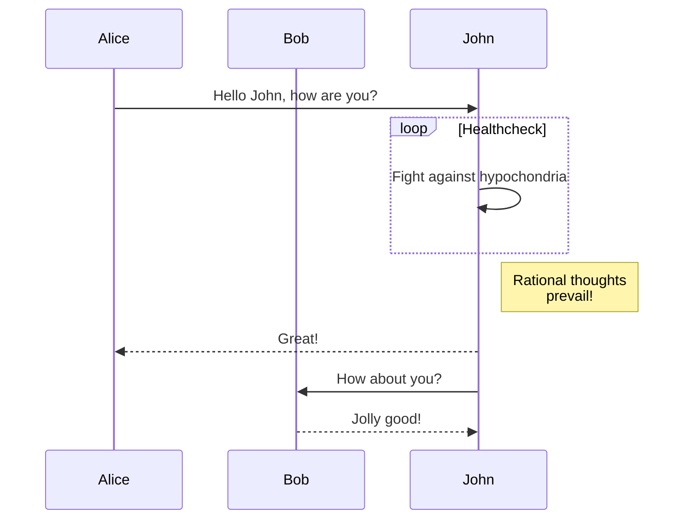

## Markdown 写作技巧

> 前言：
> 本文是我在使用 Markdown 的过程中，遇到种种问题的解法。
>
> - 不定期更新，更新内容也不定，所以建议作为工具手册查看，遇到问题的时候可以用来参考。
> - 由于 Markdown 并没有规范一说，也就导致了各个公司的 Markdown 多多少少都会有一点定制的内容。本文将尽量避免这些东西，做到足够的通用性。

## 目录
[[TOC]]

<div STYLE="page-break-after: always;"></div>
导出PDF格式 94 行为一页

### 0.标题居中

<h1 align = "center" > H1标题居中 </h1>
<h2 align = "center" > H2标题居中 </h2>
<center> 文本居中 </center>


### 0.表格居中，设置固定列宽

<!-- HTML设置表格居中显示的风格,设置固定列宽 -->

<style>
.tableDocVer 
{
  width: 50%;
  display: table;
  margin-left: auto;
  margin-right: auto;
}
td, th {
    width: 33.333%;
}
</style>


<p align="center"><font face="黑体" size=2.>表1 示例表格</font></p>

<div class="tableDocVer";style="width:50px;">

| 序号 | 内容 |         描述         |
| :-----: | :-----: | :------------------: |
|  1   |  l   | 大写字母L的小写字母l |
|  2   |  I   |      大写字母I       |
|  3   |  1   |        数字1         |

</div>

|<div style="width:50px;color:#f00;font-weight:normal;font-style:italic;">字段1</div>


### 1.表格中文本竖线 `|` 到底要怎么插入

如果你有尝试过在 Markdown 的表格中写过代码示例的话，应该就会遇到过无法插入竖线 `|` 的情况。尽管软件并不会提示你有错误，但是其实你所期望的竖线 `|` ，并没有成功地出现在表格之中，而是像下面这样，自动与后面的 `|` 配对成为了表格组成。


**解决方法1**：使用转义符`\`，如图所示：


**解决方法2**：
使用 Vertical bar (竖线) 的HTML 实体 `|` 代替 `|` ，注意这里面的 `;` 不要漏掉。


### 2. 如何高亮一个反引号 ```

但凡是用过 Markdown 的同学都应该知道呀，反引号 ``` 在 Markdown 中是「行内代码」的「标志符」，正常情况下都是成对存在。而三个反引号是「代码块」的「标志符」，所以你没办法单独高亮某一个反引号 ```（醒醒，没人会想要这么做）。

那么到底有没有办法高亮一个反引号呢？答案是有的。

**解决方法1**：
使用 `<code>` `</code>` 对来代替「反引号对」，如下图


> 注意，在大多数的场景下都可以，但是存在例外，比如少数派的编辑器。

**解决方法2**：
使用「双反引号」```` 代替原先的「单反引号」```，如图


### 3. 如何高亮三个反引号 `````

理论上更高亮一个反引号是相同的，但是这里强烈推荐使用双反引号 ````，以防止出现不可预料的情况。如图


### 4. 使用锚点 `anchor` 来进行页面跳转

许多 Markdown 编辑器都是使用 Chromium 内核进行开发的，这意味着我们可以使用 `html` 混合 `markdown` 写法，来进行页内（或者页面间）的导航。

直接上例子：


使用 `<a href="#目的地的名字属性"> 提示字符1 </a>` 放置超链接的入口，使用`<a name="目的地的名字"> 提示字符2</a>` 放置链接的终点。最终便可以实现点击上文的「这里」，就会自动跳转到 FlatButton 定义前面的效果。其中提示字符并非必选项，可以省略。

> 注意：大部分支持 Markdown 的网站，及 Markdown 编辑器均支持这种写法，但存在例外。


### 5. 如何换行

可能大多数新手都没注意到，在 Markdown 中的换行，不同于以往普通文本编辑敲下 Enter 就可以了，而是需要使用 `Space Space Enter` 两个 `空格` 加 `回车` 才可以换行。

> 注意：这是 Markdown 的通用语法，但是可能部分编辑器会自动排版，即使单独用一个 Enter 也能够换行。这里推荐使用 `Space Space Enter` 的写法，确保排版不会出错。


### 6. 文章目录自动生成

这在 Markdown 中是一个非常便捷的操作，只需要在文章需要插入目录的地方（一般为开头），写下 [TOC] 即可自动生成。


### 7. PDF 转换的强制分页

```shell
# 添加下面的Html代码，导出PDF时可强制分页
<div STYLE="page-break-after: always;"></div>
```


### 8.Typora-flow 绘制简单的流程图
#### 竖向流程图
```flow
st=>start: 开始框
op=>operation: 处理框
cond=>condition: 判断框
sub1=>subroutine: 子流程
io=>inputoutput: 输入输出框
e=>end: 结束框

st->op->cond
cond(yes)->io->e
cond(no)->sub1(right)->op
```

#### 横向流程图
```flow
st=>start: 开始框
op=>operation: 处理框
cond=>condition: 判断框
sub1=>subroutine: 子流程
io=>inputoutput: 输入输出框
e=>end: 结束框

st(right)->op(right)->cond
cond(yes)->io(bottom)->e
cond(no)->sub1(right)->op
```


### 9. Typora-sequence 绘制简单的UML时序图

```sequence
participant Alice
participant Bob
participant John

Note over Alice,Bob: Note over Alice,Bob!
Alice->>John: Hello John, how are you?
Note left of Bob: Note left of Bob!
Note right of John: Note right of John!
John-->>Alice: Great!
John->>Bob: How about you?
Bob-->>John: Jolly good!
```


### 10.Typora-mermaid 绘图插件

#### [Flowcharts Syntax](https://mermaid.js.org/syntax/flowchart.html?id=flowcharts-basic-syntax)


#### [Sequence diagram](https://mermaid.js.org/syntax/sequenceDiagram.html)



-- 未完待续--
updated 24.02.22


## 参考文档

[基本撰写和格式语法 - GitHub 文档](https://docs.github.com/zh/get-started/writing-on-github/getting-started-with-writing-and-formatting-on-github/basic-writing-and-formatting-syntax)

[GitHub Flavored Markdown Spec](https://github.github.com/gfm/)

[MarkDown介绍-MarkDown入门-CSDNCS入门技能树](https://edu.csdn.net/skill/gml/gml-e67e64c1c880432ab6bc1b0452124ec0?a=gml-e5b1eb56008b451699a9e7e6d941c8ca)

[About Mermaid | Mermaid](https://mermaid.js.org/intro/)

[Online FlowChart & Diagrams Editor - Mermaid Live Editor](https://mermaid.live/edit#pako:eNpVjk2Lg0AMhv9KyGkL9Q94WGh1t5fCFurN6SFo7AztfDBGpKj_fcd62c0pvM_zhkzY-JYxx-7px0ZTFKhK5SDNoS50NL1Y6m-QZZ_ziQWsd_ya4fhx8tBrH4Jx993mH1cJium8agyijXssGyre_R_HM5T1mYL4cPtLqtHP8FWbi07n_xMdObW-647yjrKGIhQU3wru0XK0ZNr0_rQmCkWzZYV5WlvuaHiKQuWWpNIg_vpyDeYSB97jEFoSLg3dI9ktXH4B_cJWqw)

[使用Typora画 流程图、时序图、顺序图、甘特图、等图详解-蒲公英云 (dandelioncloud.cn)](https://www.dandelioncloud.cn/article/details/1578950641525682178)

[Typora画流程图、时序图、顺序图、甘特图 - CSDN博客](https://blog.csdn.net/u010164190/article/details/128190915)