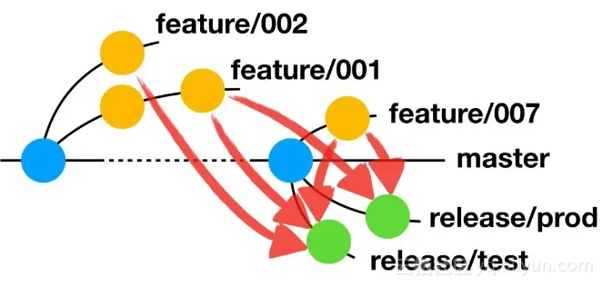
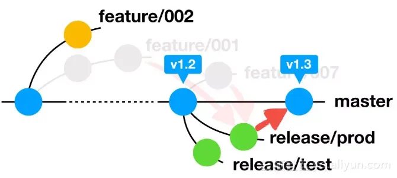
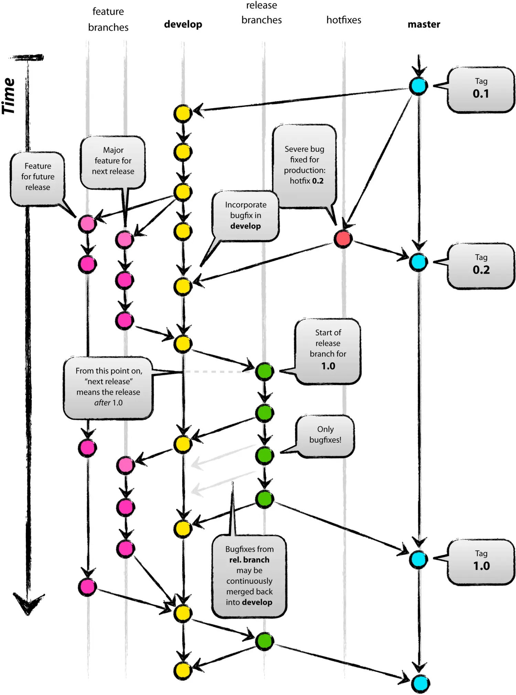
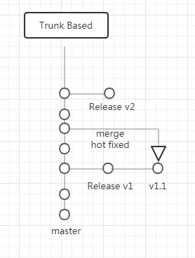
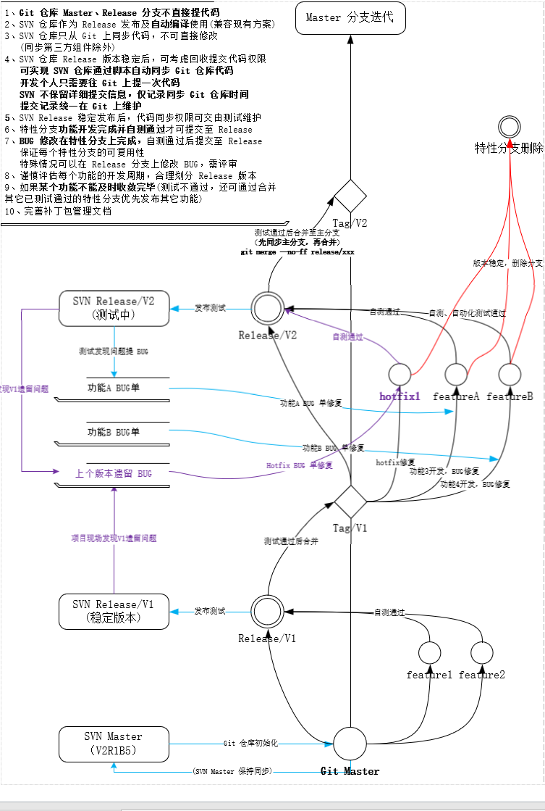
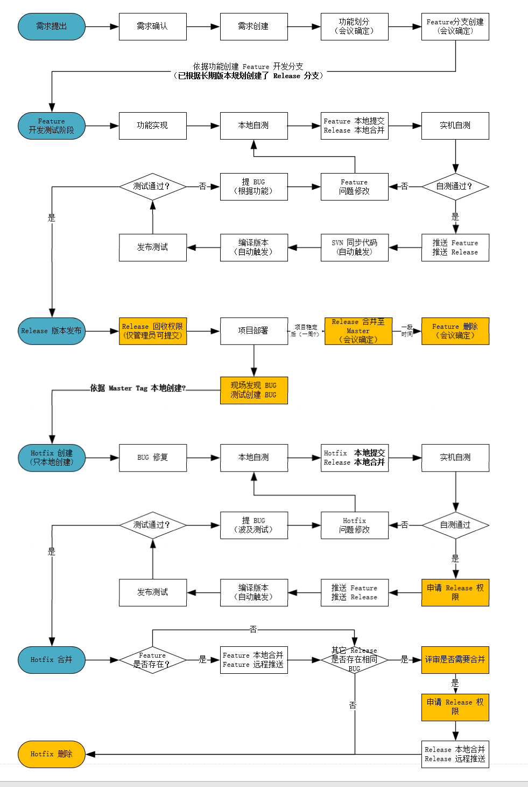

# Git 仓库分支管理

**目录**

[TOC]

------

## 一、Git 仓库分支管理模型

### AoneFlow

#### 分支类型及基本规则

在 AoneFlow 上你能看到许多其他分支模式的影子。它基本上兼顾了 TrunkBased 的“易于持续集成”和 GitFlow 的“易于管理需求”特点，同时规避掉 GitFlow 的那些繁文缛节。

看一下具体套路。**AoneFlow 只使用三种分支类型：主干分支、特性分支、发布分支，以及三条基本规则。**

**规则一，开始工作前，从主干创建特性分支。**

AoneFlow 的特性分支基本借鉴 GitFlow，没有什么特别之处。每当开始一件新的工作项（比如新的功能或是待解决的问题）的时候，从代表最新已发布版本的主干上**创建一个**通常以 **feature/xxx** 命名的特性分支，然后在这个分支上提交代码修改。也就是说，**每个工作项（可以是一个人完成，或是多个人协作完成）对应一个特性分支，所有的修改都不允许直接提交到主干。**


**特性分支不止承担了新功能，也是待解决问题的分支**。实际应用，为了避免歧义，可以将**新功能**以 `feature/`为前缀，**待解决问题**以 `hotfix/`为前缀，除了名称外，其他都按照规则一执行。

**规则二，通过合并特性分支，形成发布分支。**

AoneFlow 的发布分支设计十分巧妙，可谓整个体系的精髓。GitFlow 先将已经完成的特性分支合并回公共主线（即开发分支），然后从公共主线拉出发布分支。TrunkBased 同样是等所有需要的特性都在主干分支上开发完成，然后从主干分支的特定位置拉出发布分支。**而 AoneFlow 的思路是，从主干上拉出一条新分支，将所有本次要集成或发布的特性分支依次合并过去，从而得到发布分支。**发布分支通常以 **release/xxx** 命名。

这条规则很简单，不过实际的玩法就相当丰富了。



首先，**发布分支的用途可以很灵活**。基础玩法是将每条发布分支与具体的环境相对应，比如 release/test 分支对应部署测试环境，release/prod 分支对应线上正式环境等等，并与流水线工具相结合，串联各个环境上的代码质量扫描和自动化测试关卡，将产出的部署包直接发布到相应环境上。进阶点的玩法是将一个发布分支对应多个环境，比如把灰度发布和正式发布串在一起，中间加上人工验收的步骤。高级的玩法呢，要是按迭代计划来关联特性分支，创建出以迭代演进的固定发布分支，再把一系列环境都串在这个发布分支的流水线上，就有点经典持续集成流水线的味道了。再或者做一个将所有特性分支都关联在一起的发布分支，专门用于对所有提交做集成测试，就玩出了 TrunkBased 的效果。当然，这些花哨的高级玩法是我臆想的，阿里的发布分支一般都还是比较中规中矩。

其次，**发布分支的特性组成是动态的，调整起来特别容易**。在一些市场瞬息万变的互联网企业，以及采用“敏捷运作”的乙方企业经常会遇到这种情况，已经完成就等待上线的需求，随时可能由于市场策略调整或者甲方的一个临时决定，其中某个功能忽然要求延迟发布或者干脆不要了。再或者是某个特性在上线前发现存在严重的开发问题，需要排除。按往常的做法，这时候就要来手工“剔代码”了，将已经合并到开发分支或者主干分支的相关提交一个个剔除出去，做过的同学都知道很麻烦。在 AoneFlow 的模式下，重建发布分支只是分分钟的事，将原本的发布分支删掉，从主干拉出新的同名发布分支，再把需要保留的各特性分支合并过来就搞定。这一系列动作能够在很大程度上实现自动化，而且不会在仓库留下一堆剔除代码的记录，干净无污染。

此外，**发布分支之间是松耦合的**，这样就可以有多个集成环境分别进行不同的特性组合的集成测试，也能方便的管理各个特性进入到不同环境上部署的时机。松耦合并不代表没有相关性，由于测试环境、集成环境、预发布环境、灰度环境和线上正式环境等发布流程通常是顺序进行的，在流程上可以要求只有通过前一环境验证的特性，才能传递到下一个环境做部署，形成漏斗形的特性发布流。阿里有统一平台来自动化完成特性组合在发布分支间的迁移，在下面讲工具的部分里会再介绍。

**规则三，发布到线上正式环境后，合并相应的发布分支到主干，在主干添加标签，同时删除该发布分支关联的特性分支。**

当一条发布分支上的流水线完成了一次线上正式环境的部署，就意味着相应的功能真正的发布了，**此时应该将这条发布分支合并到主干**。**为了避免在代码仓库里堆积大量历史上的特性分支，还应该清理掉已经上线部分特性分支。**与 GitFlow 相似，主干分支上的最新版本始终与线上版本一致，如果要回溯历史版本，只需在主干分支上找到相应的版本标签即可。



除了基本规则，还有一些实际操作中不成文的技巧。**比如上线后的 Hotfix，正常的处理方法应该是，创建一条新的发布分支，对应线上环境（相当于 Hotfix 分支），同时为这个分支创建临时流水线，以保障必要的发布前检查和冒烟测试能够自动执行。**但其实还有一种简便方法是，将线上正式环境对应的发布分支上关联的特性分支全部清退掉，在这个发布分支上直接进行修改，改完利用现成的流水线自动发布。**如果非得修一个历史版本的 Bug 怎么办呢？那就老老实实的在主干分支找到版本标签位置，然后从那个位置创建 Hotfix 分支吧，**不过由于阿里的产品大多是线上 SaaS 业务，这样的场景并不多见。

正是这些简单的规则，组成了 AoneFlow 独树一帜的核心套路。

AoneFlow 中每一个看似简单的步骤都并非凭空臆造，而是经历大量产品团队反复磨砺后积累下来的经验。接下来，我会说说 AoneFlow 的技术门槛以及阿里内部的应对之道。

### GitFlow

Git Flow 在**本地**和 master 之间引入多个分支，以做缓冲，集成和测试，保证 master 尽量干净。在这个方案下，分为以下几条分支：Master 主分支，Release 发布分支，Develop 集成分支，Feature 开发分支，Hot Fixes 线上 bug 分支。由于这个方案的复杂度较高，受到了很多批判，主要的点是说 **long lived branch considered harmful** 。

#### 主要过程

- 1 初始环境。在 master 上打 tag-0.1。

- 2 初始环境。从 master 拉出 develop 分支。

- 3 开发新功能。在 develop 分支上拉出 feature 分支，可能会有多个。

- 4 提交新功能。将完成单元测试的 feature 合并回 develop。

- 5 集成测试。在 develop 上可能存在多个 feature 集成测试的 bug，直接在 develop 上改。

- 6 准备发布。当 develop 达到发布计划的要求时，就从 develop 提交到 release。

- 7 发布测试。在 release 上的 bug，直接在 release 上改，改完 merge 回 develop。

- 8 部署上线。从 release 提交到 master，并打上新 tag-0.2，并从 master 部署上线。

- 9 线上bug。如果不是紧急 bug，还是可以按常规 feature 去做。**如果是紧急 bug，就从 master 拉出 hotfixes，在 hotfixes 改和测，然后提交到 master**，merge 到 develop。



#### 关键点

1. 引入了 Feature 分支。新特性完全在分支上开发，避免了对 master 的污染，并且多个新特性同时开发，不会相互影响。

2. Feature 分支的长期存在，带来很多麻烦。Feature 的颗粒，需要反复考虑。如果颗粒较大，比如到模块级，将导致 Feature 分支长期存在，带来的问题就是合并时的大量冲突，以及无法在 feature 完全完成前尽早集成。如果颗粒较小，又无法做到不污染主要分支。

3. 对项目或产品计划要求较高 。产品计划里要做好各个 Feature 的编号和管理，这样才能更好的管理 develop 和 release 分支，使发布内容和过程可视度更高。比如有时 Feature 即使做完了也暂时不提交到 Develop。

4. 持续集成的思路，在这个方案下是无效的。

5. 需要团队的每个人，都理解每一个提交点合并点的意义。应该从谁提交到谁，从谁 merge 到谁。而团队的能力总是分层的，总会有人不太理解，这时就会造成麻烦。

#### 最佳实践

1. 适合比较复杂的产品线。

2. 需要投入相对较大的成本维护各分支。也许需要有专人维护。

3. 需要配合维护比较完善的产品发布计划。

总之，如果产品线复杂度比较高，也愿意花成本维护一套比较重的版本方案，Git Flow 还是比较规范的。

#### 1、Branch 命名规范

> GitFlow 开发分支分为三类 `集成分支`、`功能分支`、`修复分支`。分别命名为 `develop`、`feature`、`hotfix`，均为单数。不可使用 features、future、hotfixes、hotfixs 等错误名称。
>
> - master（主分支，**永远是可用的稳定版本，不能直接在该分支上开发及修复BUG**）
> - develop（开发主分支，所有新功能以这个分支来创建自己的开发分支，**该分支只做合并操作，不能直接在该分支上进行开发**）
> - feature/xxx（功能开发分支，在 develop 上创建分支，以自己开发功能模块命名，功能测试正常后合并到 develop 分支）
> - feature/xxx-fix（功能 bug 修复分支，feature 分支合并之后发现 bug，在develop上创建分支进行修复，之后合并回 develop 分支）
>   - PS：feature 分支在申请合并之后，未合并之前还是可以提交代码的，所以 **feature 在合并之前还可以在该分支上继续修复 bug**
> - hotfix/xxx（**紧急 bug 修改分支，在 master 分支上创建，修复完成后合并到 maste**r）
> - bugfix/xxx （bug 修改分支，短期从 develop 创建）
> - release/xxx（版本发布分支，短期从 develop 创建）
>
> 注意事项：
>
> - 一个分支尽量开发一个功能模块。不要多个功能模块在一个分支上开发
> - feature 分支在申请合并之前，最好是先 pull 一下主分支 develop，看一下有没有冲突。如果有，先解决冲突后再申请合并。

#### 2、Branch 功能详解

> master 负责记录上线版本的迭代，该分支代码与线上代码是完全一致的主分支。
>
> develop 负责记录相对稳定的版本，所有的feature分支和bugfix分支都从该分支创建
>
> feature/* 用于开发新的功能，不同的功能创建不同的功能分支，功能分支开发完成后并自测，自测通过之后，需要合并到develop分支，之后删除该分支。
>
> bugfix/* 用于修复不紧急的 bug，普通 bug 均需要创建 bugfix 分支开发，开发完成自测，pass 之后合并到 develop 分支后删除该分支
>
> release/* 用于代码上线准备，该分支从 develop 分支创建，创建之后由测试人员发布到测试环境进行测试，测试过程中发现 bug 需要开发人员在该release分支上进行 bug 修复，所有 bug 修复完成后，在上线之前，需要合并该 release 分支到 master 分支和 develop 分支。
>
> hotfix/* 紧急 bug 修复分支。该分支只有在紧急情况下使用，从 master 分支创建，用于紧急修复线上 bug，修复完成后，需要合并该分支到 master 分支以便上线，同时需要再合并到 develop 分支。

#### 3、分支用途详解

> **这些分支有什么意义呢？**这么说吧，如果你是一个人开发，那么这确实没什么用，当你在一个团队时就发挥了很大的作用。
>
> 一般情况下，master 分支和线上版本是保持一致的，那么我们需要对它非常重视。**一切开发任务都不能在这里进行**。因为在开发过程中如果出现 bug 就会弄脏 master 分支。如果我们在 develop 分支上开发，不管出什么错误都不怕，因为 master 是干净的，实在不行可以从 master 重新拉取没有问题的项目。
>
> 这个就是分支其中一个作用。
>
> **我们在 develop 分支上完成了项目，那么之后对各个分支是怎么处理呢？**
>
> 过程大概是这样的：将我们的 develop 分支合并到 release 分支，这个是一个预发布分支，这个预发布分支是交给测试的人员。测试人员在 release 分支上拉取完整项目进行测试，在测试过程中发现了一个 bug。
>
> 测试人员找到了开发人员，开发人员在 release 分支上修改好问题，所有问题都解决了，这时 release 分支合并到 master 分支和 develop 分支。这时开发人员的 develop 是最新的，master 分支也是最新的。
>
> 另外一种情况是这样的：线上产品使用过程中突然出现了一个 bug，这时非常紧急的情况，这时需要处理的步骤大致如下：创建一个紧急 bug 分支名为hotfix/xxx，将 master 分支拉取到 hotfix 分支。紧急修改完 bug 之后将 hotfix 同步到 master 分支和 develop 分支，再删除 hotfix 分支。世界就恢复平静了。
>
> **总之，分支会让你在更安全的环境下开发，Git 里面什么后悔药都有的。**

#### 4、工作流程

> 1. 克隆项目
>
> 2. 迁出并创建 develop 分支，使其跟踪远程的 origin/develop 分支
>
> 3. 在 develop 分支基础上创建自己的开发分支 feature/member*
>
> 4. 在自己的开发分支上添加文件
>
> 5. 在自己的开发分支上修改文件
>
> 6. 合并到 develop 分支
>
> 7. 推送 develop 分支到 origin/develop 分支(先 pull 一下主分支 origin/develop，看一下有没有冲突。如果有，先解决冲突后再申请合并)
>
> 8. 更新 .gitignore 文件。从 develop 新建一个分支 ignore
>    如果预测变更频繁就建立一个远程分支，现在一般都有模板，偶尔有个没有忽略的直接在 develop 分支上修改就可以了
>    忽略更新文件的修改要尽快合并推送到 origin/develop 分支（避免两个组员同时更改该文件造成冲突）

### TrunkBased

[Trunk Based Development-CSDN博客](https://blog.csdn.net/SUWEISUWEISUWEI/article/details/139052482)

Trunk Based 只有一个 master 主干，每个人都在本地写新代码，达到可提交程度的时候，就往 master 合并。如下图：



#### 关键点

1. 这种模式在本地和 master 之间不存在一个缓冲的区域，所以从本地 commit 到 master 时，需要确保经过了本地测试可用。

2. 过程足够简单，节省项目一致性成本。

3. 对项目或产品计划要求不高。有基本的 WBS，任务计划，里程碑计划就行了。而且由于计划复杂度要求不高，修改计划的成本也就比较低。**这点最本质的说法，就是产品只有一个 release 线。**

4. ABC 三个模块同时开发时，一旦决定只上线 AB 模块，由于都在 master，线上版本其实也包含 C 模块的部分。当然可以也有办法去回避这个问题，比如 Feature Toggle，功能开关。

#### 最佳实践

1. 对项目和定义清晰的产品非常友好。不适合走 IPD 过程而形成的 VRM 产品线 [IPD和VRM](https://www.jianshu.com/p/eaa8f37ccfed)。不太适合探索型产品，原因是探索型产品可能需要做各种 Feature，最终有些留下有些不留，在 TrunkBased 模式下，没有 Feature 分支，剔除 Feature 不太方便。

2. 对持续集成，每日构建，每日冒烟非常友好。

3. 为了减少本地代码到 master 之间的时差，发挥持续集成和每日构建的价值，在项目计划的 WBS 时，任务颗粒应该尽量小一些。因为颗粒越小，自测越迅速，提交越快，冲突越小。我们通常以人时为单位做 WBS，原则上不允许一个任务超过 8 人时。通常在 2 到 6 左右。

## 二、MPU 规范

**综合考虑，显控适合选择 AoneFlow 分支管理方式**。

Aone Flow 只存在一个 Master 分支，当要开发功能时，就从 Master 拉出新的 Feature 分支，可以同时存在多个 Feature，当达到发布计划时，就把需要合并的多条 Feature 分支合并为一个 Release，测试通过后再往 Master 上合并，并且 Tag 下来。

### 1、现状

0、基于 SVN 的版本管理，代码合并、版本迭代不够灵活（考虑迁移至 Git 的成本）

1、功能开发直接在 Release 分支上进行，各项工作进度之间是耦合的，如果一项工作未及时完成，会影响版本发布进度。

2、存在多个 Release 分支并行开发不同功能，不是依据版本号线性的向下兼容迭代所有功能，没有做到持续集成。

3、合并代码管理混乱，无法确保每个人的修改都正确合并至 Master，部分修改甚至没有合并至 Master

4、没有很好的管控什么时候进行代码合并

5、前端代码仓库管理与后端代码仓库管理区分开（前端可能定制版本较多）

​      如果前端定制版本，只需添加版本编译脚本，打包不同的前端打包的文件，不用拉新流，但是需要发个独立定制版本。

**管理问题：**

1、群里喊 “有没有要合代码的，要拉新分支开发收敛新功能” 
      没有正确的合代码流程？SVN 如何保证合并代码质量？漏了怎么办 ？

2、总是在某个已经发布的低版本 Rlease 分支上扩展开发新功能，然后合并到多个 Release 版本。影响多个 Release 版本的稳定，引入大量重复的工作量。

3、如何避免代码夹带问题？

4、现在 SVN 上拉了多个 Release 分支在开发测试(**V2R1B3>国产化>分布式、国际化脱敏**)，后期如何合并兼容？


#### **>显控迁移至 Git 会议记录**

**版本规划：**
V2R1B3  -- 已有给现场的稳定版本，不再同步 V2R1B2 的增加功能，不用再测试。之后只修 BUG。

V2R1B4  -- 合并之前所有版本功能，测试基于此版本测试 Ubuntu 版本。后续项目上再有开发需求，基于此版本进行开发

​                -- 计划在此版本支持主控板国产化 

​                -- 基于此版本迁移至 Git(初始化主分支)，并创建 feature/V2R1B4_Ubuntu_bugfix、feature/V2R1B4_FT2000&Euler

V2R1B5  -- 分布式显控开发，**分布式需要讨论按功能创建多个 feature 分支，便于后续能及时发布出来可用版本。**

**其它：**

Hotfix 修复合并到其它稳定分支时需要评审?

Release 稳定，如何确认可以合并的时间节点?

​    -- 项目现场需求，**测试稳定并发给现场正常使用后**开始就合到主流

​    -- 常规规划功能，没有项目需要时正常迭代合并

迁移至 Git 之前，所有的版本遗留问题、优化类 BUG 需要评审是否有必要在后续版本迭代支持

**现有 SVN 仓库 V2R1B2\V2R1B3 版本新增功能**

- 级联功能修改
- 葡萄牙语支持 -- B3 开发功能未翻译支持
- 优化分组查询逻辑
- 矩阵预案显示模式、音视频绑定快捷调度V1、子预案切换
- 国际化脱敏修改兼容逻辑
- 场景排序

- 会议调度
  - 支持会议调度常用功能
  - 支持对接 4.7 MCU
  - 支持会议电视墙
  - 支持添加终端入会(无通讯录)
  - 支持会议轮询
  - **支持终端选看**  -- B3上实现了没测试。可以在 V2R1B4 测试

- 场景节目

- 收藏夹排序

- 优化许可证报错提示

- 矩阵预案音视频绑定快捷调度V2

**BUG 修改**

- 切场景窗口报错显示问题
- 其它略

**V2R1B2 独有未合并至 V2R1B3 功能**

**注：** 后续项目 B2 或 B3 版本升级需要下面的功能，可以直接升 V2R1B4 第一个稳定版

- 级联功能修改
- 葡萄牙语支持            -- B3 开发功能未翻译支持
- 优化分组查询逻辑（分组数量2W+的项目、web卡顿问题）
- 矩阵预案显示木事、音视频绑定快捷调度V1、子预案切换
- 国际化脱敏修改兼容逻辑

### 2、解决

1、测试收敛一个稳定的 SVN Master 分支，严格管控 Master 分支代码提交权限

2、Master 分支同步至 GitLab 仓库，开发统一使用 GitLab 进行代码提交，便于维护代码仓库。SVN 仓库仅作为版本发布使用，并兼容现有自动化编译机制

3、**借鉴 AoneFlow 仓库管理模型**进行分支管理及版本迭代开发，支持四种分支类型： `master` `release` `feature` `hotfix`

**基本流程如下：**



### 3、测试流程

基于现状，各环节测试流程大致如下：

1、**特性分支**测试主要依赖**开发自测**以及**自动化测试**

2、功能开发自测通过后基于 Master 迁出 Release 分支，将 Feature 合并至 Release 分支。Release 代码同步至 SVN 仓库编译版本，提供给测试部门测试。

3、测试只针对 Release 版本进行测试，针对功能提 BUG 单

4、修复 BUG 在 **Feature** 修复，自测通过后合并至 Release 分支，发布测试

5、Release 测试通过合并至 Master 分支

### 4、分支命名规范

#### **4.1 Release 分支**
>
> V2R1B1 格式的版本命名规范是 SVN 上发布一个版本时定义的（项目上为了避免同时维护很多个对外版本，以及拉取大量的 SVN 仓库，SVN 仓库版本升的比较慢，但是功能可能一直在逐步增加，但是对外版本号一直是 V2R1B1。以前的 SVN 版本号迭代失去了该有的作用）。
>
> 迁移 Git 之后，为了方便部门内部功能开发迭代，SVN 上的一个版本在 Git 上会存在多个子版本。Git Release 分支命名新增 3 个字段区分在一个长期版本下发布的多个子版本。
>
> MAJOR.MINOR.PATCH
>
> MAJOR  主版本号      扩展开发了一个不兼容的功能时，增加主版本号
>
> MINOR  次版本号      扩展开发了一个向下兼容的功能时，增加次版本号
>
> PATCH   修订号          修历史 BUG 发布版本时，增加修订号。   --  **先确定的修复历史 BUG 的流程，PATHC 可能只在 Tag 上记录。**
>
> **历史 BUG 修复发布策略：**
> **1、修历史 BUG 如果直接发 Release，可能会发很多 Release(需要删历史 Release)，只保留 Tag。**
> **2、如果不发新的 Release 直接合并到已有 Release，可以只创建 Tag 记录对应 Release 最新修改。Release 的 PATCH ID 就意义不明了，Release 分支名就不用记录 PATCH 号，只在 Tag 上记录。**
>
> **只要修历史版本的 BUG 就需要更新 Tag PATCH**
>
> **Tag 命名格式：** SVN版本_X.X.X-[项目]，X.X.X 就是 MAJOR.MINOR.PATCH，**[项目]**信息可选。特殊发布或项目定制的 Release 分支才需要**[项目]**信息
>
> 例如：
>
> - Release 发布打 Tag：V2R1B3_1.0.0
> - Release 修bug打 Tag：V2R1B3_1.0.1
> - Release 迭代发布子版本：V2R1B3_1.1.0
> - 特殊的 release 分支打 Tag：V2R1B3_1.0.0_International
> - 特殊的 release 分支修 bug 打 Tag：V2R1B3_1.0.1_International
>
> **Release 命名格式：**release/SVN版本_X.X-[项目]，X.X 就是MAJOR.MINOR，**[项目]**信息可选。项目定制发布的 Release 分支才需要**[项目]**信息
>
> **例如：**
>
> - 普通分支：release/V2R1B3_1.0
> - 特殊分支：release/V2R1B3_1.0_International
> - 定制分支：release/V2R1B3_1.0_WuXi
>

#### **4.2 Feature 分支**

>格式：feature/版本-功能-[需求ID]
> 
>例如：feature/V2R1B5_1.0_ChnFavoriteSort
> 

#### 4.3 **Hotfix 分支**

> 格式：hotfix/版本
>
> 例如：hotfix/V2R1B5_1.0
>

### 5、分支维护

> 分支的管理维护主要考虑两个方面：
>
> 1、适用于现状，符合现在的工作流程、测试流程
>
> 2、避免存在大量的分支去维护

**各类分支创建维护流程如下图：**



#### 5.1、Master 分支维护

> Master 默认是受保护的分支，**只有管理员有权限推送合并代码。**
>
> 正常来说，测试部门只需针对于 Release 版本进行测试，测试通过后将 Release 开发功能合并至 Master 分支。
>
> **Master 分支一直是最新稳定状态， 不需要一直进行测试维护。可定期对 Master 分支进行持续集成测试。**
>
> 如何确保 Master 一直是稳定状态？
>
> - 确保每次 Release 版本发布后，都将新发布功能合并至 Master（除已明确为定制开发分支)
> - 确保代码合并质量，及合并方式（正常是 Release 整个流合并至 Master）
> - 拒绝通过人工比对合并代码。
> - 严格的 Master 分支代码提交权限管理
>
> 什么操作会导致主分支被污染？
>
> 1、代码写的不合规范，代码质量？测试仅仅功能通过，长久下去主分支代码也会被污染。
>
> 解决：代码评审

#### 5.2、Release 分支维护

> Release 版本分为**长期版本**、**定制版本**。
>
> **长期版本**映射的 SVN 仓库，支持自动编译发布完整的升级包。长期版本可迭代发布多个子版本，**发布子版本需要更新 SVN 仓库映射的 Git 分支代码**。
>
> **定制版本**只在 Git 仓库上发布，在 SVN 上不存在对应的版本，也不会发布完整的升级包。**定制版本通过制作补丁包的方式升级，补丁包发布在 Git 仓库**。
>
> - 定制版本只能基于某个长期版本发布。
> - 项目现场如果需要迭代升级长期版本的子版本，需要特别注意**定制版本包**升级顺序。
> - 项目现场如果存在定制包，需要特别注意跨大版本升级问题。
> - 详细设计定制版本补丁包格式及升级规范。
> - 修复历史遗留 BUG 也要考虑合并到定制版本。
>
> **定制补丁包规范：**
>
> - TODO
>
> **特别注意：**
>
> 修复遗留 BUG 是出补丁包还是直接 Cherry-Pick 到已发布 Release 分支？  
>
> ​    --  出补丁包会引入升级覆盖问题。直接 Cherry-Pick 到 Release 分支。
>
> ​    --  直接合会不会影响稳定性，需要测试每个版本都验证一遍？而且在新版本修 BUG 能不能正常合并回历史版本也是个问题？
>
> ​    --  **综上要评估 BUG 是否还需要合并到历史版本，如果合并就需要测试验证，不合并就在对应版本更新遗留 BUG 记录。**
>
> SVN 仓库与哪个 Git Release 分支同步代码是可以修改的，这里面可操作性行很大。选择合适的方式最重要。
>
> 如果修 BUG 合并到 Release，只有需求类开发出补丁包，要考虑清楚现场升级修 BUG 版本可能会覆盖补丁包。升补丁包又会覆盖 BUG 修复？这个策略得评估清楚。。 
>
> ​    -- 补丁版本也需要评估是否持续合并遗留 BUG ，以及更新遗留 BUG 记录。

0、项目组根据会议讨论结果，合理划分长期 Release 版本，并创建对应 Release 分支

1、Release **不可以直接提交代码**，**只接受特性分支合并**以及**Hotfix bug Cherry-Pick**（特殊情况可直接在 Release 分支修改提交代码）

2、项目迁移至 Git 上维护分支代码，**SVN 仅作为 Release 版本自动编译使用**。在一个长期大版本下**可适当的发布多个 Release 子版本**。 

3、如果某个长期 Release 版本计划要实现的功能中，某个功能不能及时收敛完毕(测试不通过，**可通过合并其它已测试通过的特性分支优先发布，之后通过迭代子版本的方式发布遗留功能，不拖延版本整体发布进度**。

4、Release 分支发布后只改 BUG，不直接扩展新功能开发，如果计划**开发新功能或定制功能（前端需求较多）**，又不打算发布下个长期 Release 版本（也可能是规划的下个 Release 版本开发周期很长），可以通过迭代子版本和定制版本方式实现。同一个长期 Release 版本上开发的需求扩展包不能超过 N 个，超过 N 个应考虑发布一个长期 Release 版本，同时应注意同时维护的长期 Release 版本数量。**这个 N 怎么定义？需要结合实际评估下确定**

5、Release 分支发布后**修改 BUG 不发布子版本**，通过 **Hotfix bug Cherry-Pick** 方式合并到 Release 版本，只有新增通用功能时发布迭代子版本。

6、如果是在后续版本上修复某个**隐藏 BUG**，而且之前已发布的 Release 分支上存在相同问题，需要评审是否需要合并至对应分支，以及更新遗留问题清单。**BUG 修复并合并至主分支后，通过 Cherry-Pick 的方式同步至之前发布的 Release 版本**。

7、Release 默认是受保护的分支，测试阶段**所有开发者**可以通过合并 `feature` `hotfix` 分支的方式提交代码，发布之后只有**管理员**可以合并提交代码。

8、Release 测试没有问题后，将使用 release 版本进行灰度发布→全量发布。正常情况下，release 版本代码将在版本全量发布后 **2-3 天后合并至 master 分支**。

#### 5.3、Feature 分支维护

> 1、Feature 分支**经开发组讨论后创建（讨论划分颗粒度）**
>
> 2、注意控制 Feature 分支数量，定期清理部分 Feature 分支
>
> 3、Release 测试阶段，在 Feature 分支上修复测试 BUG，然后合并至 Release
>
> 4、Feature 分支生命周期：Release 测试通过，并发给项目现场部署无问题后，会议评审后确认删除。

#### 5.4、Hotfix 分支维护

> **TODO：** 实际应用过程中完善 hotfix 分支维护规则
>
> - Release 发布后创建对应 hotfix 用于处理现场发现的遗留 BUG，处理一批 BUG 后根据实际情况确定是否发布子版本或更打 tag
>
> 
>
> 1、Hotfix 发现历史版本有 BUG 需要修复时创建，根据问题的严重程度 **[普通、严重]** 与问题发现方式 **[测试过程中、项目现场]** ；Hotfix 有不同的验证流程以及合并回主流的方式。
>
> | Hotfix 处理方式 | 普通                                                         | 严重                                                         |
> | --------------- | ------------------------------------------------------------ | ------------------------------------------------------------ |
> | 测试阶段        | **基于最新发布的 Tag 拉取 hotfix 分支** <br />修复后合并至当前测试阶段 Release 版本验证.<br />验证通过后 hotfix 不用合并至主分支，与当前 Release 发布后合回 Master<br />**其它已发布 Release 不处理，只更新遗留问题清单** | **测试阶段**修复测试流程相同<br />hotfix要合并到其它Release<br />需要针对特定版本进行验证<br />验证通过后对应版本更新问题修复记录 |
> | 项目现场        | 基于对应版本 Tag 拉取 hotfix 分支<br />修复后合并至项目现场对应版本测试.<br />验证通过后 hotfix 合并至 Master<br />**其它已发布 Release 不处理，只更新遗留问题清单** | **现场问题**修复测试流程相同<br />hotfix要合并到其它 Release<br />需要针对特定版本进行验证<br />验证通过后对应版本更新问题修复记录 |
>
> 2、Hotfix 分支由 BUG 责任人本地创建
>
> 3、Hotfix 分支生命周期，Hotfix 可以只存在于本地，验证通过后本地删除。

### 6、Git 提交流程

#### 6.1 代码提交注意事项

> - 每次提交的代码应保证质量，本地测试通过后提交。
> - 一次修改多个文件，不能分多次提交，要整体提交。
> - 完成一个功能点或者修复一个 BUG 提交一次，不能本地堆积大量的修改只提交一次。
> 
#### 6.2 提交信息规范

**Git 延用之前 SVN 上提交信息规范，可以与 SVN 仓库同步提交记录**
```shell
关键字1 关键字2 关键字3 标题
修改说明：
平台/产品/模块：
波及分析：
自测结果：


关键字1：IN
关键字2：缺陷 需求 优化 第三方 其他
关键字3：模块名
标  题：修改简介，格式参考下面的示例
```

**示例：**
```
BUG[id]   缺陷修复
ADD[id]   需求新增功能
DEL[id]   需求删除功能
UPT[id]   功能优化

IN 缺陷 mpuaps BUG[954875]:ipc获取不到网关信息
修改说明: 修复因xxx错误导致的ipc获取不到网关信息
平台/产品/模块: mpuserver
波及分析: 设备注册
自测结果: pass
```

```
IN 需求 mpuaps ADD[4564654]:排序实现
修改说明: 收藏夹排序实现;
波及分析: 无
平台/产品/模块: mpuaps
自测结果: pass
```

```shell
IN 优化 mpuaps UPT[494645]:排序实现优化
修改说明: 收藏夹排序优化;
波及分析: 无
平台/产品/模块: mpuaps
自测结果: pass
```

```
IN 需求 mpuaps DEL[494646]:删除排序功能
修改说明: 收藏夹排序功能删除;
波及分析: 无
平台/产品/模块: mpuaps
自测结果: pass
```


其它规范：

> 为了方便自动生成 Change log 可以统一采用 [Angular 规范](https://docs.google.com/document/d/1QrDFcIiPjSLDn3EL15IJygNPiHORgU1_OOAqWjiDU5Y/edit#heading=h.greljkmo14y0)
>
> [Commit message 和 Change log 编写指南 - 阮一峰的网络日志 (ruanyifeng.com)](https://www.ruanyifeng.com/blog/2016/01/commit_message_change_log.html)

#### 6.3 各类修改提交示例

**特别说明：**
从远程分支拉取合并到本地分支，可使用 git pull  --rebase 合并远程分支修改，不保留合并记录
本地将 feature 分支合并到 release 分支时，必须使用 git merge --no-ff  保留合并记录

##### 6.3.1 Feature 分支修改提测过程

> 此流程，每个开发都需要熟悉
```shell
#切换到对应 Feature 分支并创建本地分支，实现功能及修复BUG
#如果分支已存在，直接切换至 feature 分支: git checkout feature/V2R1B4_1.0_UbuntuVerBugFix
git checkout -b feature/V2R1B4_1.0_UbuntuVerBugFix origin/feature/V2R1B4_1.0_UbuntuVerBugFix


#自测通过，将修改添加到暂存区并提交[本地]
git add <fix files>
git commit -m "IN 其他 Git-SVN Init
修改说明: Initial Repositiory
波及分析: 无
平台/产品/模块: 10-common/doc
自测结果: 自测通过"


#自测通过，将提交推送到远程仓库
git pull --rebase origin feature/V2R1B4_1.0_UbuntuVerBugFix
git push origin feature/V2R1B4_1.0_UbuntuVerBugFix

#合并至对应预发布 Release 分支提测
# -- 只有要提测的时候才需要合并到 Release，不用每次修改完都合并
# -- 合并至 Release 提测是自动化还是人为提交？后续根据实际情况调整。如果每个 Feature 都是单独可自测的，这一步可以自动化。  -- 在服务器上申请合并.
# -- 合并规则后续根据实际情况调整
git checkout release/V2R1B4_1.0
git pull --rebase origin release/V2R1B4_1.0
git merge --no-ff feature/V2R1B4_1.0_UbuntuVerBugFix
git push origin release/V2R1B4_1.0


#对应 SVN Release 仓库自动同步 Git Release 分支代码
#自动编译 DashBoard Jenkins
#测试取版本验证
```

##### 6.3.2 Release 分支发布过程

> 此流程是 Release 测试稳定后由管理员操作
```shell
#如果基于同一个 Tag 拉取了多个 Release 分支在同步开发，并且有其它的 Release 已经先发布了，并已同步至 Master; 
#先拉取 Master 最新代码并解决冲突 > 测试冲突；不存在此场景则可忽略此步骤;
git checkout release/V2R1B4_1.0
git pull --rebase origin master

#如果合并代码有冲突，通知测试部门验证冲突
git pull --rebase origin release/V2R1B4_1.0
git push origin release/V2R1B4_1.0

#测试通过 Release 代码合并至主流(--no-ff 保留合并的提交历史记录) 
git checkout master
git merge --no-ff release/V2R1B4_1.0

#推送合并结果
git push origin master

#添加标签
git tag -a V2R1B4_1.0.0 -m "V2R1B4 Version 0.0.0"
git push origin V2R1B4_1.0.0
```

##### 6.3.3 Hotfix 修复过程

> 此流程是在已发布的**历史版本上修复 BUG**
>
> 特别注意：
> tag 是对历史一个提交id的引用， 使用 git checkout tag 即可切换到指定 tag，例如：git checkout v0.1.0  直接切换到 tag 对应代码， 但此时**历史记录会处在分离头指针状态**，这个状态是比较危险的，在切换回主线时如果没有合并，之前的修改提交基本都会丢失；所以不要直接切换到对应 tag 去修改代码；
>
> 如果需要修改，就要 git checkout -b branch tag 创建一个基于指定 tag 的分支，例如：git checkout -b tset v0.1.0 这个时候就会在分支上进行开发，之后可以切换到主线合并。

**创建 Hotfix 分支，方式一：**
```shell
#创建并切换到分支
git checkout -b hotfix/V2R1B4_1.0.0_XXX  V2R1B4_1.0.0
```

**创建 Hotfix 分支，方式二：**
```shell
#切换到主分支
git checkout master
#查看对应版本标签详细信息
git show V2R1B4_1.0.0

...
commit a83516d0fb5da5fd5ad749733a160219b5a5ceac (tag: V2R1B4_1.0.0)
Author: liyongjun <liyongjun@kedacom.com>
...

#代码回退到对应提交
git reset --hard a83516d0fb5da5fd5ad749733a160219b5a5ceac

#基于当前Head创建 Hotfix 分支
git checkout -b hotfix/V2R1B4_1.0.0_XXX

#创建 Hotfix 之后，先将 Master 分支恢复到最新版本
git checkout master
#查看最新版本 Commit ID
git reflog
...
96451b9d (HEAD -> master) HEAD@{0}: pull origin master: Merge made by the 'ort' strategy.
094a14f0 (git-svn) HEAD@{1}: reset: moving to refs/remotes/git-svn
...
#将 Master 分支恢复到最新版本
git reset --hard 96451b9d

#切换到 Hotfix 开始修复BUG
git checkout hotfix/V2R1B4_1.0.0_XXX
```

**合并 Hotfix 过程：**
```shell
#切换到 Hotfix 开始修复BUG
git checkout hotfix/V2R1B4_1.0.0_XXX

#修复 BUG，自测通过提交
git add <fix files>
git commit -m "IN 缺陷 模块 标题
修改说明: xxx
波及分析: 无
平台/产品/模块: xxx
自测结果: 自测通过"

#将 hotfix 合并到对应 Rlease 提测
git checkout release/V2R1B4_1.0
git merge --no-ff hotfix/V2R1B4_1.0.0_XXX
git pull --rebase origin release/V2R1B4_1.0
git push origin release/V2R1B4_1.0

#测试验证问题，重打 Tag 流程
# -- 后续根据实际情况，可能是修改一批 BUG 后再重打 Tag
# -- 历史版本重打标签，是在 bugfix 合并到对应 Rlease 后打标签；不是在合并 Master 后打标签
#将改好 Bug 的代码重新打上 V2R1B4_1.0.1 的 tag
#这里需要注意的是，默认情况下 git 会给 V2R1B4_1.0.1 附上一个当前的时间戳
#从而会出现 V2R1B4_1.0.1 的发布时间比 V2R1B5_1.0.0 晚的情况，GitLab 的 Release 页面则会认为 V2R1B4_1.0.1 是最新的版本
#可以指定一个提交日期，使用原先 V2R1B4_1.0.0 的提交日期即可
GIT_COMMITTER_DATE="2024-11-30 09:30" git tag -f V2R1B4_1.0.1 -m "The V2R1B4_1.0.1 Release"

#推送标签
git push origin --tags

#合并至 Master 主分支
# -- 回退到历史版本修BUG，合并到主分支的时候很容易会有冲突，根据实际情况处理好冲突; 然后提交
git checkout master
git merge --allow-unrelated-histories --no-ff hotfix/V2R1B4_1.0.0_XXX
git push origin master


#根据实际情况确认是否需要 Cherry-Pick 至其它 Release 分支，或是更新遗留问题记录
#切换到其它历史 Releas 分支，Cherry-Pick 对应修改(可选)，解决冲突
#测试验证，其它历史版本重打标签


#清理分支（可选）
git branch -d hotfix/V2R1B4_1.0.0_XXX
git push origin --delete hotfix/V2R1B4_1.0.0_XXX
```


## 三、Git 基础命令

### Git 安装配置

#### Git Win环境安装 

```
```

#### Git Linux环境安装

```shell
```

### Git 仓库

> 分布式
>
> 工作区、暂存区、版本库(仓库)


### Git 分支管理

#### Git 分支查看
```shell
#列出所有本地分支
git branch -l

#列出所有分支(包括远程)
git branch -a
```


#### Git 分支合并

> 不同的团队，采用的合并策略不同
```shell
在多人协作的 Git 版本控制中，有时候合并操作（merge）可能不会记录合并提交，这通常发生在所谓的“快进模式”（fast-forward mode）下。以下是几种可能导致合并没有记录的情况：

快进模式（Fast-Forward）：如果新分支是基于 master 新建的，并且在合并到 master 之前，没有其他分支合并到master，那么新的分支与 master 最新提交的分支没有分支差异，对于树形结构来说就是没有分叉，可以直接嫁接。在这种情况下执行 git merge 后，master 的 HEAD 会直接指向最新的提交，不会生成新的合并提交记录。这个过程就是 Git 提交的快进模式。

--no-ff 选项：为了在合并时保留合并的记录，以便后续定位问题，可以禁用快进模式。在合并命令中使用 --no-ff 选项，例如 git merge bugfix --no-ff，这样即使没有实质性的合并冲突，也会创建一个新的合并提交记录。

版本冲突：当两个分支的同一文件的同一部分进行了不同的修改时，Git 将无法自动合并这些变更。这会导致 git merge 命令无效，需要手动解决冲突后才能完成合并。

已经合并的修改：有时，我们可能已经在一个分支中合并了对另一个分支所做的修改。这种情况下，Git 会认为两个分支已经同步，因此不会再做任何变更，导致合并操作没有记录。

非快进合并：在某些情况下，即使存在分支差异，Git 也可能不会创建一个新的合并提交记录，尤其是在使用 git pull 与 git merge 结合特定参数时，可能会跳过创建合并提交。

为了确保合并操作总是记录在案，可以明确使用 --no-ff 选项来禁用快进模式，从而在合并时总是创建一个新的合并提交记录。这样，即使合并没有引入新的变更，也会在历史记录中留下痕迹，方便后续的代码审查和问题定位。
```


#### Git 分支删除
```shell
#远程服务器上删除分支，本地同步
git fetch -p
git fetch --prune

#本地删除本地分支
git branch -d xxx

#本地删除远程分支，并推送到服务器
git push origin --delete <remote_branch_name>

#先删除本地分支，再推送到远程
git branch -d <branch_name>
git push origin :<branch_name>

#

```


### Git 标签

#### 查看标签
```shell
#列出现有标签
git tag
#只列出指定版本的标签
git tag -l 'V2R1B4'

#查看标签详细信息
git show V2R1B4_1.0.0
```

#### 新建标签

> Git 使用的标签有两种类型：轻量级的（lightweight）和含附注的（annotated）。
>
> 轻量级标签就像是个不会变化的分支，实际上它就是个指向特定提交对象的引用。而含附注标签，实际上是存储在仓库中的一个独立对象，它有自身的校验和信息，包含着标签的名字，电子邮件地址和日期，以及标签说明，标签本身也允许使用 GNU Privacy Guard (GPG) 来签署或验证。一般我们都建议使用含附注型的标签，以便保留相关信息；当然，如果只是临时性加注标签，或者不需要旁注额外信息，用轻量级标签也没问题。
>
> Git 打标签默认是基于当前分支最后一次提交。也可以指定提交ID打标签。

##### 含附注的标签
```shell
git tag -a V2R1B4_1.0.0 -m 'Release V2R1B4_1.0.0'

#如果有自己的私钥，还可以用 GPG 来签署标签
git tag -s V2R1B4_1.0.0 -m 'signed V2R1B4_1.0.0 tag'

#

```

##### 轻量级标签
```shell
git tag V2R1B4_1.0.0

#轻量级标签后期加标注
git tag -a V2R1B4_1.0.0 9dbec82
```

#### 推送标签

> 默认情况，git push 不会把标签推送到远端服务器，只有显示的调用推送命令才能推送标签至远端服务器。
>
> git push origin [tagname]
>
> 一次推送本地所有新增标签
>
> git push origin --tags


### Git 提交

#### Git 修改提交描述


#### Git 撤销提交（回退）

如果你需要撤销某次提交并同步到远程仓库，可以使用 git revert 或 git reset 命令。这两种方法有不同的用途和效果。

##### **方式一：git revert**
使用 git revert 撤销某次提交
git revert 会创建一个新的提交来撤销指定的提交。这个新提交会包含撤销的内容，因此不会重写历史记录。这是推荐的方法，因为它不会影响其他开发者的分支。
```shell
#找到要撤销的提交的哈希值
#使用 git log 查看提交历史，找到要撤销的提交的哈希值。
git log
 
#撤销指定的提交
#使用 git revert 命令撤销指定的提交。
git revert <commit-hash>
 
#推送更改到远程仓库
#将新的撤销提交推送到远程仓库。
git push origin master
```

##### **方式二：git reset**

使用 git reset 撤销某次提交
git reset 会重置当前分支的 HEAD 到指定的提交，并且可以选择是否保留工作目录中的更改。这种方法会重写历史记录，因此需要谨慎使用。
 ```shell
#找到要撤销的提交的哈希值
#使用 git log 查看提交历史，找到要撤销的提交的哈希值。
git log
 
#重置到指定的提交
#使用 git reset 命令重置到指定的提交。有三种模式可以选择：
#  --soft：只移动 HEAD 到指定的提交，但保留工作目录和索引。
#  --mixed（默认）：移动 HEAD 到指定的提交，并重置索引，但保留工作目录。
#  --hard：移动 HEAD 到指定的提交，并重置索引和工作目录。
#例如，撤销最近一次提交并保留工作目录中的更改：
git reset --soft HEAD~1
#或者，撤销最近一次提交并丢弃工作目录中的更改：
git reset --hard HEAD~1
 
#强制推送更改到远程仓库
#由于你重写了历史记录，需要使用 --force 或 --force-with-lease 选项强制推送更改到远程仓库。
git push origin master --force
#或者使用更安全的 --force-with-lease 选项：
git push origin master --force-with-lease
```

### Git 忽略文件

#### .gitignore 生效规则

一个项目中的多个路径下都存在 .gitignore 配置，他们是如何生效的？多个 .gitignore 规则冲突时是如何生效的？

在 Git 项目中，.gitignore 文件可以存在于项目的不同目录层级中，并且它们的规则是累积生效的。也就是说，Git 会从根目录开始查找 .gitignore 文件，并应用其中的规则，然后进入子目录，继续查找并应用该目录下的 .gitignore 文件中的规则。因此，一个文件是否被忽略是根据所有适用的 .gitignore 规则来决定的。

当存在多个 .gitignore 文件时，规则的应用顺序如下：

- 全局 .gitignore 文件：如果配置了全局的 .gitignore 文件（通过 git config --global core.excludesfile 命令），它的规则会被首先应用。

- 仓库根目录下的 .gitignore 文件：位于 Git 仓库根目录的 .gitignore 文件中的规则。

- 其他各级子目录中的 .gitignore 文件： 各个子目录中的 .gitignore 文件。这些文件仅影响它们所在目录及其子目录中的文件。

**关于冲突问题，如果有两个或多个 .gitignore 规则互相矛盾，例如一个规则忽略了某个文件，而另一个规则又明确包含该文件，则：**

最具体的规则优先。通常来说，在更深层级的目录中定义的规则更加具体，因为它们只适用于那个目录和其子目录。所以如果在子目录中有与根目录 .gitignore 文件相冲突的规则，**子目录中的规则将覆盖根目录中的规则。**
如果在同一级别的 .gitignore 文件中有冲突的规则，**那么后面的规则会覆盖前面的规则（按文件中的顺序）。**
使用感叹号 `!` 可以取消忽略，即如果先有一个规则忽略了所有 .log 文件，之后的规则 `!.important.log` 将会取消对名为 important.log 的文件的忽略。
需要注意的是，一旦文件已经被纳入版本管理（即已经提交到了 Git 仓库），修改 .gitignore 文件不会自动停止追踪这些文件。要让 .gitignore 对已跟踪的文件生效，你需要先停止追踪这些文件（使用 `git rm --cached <file>`），然后再提交更改。

### Git LFS

#### Git LFS 简述

> 在 Git 中管理大量大文件且频繁更新的情况下，可能会遇到一些问题，主要包括：
>
> - 性能下降：克隆、拉取、推送等 Git 操作的速度会明显下降，因为 Git 需要处理更多的数据
>
> - 存储空间占用增加：大文件的每次更新都会增加仓库的大小，导致存储空间的占用增加
>
> - 网络带宽消耗：大文件的传输会消耗大量的网络带宽，尤其是对于需要频繁更新和同步的场景。
>
> - 版本控制效率降低：Git 最适合处理文本文件，而不是大型二进制文件。将大文件纳入 Git 版本控制可能会影响版本控制的效率，因为每次提交都需要保存大文件的完整副本，增加了存储库的大小和复杂性。
>
> - 仓库损坏风险：随着项目规模的扩大和复杂度的增加，代码仓库中可能会存在大量文件和大文件，这可能会导致 Git 仓库损坏的情况
>
> 为了解决这些问题，可以采取以下措施：
>
> - 使用 Git LFS（Large File Storage）：Git LFS 专门设计用来处理大文件的版本控制问题，它将大文件存储在远程服务器上，本地仓库中只保留指向这些文件的指针，这样可以减少本地仓库的大小，提高克隆和推送的速度。
>
> - 仓库拆分与子模块使用：将大仓库拆分成多个较小的仓库，并使用子模块来管理它们，以减轻 Git 处理大仓库所带来的负担
>
> - 优化索引操作：随着仓库规模的增大，索引的维护和更新会变得更加耗时，需要优化索引操作以提高效率
>
> - 浅克隆和稀疏检出：使用 git clone --depth 1 命令进行浅克隆，只获取最近的提交历史，减少克隆时间和磁盘占用。使用 git sparse-checkout 命令只检出项目中的特定文件或目录，减少工作区的大小
>
> 通过这些措施，可以有效地管理和优化包含大量大文件的 Git 仓库，提高开发效率和仓库的可维护性

**注意：** 为了减少仓库体积，以及频繁提交大量二进制文件带来 Git 仓库体积过大的问题，/10-common/lib 下的文件可以只在 SVN 上维护。业务模块二进制文件应该由自动编译生成。如果后面整个 Git 仓库体积太大，还要考虑拆分成多个子仓库(git submodule)。

#### Git LFS 使用问题记录

[详解 Git 大文件存储（Git LFS） - 苍青浪 - 博客园 (cnblogs.com)](https://www.cnblogs.com/cangqinglang/p/13097777.html)

**问题1：** git lfs pull 拉取文件到本地，git status 检测文件状态是变更的，并直接 add 到暂存区?（工作区 lfs 指针文件 -> 原始文件 ，正常不应该检测到文件变化）

​              --  ubuntu 环境存在此问题，windows 环境正常

```shell
#安装 lfs
$ git lfs install
Updated Git hooks.
Git LFS initialized.

#更新数据
git lfs fetch

#lfs 正常情况 checkout 分支时会自动同步原始文件到工作区

#拉取所有文件(同步到工作区)
git lfs pull | git lfs checkout

#拉取指定文件(同步到工作区)
git lfs pull -I <filename>
git lfs checkout <filename>
```


**问题2：** git lfs 处理过的文件，又被直接提交到仓库中

[How to resolve the issue "Encountered 1 file(s) that should have been pointers, but weren't" · Issue #2839 · git-lfs/git-lfs (github.com)](https://github.com/git-lfs/git-lfs/issues/2839)

如果某位成员本地未安装 git lfs，一些已经被 git lfs 处理的大文件，有可能被误操作错误的直接提交到仓库中 ！！! 
```shell
Tiger@DESKTOP-KFMJ3IA MINGW64 /f/project/MPUGIT (release/V2R1B4_1.0)
$ git lfs migrate import --include-ref=HEAD~10 --include=40-servers/mpuaps/library/mcusdk/lib/ubuntu_amd64/release/libkdvmedianet.so
migrate: override changes in your working copy?  All uncommitted changes will be lost! [y/N] y
migrate: changes in your working copy will be overridden ...
migrate: Sorting commits: ..., done.
migrate: Rewriting commits: 100% (70/70), done.
migrate: Updating refs: ..., done.
migrate: checkout: ..., done.

Tiger@DESKTOP-KFMJ3IA MINGW64 /f/project/MPUGIT (release/V2R1B4_1.0)
$ git status
On branch release/V2R1B4_1.0
Your branch and 'origin/release/V2R1B4_1.0' have diverged,
and have 1 and 4 different commits each, respectively.
  (use "git pull" if you want to integrate the remote branch with yours)

Changes not staged for commit:
  (use "git add <file>..." to update what will be committed)
  (use "git restore <file>..." to discard changes in working directory)
        modified:   40-servers/mpuaps/library/mcusdk/lib/ubuntu_amd64/release/libkdvmedianet.so

no changes added to commit (use "git add" and/or "git commit -a")

Tiger@DESKTOP-KFMJ3IA MINGW64 /f/project/MPUGIT (release/V2R1B4_1.0)
$ git restore 40-servers/mpuaps/library/mcusdk/lib/ubuntu_amd64/release/libkdvmedianet.so
Encountered 1 file that should have been a pointer, but wasn't:
        40-servers/mpuaps/library/mcusdk/lib/ubuntu_amd64/release/libkdvmedianet.so

Tiger@DESKTOP-KFMJ3IA MINGW64 /f/project/MPUGIT (release/V2R1B4_1.0)
```

方法一、修改提交历史
```
#这个命令会将历史提交中的大文件转换为 LFS 对象
git lfs migrate import --include='*.a' --everything

#如果你的 Git 版本较新，可以使用 --renormalize 选项来修复这个问题。这个命令会重新规范化文件，使其符合 LFS 的要求
git add --renormalize .
git commit -m "Fix broken LFS files"
```

方法二、如果错误提交之后没有很多提交，可以直接回退上次错误的提交
```shell
git reset --hard
git push --force origin xxx
```

### Git SVN
```shell
# git svn 初始化
git svn init -s clone http://172.16.6.108/svn/MSP/branches/20241128_msp_master

# 同步 SVN 最新记录 
git svn fetch

# 拉取 SVN 最新代码
git svn rebase

# 同步提交至 SVN
git svn dcommit
```


## 四、SVN 常用命令

### SVN 回退
#### svn revert
```shell
# SVN 还原代码命令
## 递归还原所有文件
svn revert --depth infinity .
## 递归还原所有指定目录所有文件
svn revert --depth infinity mpuaps
## 撤销单个文件
svn revert xxx
```

## 五、显控代码 SVN 迁 Git 记录

### Git 仓库初始化

**注意：** GitLab 服务器限制单文件最大 10M，超过上限需要 LFS 管控；GitLab 服务器未限制单仓库大小；GitLab 单次推送数据量有上限；  
​           -- CMO 的回答，实测此回复不正确，大于 10M 的文件也能正常提交，估计是受单次推送数据量的限制 。

[git-lfs 指南 - MartinLwx - 博客园 (cnblogs.com)](https://www.cnblogs.com/MartinLwx/p/15586730.html)

[Duplicating a repository - GitHub Docs](https://docs.github.com/en/repositories/creating-and-managing-repositories/duplicating-a-repository)

[Troubleshooting the 2 GB push limit - GitHub Docs](https://docs.github.com/en/get-started/using-git/troubleshooting-the-2-gb-push-limit#splitting-up-a-large-push)

[代码仓库迁移 pack 超过最大限制 remote: fatal: pack exceeds maximum allowed size](https://www.cnblogs.com/zheyi420/p/18166535)

#### Git 仓库创建

> 基于 SVN 服务器代码，创建本地 Git 仓库

**采用方式，不保留之前版本的提交记录**
```shell
#1、CMO 创建 SVN 主分支(不包含任何文件)
# http://172.16.6.108/svn/MSP/branches/20241128_msp_master mpu_master

#2、GitLab 创建仓库
# https://szgitlab.kedacom.com/media-switch-platform/mpu.git

#3、基于 SVN 初始化本地 Git 仓库
git svn clone http://172.16.6.108/svn/MSP/branches/20241128_msp_master mpu_master

#4、梳理 .gitignore .gitattributes

#5、分批次添加提交文件
```

#### **Git-SVN 测试**
```shell
# 基于 SVN 初始化本地 Git 仓库；git svn clone 会从 SVN 仓库中提取所有历史记录并转换为 Git 提交
# 耐心等待，这个过程耗时约：50min[14:24:50 - 15:16:10]
git svn clone http://172.16.6.108/svn/MSP/branches/20241108_MSP_V2R1B5/msp_vob/ mpu_v2r1b5

# 创建 GitLab 仓库
# 本地关联到远程 GitLab 仓库
git remote add origin https://szgitlab.kedacom.com/media-switch-platform/mpu.git

# 确认 Git 与 SVN 已正确关联
$ git svn info
Path: .
URL: http://172.16.6.108/svn/MSP/branches/20241108_MSP_V2R1B5/msp_vob
Repository Root: http://172.16.6.108/svn/MSP
Repository UUID: 2a7aa3d1-8e10-40d3-a8da-2e511ad04525
Revision: 28703
Node Kind: directory
Schedule: normal
Last Changed Author: liyongjun
Last Changed Rev: 28702
Last Changed Date: 2024-11-25 11:30:23 +0800 (Mon, 25 Nov 2024)

# 查看本地状态
$ git status

# 处理 CRLF -> LF 自动转换问题(提交自动修改)
git commit -m "IN 需求 Git-SVN Init
修改说明: Initial Repositiory
波及分析: 无
平台/产品/模块: ALL
自测结果: 自测通过"
```

CMO 说 GitLab 服务器限制单文件最大 10M，实际好像并不仅仅是 10M 限制。单次推送提交的数据量大，也会引起下面的 git push 失败的问题

如果单次向 GitLab 服务器 push 的数据量过大，会推送失败，需要分批推送。

因为是基于 SNV 初始化的本地 Git 仓库, 本地 Git 仓库直接包含 SVN 上的所有文件和提交记录，一些大文件已经 commit 并生成了快照。直接 git lfs track 无法追踪处理那些已提交的历史大文件，使用 git lfs migrate import --everything --above=10MB 可以修改历史记录，重新提交大文件。但是因整体推送数据量过大，无法正常推送到 GitLab 远程仓库。

**基于以上情况，本地 Git 仓库需要先删除部分文件再分批添加：**

0、Git 只提交依赖的第三方组件二进制文件(不会频繁变动)；**业务代码编译的二进制文件不直接提交，全部通过编译脚本，自动编译时生成**

1、先查找存在大文件的目录

2、脚本查找所有大于 10M 的文件，相关文件添加 git lfs track
```shell
# 可以直接编辑 .gitattributes
...
/10-common/lib/debug/linux64/ubuntu/grpc/libprotobuf.a filter=lfs diff=lfs merge=lfs -text
/10-common/lib/debug/win32_vc12/mtilib.lib filter=lfs diff=lfs merge=lfs -text
/10-common/lib/debug/win32_vc12/kafka/libeay32MT.lib filter=lfs diff=lfs merge=lfs -text
/10-common/lib/debug/win32_vc12/protobuf/libprotobufd.lib filter=lfs diff=lfs merge=lfs -text
/10-common/lib/debug/win32_vc15/grpc++_unsecure.lib filter=lfs diff=lfs merge=lfs -text
/10-common/lib/debug/win32_vc15/grpc_unsecure.lib filter=lfs diff=lfs merge=lfs -text
/10-common/lib/debug/win32_vc15/libprotobufd.lib filter=lfs diff=lfs merge=lfs -text
/10-common/lib/debug/win32_vc15/mtilib.lib filter=lfs diff=lfs merge=lfs -text
/10-common/lib/debug/win32_vc15/dante/dapid.lib filter=lfs diff=lfs merge=lfs -text
/10-common/lib/debug/win32_vc15/kafka/libeay32MT.lib filter=lfs diff=lfs merge=lfs -text
...
```

3、删除相关路径文件及提交历史记录
```shell
# 删除文件及其历史记录
git filter-branch --force --index-filter "git rm --cached -r --ignore-unmatch '10-common/lib/'" --prune-empty --tag-name-filter cat -- --all

# 清理旧的引用和垃圾数据（可选）
git reflog expire --expire=now --all
git gc --prune=now

# 强制推送更改（可选，远程有相同的历史记录才需要执行此步骤）
git push --force-with-lease origin main
```
```shell
需要删除重新分批次提交的文件路径如下(SVN 上也先删除对应文件)：

10-common/lib、10-common/version、10-common/resource

40-servers/distributedDevs、40-servers/nmsmanager

40-servers/mpuaps、40-servers/mpuaps/document、40-servers/mpuaps/vendor、40-servers/mpuaps/library

```
4、git add 分批次添加相关文件，并提交

5、git push 分批次推送

6、Git - SVN 重新映射处理！

上面 Git 仓库中删除重新添加的操作会导致，svn 服务器还存在相关文件历史记录，不能直接 git svn dcommit 同步到服务器

```shell
# Git 删除文件历史记录并重新添加，推送到 SVN 时报错 ！！！
# 需要从 SVN 服务器上也删除对应文件，重新从 Git 提交并推送至 SVN
Tiger@DESKTOP-KFMJ3IA MINGW64 /f/project/Git_SVN_Clone/msp_vob_bak_base (master)
$ git svn dcommit
Partial-rebuilding .git/svn/refs/remotes/git-svn/.rev_map.2a7aa3d1-8e10-40d3-a8da-2e511ad04525 ...
Currently at 28714 = aa783082ec5cc88c716fbb7b01d5c7c01149eb69
r28694 = 35d6f8dd34e90083f25881d2f015ef196ad66dcf
r28696 = a4bf9e4eee6242739a6a8ad2d056812c4e22c35b
r28697 = 0885d3523a79fff36dc6a2dd56a9db61f143d003
r28698 = 78995f98dc490b027b2baa7ce33ac0994469b66b
r28699 = e082f8878aa903e6060d1ce3b7789796a5be204e
r28700 = a821bc4882def0f918999373800cf54f8a45ab01
r28702 = 6d1f8354f5a7b79804adc3cbfb328d4004d6a766
r28705 = 25eb16d204ec8066c81a9f4d11936db58549e597
r28709 = 496aec8202cac7c4a7f51dce81f214be19215040
r28710 = 05b1e9fa41fc0a19cd28edc9d8e738f239bf5c4b
r28713 = 24c40fc5cf7e2ffb77d103f5d3c11679fff1a228
Done rebuilding .git/svn/refs/remotes/git-svn/.rev_map.2a7aa3d1-8e10-40d3-a8da-2e511ad04525
Committing to http://172.16.6.108/svn/MSP/branches/20241108_MSP_V2R1B5/msp_vob ...

ERROR from SVN:
The URL doesn't allow the requested method: The HTTP method 'MKCOL' is not allowed on '/svn/MSP/!svn/txr/28714-ngj/branches/20241108_MSP_V2R1B5/msp_vob/80-Git
Test'
W: debc456785548e2ed58e6e156ece1e2a918bd2c0 and refs/remotes/git-svn differ, using rebase:
:040000 000000 ebea88cc4a60680593ab3512f863bb159db6a76d 0000000000000000000000000000000000000000 D      80-GitTest
Current branch master is up to date.
ERROR: Not all changes have been committed into SVN, however the committed
ones (if any) seem to be successfully integrated into the working tree.
Please see the above messages for details.
```


> 提交格式
```shell
git commit -m "IN 需求 Init Git-SVN
修改说明: Git-SVN Add mpuaps;
波及分析: 无
平台/产品/模块: 10
自测结果: 自测通过"
```


> 处理大文件测试
```shell
# git lfs 处理大文件

# 安装 lfs
Tiger@DESKTOP-KFMJ3IA MINGW64 /f/project/MPU_V2R1B5_ZH (master)
$ git lfs install
Updated Git hooks.
Git LFS initialized.

# 因为是直接基于 SNV 初始化的本地 Git 仓库, 一些大文件已经 commit 并生成了快照
# 直接 git lfs track 无法追踪那些已提交的历史大文件
# 使用下面的命令修改历史记录，重新提交这些文件

# Cannot use --above with --include, --exclude, --fixup
# --above 与 --include, --exclude, --fixup 不能同时使用
# 使用 --above 选项来迁移所有大于 100MB 的文件，--skip 可以指定排除的路径
git lfs migrate import --everything --above=100MB --skip="xxx"

# 迁移指定文件，无论大小
git lfs migrate import --include="*.exe,*.dll,*.lib,*.a,*.so*,*.ttf,*.pdb,/40-servers/mpuaps/bin/*,/40-servers/mpuaps/bin/*" --everything

# 
git lfs track import --include="*.exe,*.dll,*.lib,*.a,*.so*,*.ttf,*.pdb,/40-servers/mpuaps/bin/*,/40-servers/mpuaps/bin/*" --everything

# lfs 处理指定文件
git lfs track 40-servers/mpuaps/library/mcusdk/lib/ubuntu_amd64/release/libkdvmedianet.so

# 查看都迁移了那些文件
git lfs ls-files


# powershell
# 遍历目录下所有大于10MB的文件，并将它们的全路径记录到日志文件中
Get-ChildItem -Path 40-servers/mpuaps/ -Recurse -File | Where-Object { $_.Length -gt 10485760 } | ForEach-Object { 
    Write-Output $_.FullName | Out-File -Append -FilePath largeFile.txt
}

# git rev-list --objects --all | sort -k 2 > allfileshas.txt
# git gc && git verify-pack -v .git/objects/pack/*.idx | sort -k 3 -n | tail -5


```

##### Git 推送到远程仓库测试

```shell
# 因为是直接基于 SNV 初始化的本地 Git 仓库，包含之前 SVN 的所有历史记录。直接推送数据量大，无法推送成功
# Git 需要先删除一部分文件及其相关记录，重新分批次添加提交
$ git push -u origin master
Enumerating objects: 34106, done.
Counting objects: 100% (34106/34106), done.
Delta compression using up to 8 threads
Compressing objects: 100% (23493/23493), done.
remote: fatal: pack exceeds maximum allowed size
error: RPC failed; HTTP 500 curl 22 The requested URL returned error: 500    #### ERROR
Writing objects: 100% (34106/34106), 1.52 GiB | 180.61 MiB/s, done.
Total 34106 (delta 9796), reused 34106 (delta 9796), pack-reused 0 (from 0)
error: remote unpack failed: index-pack abnormal exit
Everything up-to-date
```

方式一

```shell
# 如何解决单次推送数据量大问题[2G+]
1、方式一：不保留以前的提交记录

# 删除文件，重新添加
rm 10-common/lib

# 从暂存区删除目录
git rm -r --cached 10-common/lib

# 重写历史记录
git filter-branch --force --index-filter "git rm --cached -r --ignore-unmatch '10-common'" --prune-empty --tag-name-filter cat -- --all

git filter-branch --force --index-filter "git rm --cached -r --ignore-unmatch '40-servers/mpuaps'" --prune-empty --tag-name-filter cat -- --all


# 清理缓存和引用
git reflog expire --expire=now --all
git gc --prune=now
git gc --aggressive --prune=now

# 重写历史需要强制推送到远程
git push origin --force --all
git push origin --force --tags


# 以上操作会引发 Git 远程仓库和本地仓库错乱
1、git pull origin master --allow-unrelated-histories

2、回退本地修改
git fetch origin
git reset --hard origin/master


# 重新添加并提交
git add 10-common/
git add 40-servers/mpuaps/

bin vendor document library 


# ？？？
git svn 如何忽略 Git 上的这些提交记录，不要重新提到 SVN 上

git svn rebase ??
```

方式二：

```shell
2、方式二：保留之前所有的提交记录
# 分批次推送
# 查看提交历史记录
git log --oneline --reverse refs/heads/master | awk 'NR % 1000 == 0'

# 单次推送指定commit记录
git push origin master 2ff77b8e:refs/heads/master


# 推送到 GitLab 仓库(初始化 master)
git add .
git commit -m "Initial commit"
git push -u origin master


# 推送所有本地分支以及标签
git push -u origin -all
git push -u origin --tags

# 迁移完成
```


##### Git 破坏性的操作(慎用，除非你知道在干什么)

重置工作目录(与最新提交同步，会删除未跟踪的文件)

git reset --hard

清理未被跟踪的文件(删除未跟踪的文件)

git clean -fd


### SVN 自动同步 Git 代码

> **显控开发组内部代码服务器：**10.67.76.23 ubuntu/admin23 
>
> **代码仓库路径：** **/home/project**
>
> > 不可以在服务器代码路径进行**源码编译**、**拷贝文件**等操作；**禁止手动修改此路径下任何文件；禁止在此路径添加任何文件；**
>
> **自动同步配置：**
>
> - SVN 账户信息
>
>   SVN ROOT PWD：admin123
>
>   SVN SYNC USER：liyongjun 1qaz@WSX
>
> - Git 账户信息
>
>   liyongjun/1qaz@WSX
>
> - 定时提交
>
>   每天 02:00 自动拉取 Git 上的提交记录，有更新时会自动提交到 SVN 服务器，编译机触发自动编译。
>
> 
>
> GitLab 仓 库：https://szgitlab.kedacom.com/media-switch-platform/mpu
>
> SVN Master：http://172.16.6.108/svn/MSP/branches/20241128_msp_master
>
> SVN V2R1B4：http://172.16.6.108/svn/MSP/branches/20241108_MSP_V2R1B5/msp_vob
>
> SVN V2R1B5：http://172.16.6.108/svn/MSP/branches/20240830_MSP_Distributed/msp_vob


**定时同步任务：**

```shell
#查看定时任务
$ sudo crontab -l

#打开定时任务编辑，添加定时任务，每天凌晨两点执行同步脚本
$ sudo crontab -e
0 2 * * * /home/project/svn_sync_git_commit.sh >> /var/log/mpu_svn_sync_git.log 2>&1

#如果需要手动同步提交特定SVN分支
#可以直接执行脚本: ./svn_sync_git_commit.sh $1=Git分支名 $2=本地SNV-GIT仓库路径
$ sudo su -
$ cd /home/project/
$ ./svn_sync_git_commit.sh release/V2R1B4_1.0 /home/project/mpu_v2r1b4

#同步日志配置
$ cat /etc/logrotate.d/mpu_svn_sync_git
/var/log/mpu_svn_sync_git.log {
    daily
    rotate 10
    size 5M
    compress
    delaycompress
    missingok
    notifempty
    create 640 root adm
}
```


#### 方式一：git svn dcommit

> git svn dcommit
> 优点是不用存很多份 SVN 仓库代码，而且 SVN 和 Git 都有完整的提交记录。
> 缺点是**要基于 SVN 初始化 Git 仓库；** SVN 服务器有固定的提交格式，需要 Git 提交记录按照 SVN 的规范写。
```shell
# git svn 初始化
# 主分支初始化示例
git svn init -s clone http://172.16.6.108/svn/MSP/branches/20241128_msp_master
git svn fetch


$ git svn dcommit
```

##### 写错了 commit msg 格式，提交到 SVN 被拒如何处理？
> 同步脚本支持自动发邮件。先在 git 上修改对应提交记录，重新尝试提交。
```shell
Tiger@DESKTOP-KFMJ3IA MINGW64 /f/project/Git_SVN_Clone/msp_vob (master)
$ git svn dcommit
Committing to http://172.16.6.108/svn/MSP/branches/20241108_MSP_V2R1B5/msp_vob ...
        M       70-protocol/umtio/source/umt_mgr_helper.cpp
        M       70-protocol/umtio/source/umt_mgr_httpserver.cpp
        M       70-protocol/umtio/source/umt_mgr_redis.cpp
        M       70-protocol/umtio/source/umt_msg_ctrl.cpp
        M       70-protocol/umtio/source/umt_msg_httpctrl.cpp
        M       70-protocol/umtio/source/umt_subject.cpp
        M       70-protocol/umtio/source/umtio.cpp
        M       70-protocol/umtio/umtio_test/ReadMe.txt
        M       70-protocol/umtio/umtio_test/stdafx.cpp
        M       70-protocol/umtio/umtio_test/stdafx.h
        M       70-protocol/umtio/umtio_test/targetver.h
        M       70-protocol/umtio/umtio_test/umtio_test.cpp

ERROR from SVN:
A repository hook failed: Commit blocked by pre-commit hook (exit code 1) with output:
需要用#号将缺陷系统的类型与缺陷系统的ID隔开
 请输入正确的缺陷系统，比如：PQM PLM ZenTao CQ TAPD Redmine Mantis
 第二个关键字为3到8为数字
 请输入正确的修改类型，比如：缺陷 需求 优化 第三方或者其他
 标题不能为空，请输入标题
 没有修改说明的关键字
 没有平台产品关键字
 没有波及分析及关键字
 没有自测结果关键字
W: 87b83ad6702a82ef0d29b9bbcbcefe9e9b277eac and refs/remotes/git-svn differ, using rebase:
:040000 040000 9ecf918429f6cb56eebb4ad49cbd8113e81ac672 367e4969407191bf2e0d3f916146e516480d6012 M      70-protocol
Current branch master is up to date.
ERROR: Not all changes have been committed into SVN, however the committed
ones (if any) seem to be successfully integrated into the working tree.
Please see the above messages for details.
```

##### **Git 修改提交消息**

###### 修改最近一次提交消息
```shell
git commit --amend -m ""
```
###### 修改历史提交消息
```shell
git
```

#### 方式二：svn commit

> 通过 SVN 命令行工具提交(Linux|Win)都支持 [Downloads | VisualSVN](https://www.visualsvn.com/downloads/)
>
> 需要有个服务器存所有版本的 SVN 仓库，将仓库关联到对应 Git 分支
>
> **注意：** 维护好 SVN ignore 、Git ignore

##### 仓库关联
 ```shell
 #从 git 下载代码
 mkdir mpu_v2r1b4 && cd mpu_v2r1b4 && git clone xxx .
 
 #删除所有文件(除了.git文件夹)
 rm -rf 10-common 20-alg 30-client 40-servers 50-media 60-ec 70-protocol .gitattributes .gitignore readme.md svn_sync_git_commit.bat
 
 #从 svn 下载代码至同一路径[.svn]
 #本地代码仓库路径下会同时包含 .git .svn
 #支持分别和远程Git、远程SVN仓库同步代码 
 svn checkout xxx . 

 #基于 git 还原代码
 git reset --hard

 #############################################################
 ##至此，本地代码已与远程Git保持一致
 ##再通过SVN命令将本地代码推送到远程SVN仓库，即可完成同步
 ##后续定时通过脚本从远程Git拉取代码，再通过SVN命令推送到远程SVN仓库
 ##即可支持自动同步
 #############################################################


 #######################################
 ##Git部分文件不需要同步至SVN仓库
 ##SVN可配置忽略文件
 #######################################
 
 # SVN 设置忽略文件夹
 ## 忽略 .git 文件夹
 svn propset svn:ignore .git .
 ## 忽略 40-servers/mpuaps/document 文件夹；文档 SVN 不用同步
 cd 40-servers/mpuaps/document && svn propset svn:ignore document .
 
 # SVN 提交属性（忽略文件配置）
 svn commit -m "IN 需求 Git-SVN
 修改说明: SVN ignore;
 波及分析: 无
 平台/产品/模块: 无
 自测结果: 自测通过"
 
 
 #查看 svn status 查看更改内容[git 与 svn 仓库代码差别]
 #比对提交代码至 svn
 
  
 # SVN 还原代码命令
 ## 递归还原所有文件
 svn revert --depth infinity .
 ## 撤销单个文件
 svn revert xxx
  
 # 之前 SVN 仓库设置的忽略配置规则，导致有些文件没有正确同步提交到 SVN；
 # SVN 需要重新配置一些路径或文件的忽略规则
 
 # SVN 忽略配置命令
 ## 查看指定目录所有文件的属性详情
 $ svn proplist -R -v 10-common
 “.” 上的属性:
   svn:ignore
     .git
 
   svn:mergeinfo
     /branches/20230602_MSP_V2R1B2/msp_vob:26810-26813,26849-26850,26867,26895
     /branches/20231204_MSP_V2R1B3/msp_vob:26808,26816-26817,27000,27099,27117,27191,27274,27362,28008
     /trunk/mspv1/msp_vob:28006
 “10-common/doc/Git分支管理/AoneFlow_feature.jpg” 上的属性:
   svn:mime-type
     application/octet-stream
 “10-common/doc/Git分支管理/AoneFlow_master.jpg” 上的属性:
   svn:mime-type
     application/octet-stream
 “10-common/doc/Git分支管理/AoneFlow_release.jpg” 上的属性:
   svn:mime-type
     application/octet-stream
 ....
 .... 
 
 $ svn proplist -R -v 30-client/mspweb/msplanguage/
 “30-client/mspweb/msplanguage” 上的属性:
   svn:ignore
     .idea
     build
     node_modules
 
 “30-client/mspweb/msplanguage/app/assets/avatar.png” 上的属性:
   svn:mime-type
     application/octet-stream
 “30-client/mspweb/msplanguage/app/assets/layout/leftbg1.png” 上的属性:
   svn:mime-type
     application/octet-stream
 ....
 ....
 
 
 # 查看指定目录下那些文件或子目录被忽略
 $ svn propget svn:ignore .
 .git
 
 $ svn propget svn:ignore 10-common/
 svn:  警告: W200017: Property 'svn:ignore' not found on '10-common'
 svn: E200000: 发生问题；请参阅其它错误信息
 
 $ svn propget svn:ignore 30-client/mspweb/msplanguage/
 .idea
 build
 node_modules
 
 
 # 递归查看指定目录下那些文件或子目录被忽略
 $ svn propget svn:ignore . -R
 . - .git
 
 30-client/mspweb/msp - .idea
 build
 node_modules
 
 30-client/mspweb/msp-ws-lan - .idea
 build
 node_modules
 
 30-client/mspweb/mspbackstage - .idea
 build
 node_modules
 
 30-client/mspweb/msphttp - .idea
 build
 node_modules
 
 30-client/mspweb/msplanguage - .idea
 build
 node_modules
 
 30-client/mspweb/mspmanage - .idea
 build
 node_modules
 
 40-servers/genkey/prj_linux - genkey
 
 40-servers/mpuaps - document
 
 40-servers/msplib - demo
 
 60-ec/web - .git
 dist
 node_modules
 package-lock.json
 
 60-ec/web/dist - *
  
 
 # 停止忽略某个目录（如果这个目录或文件未被跟踪会报错，因为这个属性是设置在被忽略文件的父目录上的）
 # 以 30-client/mspweb/msplanguage/node_modules 为例
 $ svn propdel svn:ignore 30-client/mspweb/msplanguage/node_modules
 “30-client/mspweb/msplanguage/node_modules” 尚未纳入版本控制
 svn: E155010: 找不到节点 '/home/project/mpu_v2r1b5/30-client/mspweb/msplanguage/node_modules'。
 
 $ cd 30-client/mspweb/msplanguage/
 $ ls
 app  config  docs  env.js  LICENSE  node_modules  package.json  package-lock.json  README.md  scripts
 
 $ svn propdel svn:ignore node_modules
 “node_modules” 尚未纳入版本控制
 svn: E155010: 找不到节点 '/home/project/mpu_v2r1b5/30-client/mspweb/msplanguage/node_modules'。
 
 $ svn propdel svn:ignore node_module .
 “node_module” 尚未纳入版本控制
 svn: E155010: 找不到节点 '/home/project/mpu_v2r1b5/30-client/mspweb/msplanguage/node_module'。
 
 
 # 只能通过更新 msplanguage 的属性重新设置规则
 $ cd 30-client/mspweb/msplanguage/
 $ svn propget svn:ignore .
 idea
 build
 node_modules
 # 同时设置忽略多个文件，必须用换行符隔开
 $ svn propset svn:ignore '.idea
 build' .
 
 ```

**SVN 同步提交流程：**
以下流程已集成到自动同步脚本中，每天定时执行脚本同步提交代码至SVN。
```shell
## 切换到对应 Git 分支
$ git checkout master

## 拉取远程 Git 分支变更记录
$ git pull origin master

## 打印 svn 仓库状态
$ svn status
 M      .
?       .gitattributes
?       .gitignore
?       readme.md
?       svn_sync_git_commit.bat

## 添加所有修改
...

## 提交到 SVN
$ svn ci -m "IN 其它 [release/V2R1B4_1.0]代码同步
修改说明: 同步Git仓库代码，修改详请请查看 GitLab 代码提交记录
波及分析: 无
平台/产品/模块: ALL
自测结果: 自测通过"
```


## 测试对接人

0、测试有问题全找对接人（不管功能模块）

1、每个开发轮流当接头人，负责协助测试定位 BUG 模块；每 1 个月轮一次。
​      如果有新员工，安排新员工先干 1 个月的接头人。

2、对接人排查问题时需要输出文档，梳理定位过程以及梳理各个功能模块的流程。根据模板输出 UML 定位流程图。

3、接头人负责定位 BUG，协助测试确定 BUG 级别。

4、按周过 BUG，并分配责任人。

5、按季度评审有价值的文档案例共享。每个人可以有自己整理的文档。


## 参考文档

[如何高效使用 Git 管理代码？ - 掘金 (juejin.cn)](https://juejin.cn/post/7032479515469152269)
[代码版本管理方案](https://www.jianshu.com/p/01301c0d8c1e)
[Commit message 和 Change log 编写指南 - 阮一峰的网络日志 (ruanyifeng.com)](https://www.ruanyifeng.com/blog/2016/01/commit_message_change_log.html)