# Code Visualization Skill

## Description

代码可视化与架构梳理 Skill，使用 Mermaid 语法绘制专业的项目架构图、流程图、类图、时序图、状态机等图表。兼容 Mermaid 8.8.0 及以上版本。

## Triggers

当用户需要：
- 绘制项目架构图 / 系统架构图
- 创建流程图 / 业务流程图
- 绘制类图 / UML 类图
- 创建时序图 / 序列图
- 绘制状态机图 / 状态图
- 梳理代码结构 / 代码梳理
- 可视化技术方案
- ER 图 / 实体关系图
- 甘特图 / 项目进度图
- 饼图 / 数据占比图

## Skill Behavior

当激活此 Skill 时，我将：

1. **分析需求**：理解用户要表达的代码结构或业务逻辑
2. **选择图表类型**：根据需求选择最合适的 Mermaid 图表类型
3. **生成代码**：输出兼容 Mermaid 8.8.0+ 的语法代码
4. **提供说明**：解释图表的关键元素和设计思路

---

## Mermaid 图表类型速查

### 1. 流程图 (Flowchart)

**适用场景**：业务流程、算法逻辑、决策树

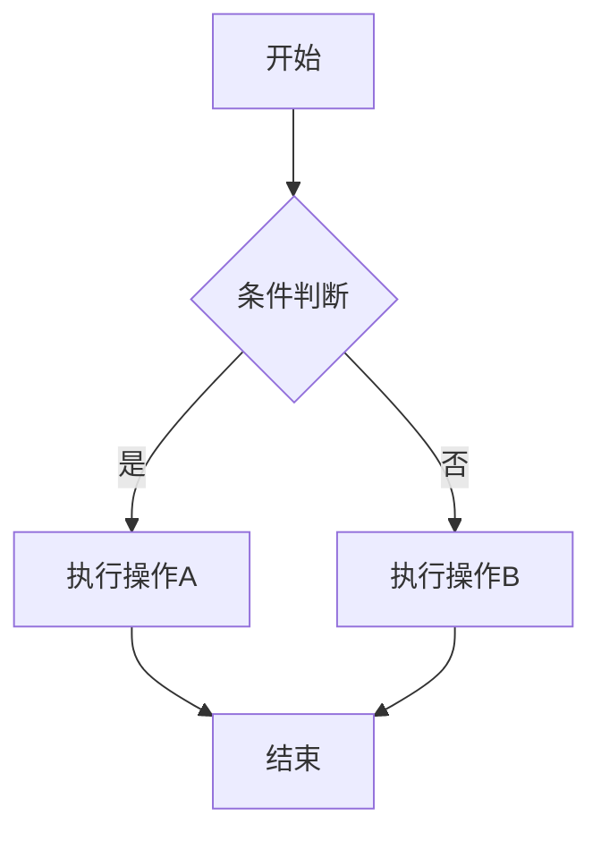

**语法要点**：
- 方向：`TB`(上到下), `BT`(下到上), `LR`(左到右), `RL`(右到左)
- 节点形状：
  - `[矩形]` - 标准矩形
  - `(圆角矩形)` - 圆角
  - `([体育场形])` - 两端圆弧
  - `[[子程序]]` - 子程序
  - `[(数据库)]` - 圆柱体
  - `((圆形))` - 圆形
  - `{菱形}` - 判断
  - `{{六边形}}` - 六边形
  - `[/平行四边形/]` - 平行四边形
  - `[/梯形\\]` - 梯形
- 连线样式：
  - `-->` 实线箭头
  - `---` 实线无箭头
  - `-.->` 虚线箭头
  - `-.-` 虚线无箭头
  - `==>` 粗线箭头
  - `===` 粗线无箭头
  - `--文字-->` 带文字连线

### 2. 时序图 (Sequence Diagram)

**适用场景**：API 调用流程、系统交互、消息传递

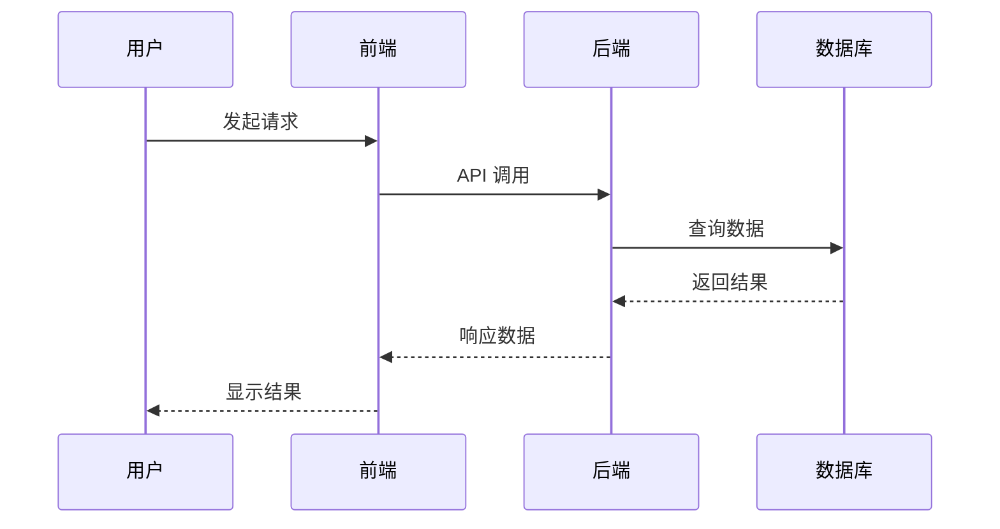

**语法要点**：
- 参与者定义：`participant A as 别名`
- 消息类型：
  - `->>` 实线箭头
  - `-->>` 虚线箭头
  - `--)` 开放箭头（异步）
  - `--x` 失败标记
- 生命线：
  - `activate A` / `deactivate A` 激活/停用
  - 或使用 `+A` / `-A` 简写
- 注释：`Note over A: 说明文字`
- 循环：`loop 条件 ... end`
- 条件：`alt 条件A ... else 条件B ... end`
- 可选：`opt 条件 ... end`

### 3. 类图 (Class Diagram)

**适用场景**：面向对象设计、类结构、继承关系

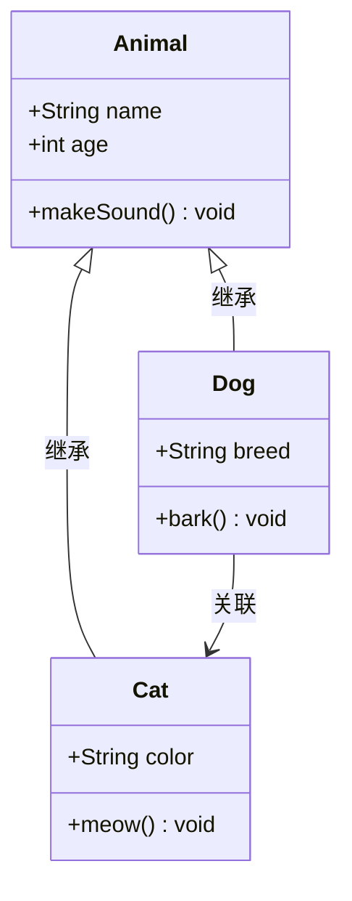

**语法要点**：
- 访问修饰符：
  - `+` public
  - `-` private
  - `#` protected
  - `~` package/internal
- 关系类型：
  - `<|--` 继承
  - `*--` 组合
  - `o--` 聚合
  - `-->` 关联
  - -- 依赖
  - `--|>` 实现
- 类型声明：`class 类名 <<接口>>`
- 注释：`note for 类名 "说明"`

### 4. 状态图 (State Diagram)

**适用场景**：订单状态、工作流状态、对象生命周期

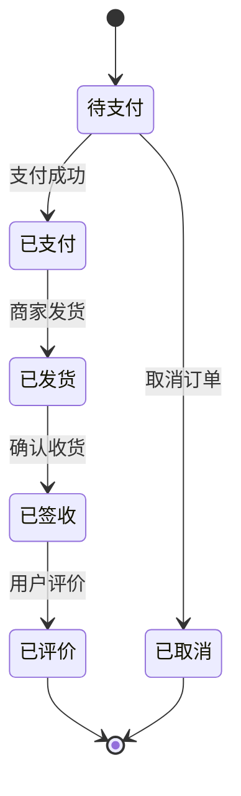

**语法要点**：
- 起始/结束：`[*]`
- 状态转换：`状态A --> 状态B : 触发事件`
- 复合状态：
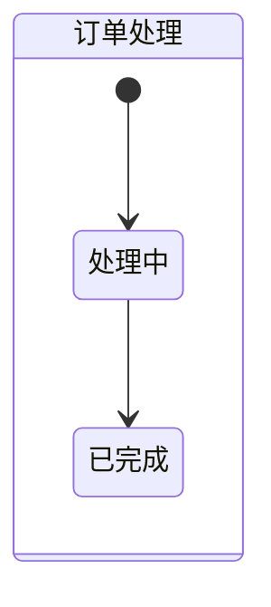
- 并行状态：`state 状态名 { ... }`

### 5. ER 图 (Entity Relationship Diagram)

**适用场景**：数据库设计、数据模型

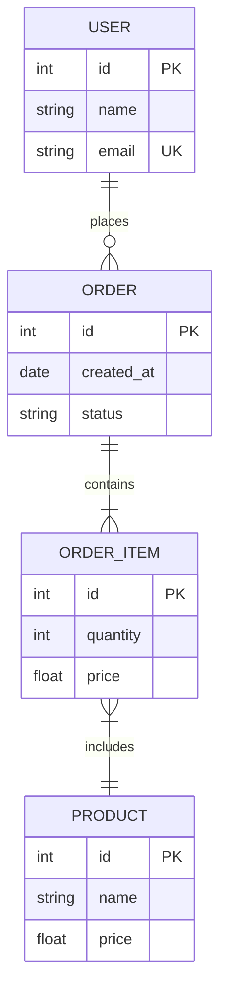

**语法要点**：
- 关系符号：
  - `||--||` 一对一
  - `||--o{` 一对多
  - `}o--o{` 多对多
  - `||--|{` 一对多（必选）
- 属性修饰：`PK`(主键), `FK`(外键), `UK`(唯一键)

### 6. 甘特图 (Gantt Chart)

**适用场景**：项目进度、任务规划

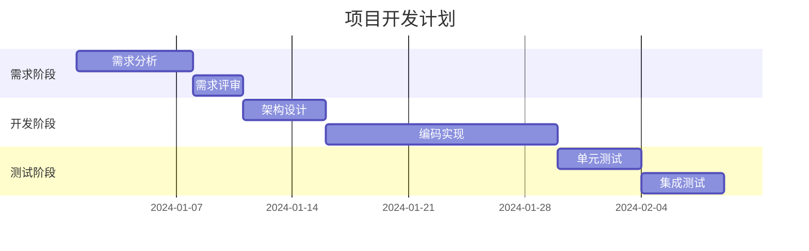

**语法要点**：
- 日期格式：`dateFormat YYYY-MM-DD`
- 任务定义：`任务名 :id, 开始日期, 持续时间`
- 依赖：`after 前置任务id`
- 进度状态：`:active`, `:done`, `:crit`
- 分组：`section 分组名`

### 7. 饼图 (Pie Chart)

**适用场景**：数据占比、市场份额

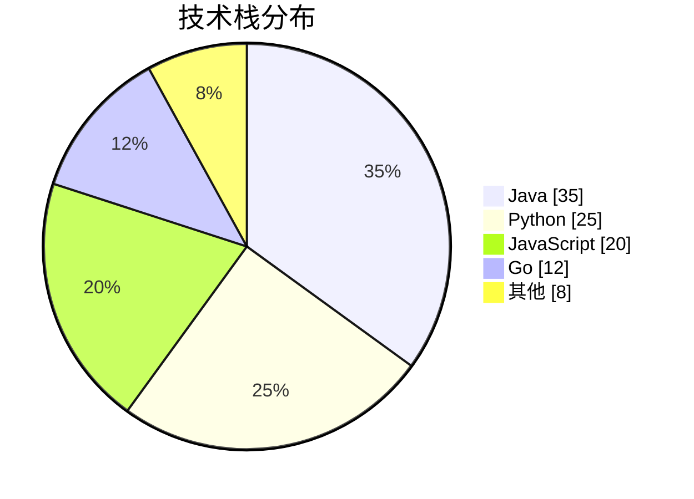

### 8. 架构图最佳实践

**微服务架构示例**：

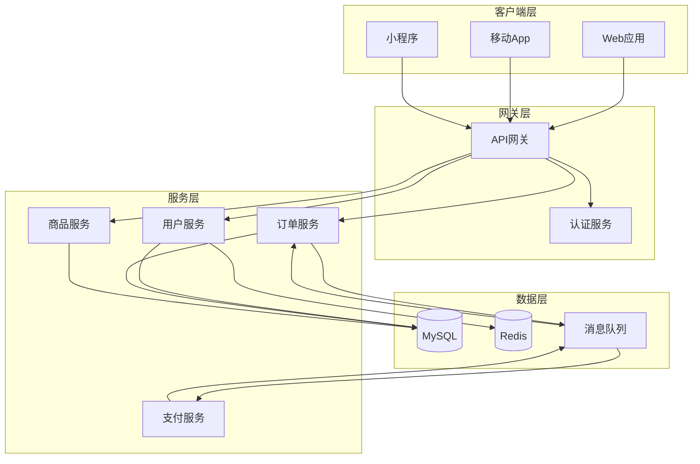

**分层架构示例**：

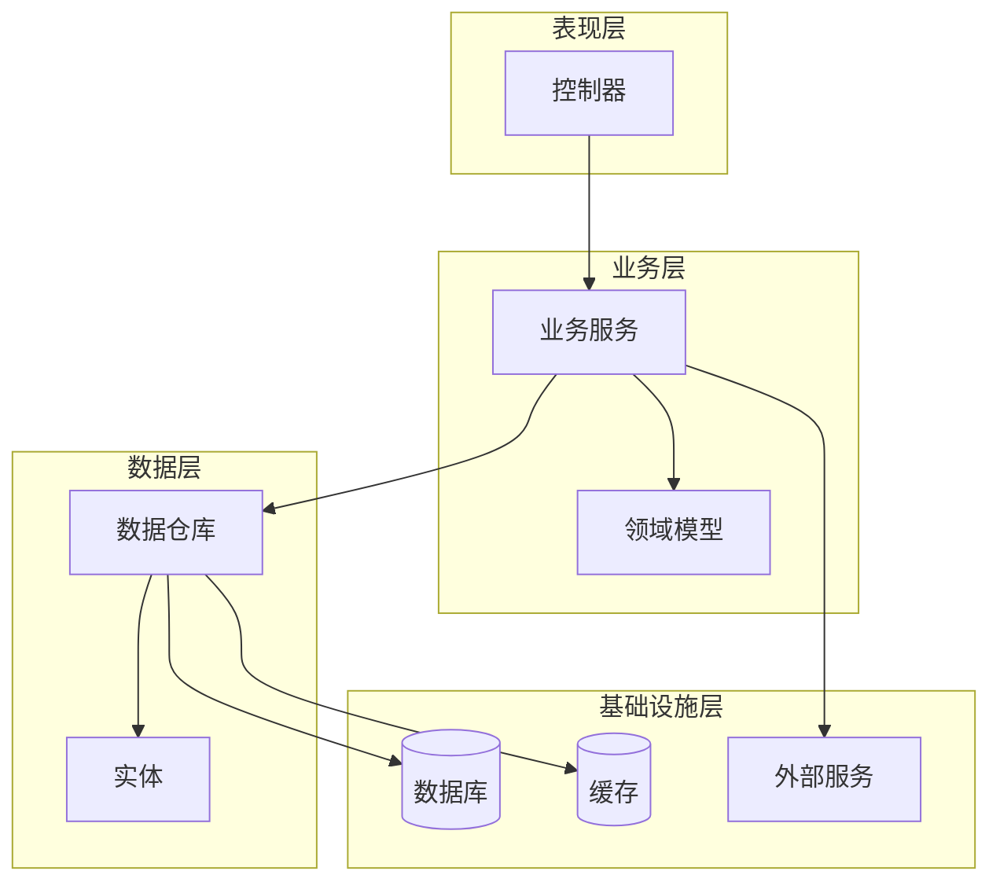

---

## Mermaid 8.8.0+ 兼容性说明

### 确保兼容的关键点

1. **避免使用新特性**：
   - 不使用 9.0+ 的 `gitGraph` 图表
   - 不使用 `mindmap`（需要 9.2.0+）
   - 不使用 `timeline`（需要 9.3.0+）

2. **安全使用 subgraph**：
   - 始终使用 `subgraph 名称` 格式
   - 方向声明放在 subgraph 内部

3. **样式定义**：
   - 使用 `classDef` 定义样式类
   - 避免内联复杂 CSS

4. **特殊字符处理**：
   - 使用引号包裹含特殊字符的文本
   - 中文内容建议用双引号

### 推荐的最佳实践

```
✅ 推荐
graph TD
    A["包含特殊字符的文本"]

❌ 避免
graph TD
    A[包含特殊字符的文本]
```

---

## 工作流程

1. **理解需求**
   - 分析用户描述的场景
   - 识别关键元素和关系

2. **选择图表类型**
   - 流程图：业务流程、算法逻辑
   - 时序图：交互过程、API调用
   - 类图：对象结构、继承关系
   - 状态图：状态流转、生命周期
   - ER图：数据模型、表关系
   - 架构图：系统结构、分层设计

3. **设计图表**
   - 合理布局节点
   - 使用语义化的命名
   - 添加必要的注释说明
   - 保持图表清晰简洁

4. **输出结果**
   - 提供 Mermaid 代码
   - 说明关键设计决策
   - 根据需要调整优化

---

## 示例模板

### 项目架构梳理模板

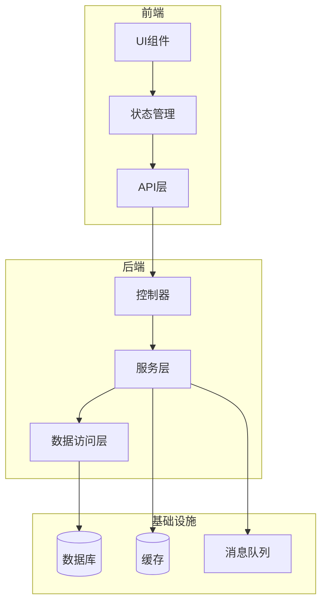

### 业务流程模板

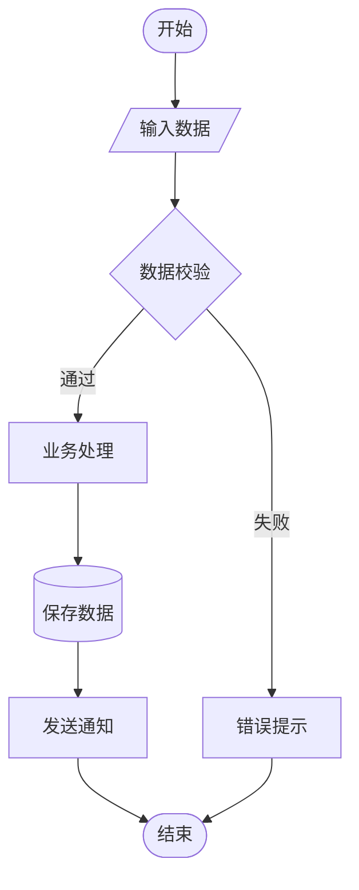

### 接口设计模板

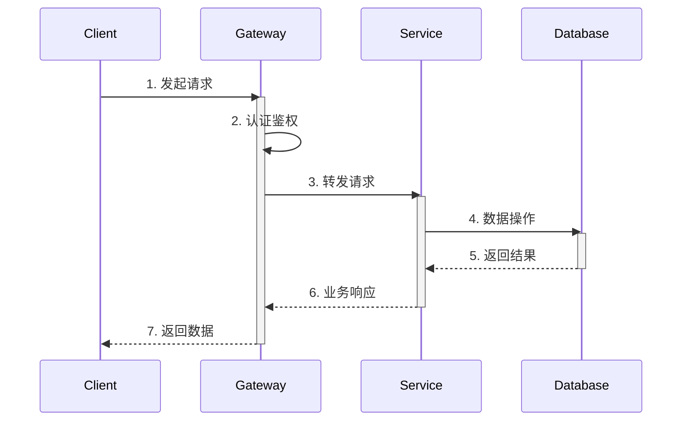

---

## 注意事项

1. **图表复杂度**：保持适中，过于复杂的图表难以阅读
2. **命名规范**：使用语义化的节点名称
3. **布局方向**：根据内容选择合适的方向（TB/LR等）
4. **颜色使用**：适当使用颜色区分不同模块
5. **版本兼容**：确保使用的语法在目标版本中支持
